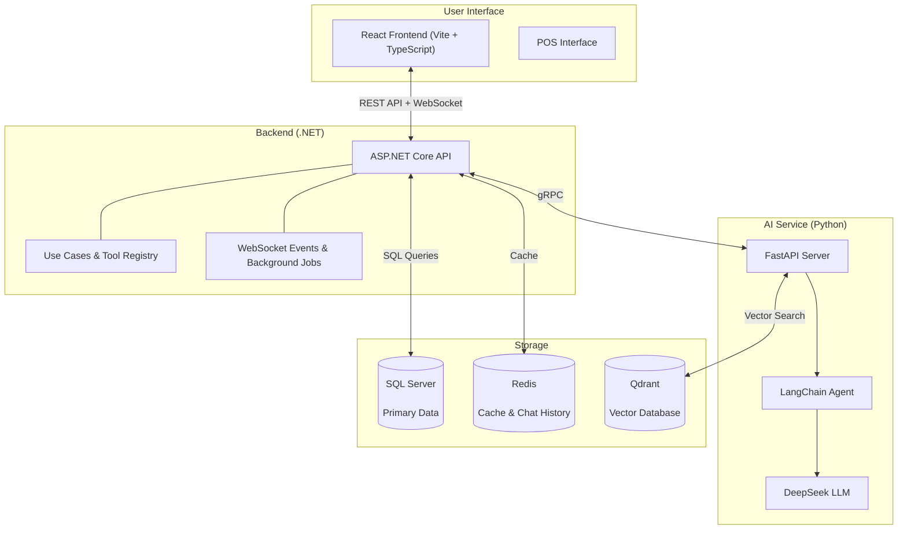

# 🎬 Galaxiad Cinema Core — Comprehensive Cinema Management System

> **Enterprise-grade multi-cinema operations and management platform — Far beyond a simple ticket booking system.**  
> An end-to-end solution covering the complete cinema operational lifecycle: from auditorium layout grids, dynamic seat matrix, conflict-free scheduling, staff shift scheduling & biometric face-scan attendance, POS counter sales, concession inventory management, janitorial task workflows, dynamic pricing rules & loyalty vouchers, to DeepSeek AI agents and business intelligence analytics.

---

## 🚀 Project Mission

**Galaxiad Cinema Core** is an enterprise-grade **Comprehensive Cinema Management System**. The architecture is engineered to reach far beyond conventional ticket booking websites, functioning as a synchronized operating platform for cinema chain networks:
- **Far Beyond Ticket Booking**: The system resolves complex cinema operations — managing multi-auditorium facilities, customizable seat matrices (Standard, VIP, Sweetbox/Couple), staff shift rosters with peer swap requests, camera-based facial recognition attendance clock-in, point-of-sale (POS) ticket and concession combo checkouts, warehouse inventory logistics, automated cleaning task dispatching, multi-tiered dynamic pricing policies (3D/IMAX/4DX format surcharges, early bird slots, audience segments), and in-depth business intelligence reporting.
- **Deep AI Integration**: Conflict-free smart showtime scheduling recommendations, 24/7 conversational customer service and automated booking flow orchestration via LangChain Agent + DeepSeek LLM, and personalized movie recommendation models powered by Qdrant vector embeddings.
- **Real-Time Customer Experience**: Seamless seat booking backed by distributed Redis seat locking to prevent double-booking collisions, cryptographically verified VNPay HMAC-SHA512 electronic payments, and collaborative social booking rooms with democratic payment method voting.

---

## 🏛️ Architecture Overview



**Simple explanation:** The web UI (React) communicates with the backend (.NET) via REST API and WebSocket (persistent two-way connection for real-time updates). The backend stores data in SQL Server, uses Redis for caching and chat history, and calls the Python AI Service via gRPC to run the LangChain Agent with DeepSeek LLM for chatbot, movie recommendations, and auto-booking.

---

## ✨ Core Features (by role)

### 👤 Customer
- **Online Booking**: Select movies, real-time seat selection (seats are temporarily locked), VNPay payment
- **AI Chatbot**: Smart Q&A — find movies, check showtimes, seat suggestions, auto-booking via LangChain Agent
- **History & Notifications**: View booking history, receive promotion alerts

### 💵 Cashier / POS
- **Counter Sales**: Find customers by email, select seats, cash or VNPay payment
- **Shift Management**: Register shifts, facial recognition clock-in/out

### 🏢 Facilities Manager
- **Cinema & Auditorium Management**: Add/edit theaters, auditoriums, seats
- **Pricing Segments**: Manage ticket pricing by segment (Student, Adult, VIP...)

### 🎬 Movie Manager
- **Read-only movie catalog**: View movies, exhibition rights, and Admin-activated dossiers; direct movie create/edit/delete is disabled
- **Change requests**: Propose poster, description, or metadata changes for an Admin diff review and approval

### 📄 Film Contracts & OCR (Movie Contract Workflow)
- **Contract intake**: MovieManager uploads partner PDFs, scans, and appendices; the original file is immutable and stored with a hash and revision
- **OCR and clause analysis**: The Python AI Service reads PDF text layers or Vietnamese/English scans with Tesseract, then extracts movies, dates, cinema/format scope, classification, and revenue-share policy
- **Evidence-backed review**: Every extracted field keeps page, source text, and `SPECIFIED` / `NO_ADDITIONAL_RESTRICTION_CONFIRMED` / `UNRESOLVED` status; missing values are never guessed as 50/50 or system-wide
- **Approve, sign, activate**: Admin approves a revision, signs internally, and activates one transaction that creates/links the movie, exhibition rights, and financial policy; contract history is retained
- **Role separation**: Admin manages templates, partners, sign-off, activation, and settlement; MovieManager handles assigned dossiers; TheaterManager schedules only from activated rights

### 📋 Theater Manager
- **Staff Shift Management**: Approve shifts, view attendance
- **Revenue Reports**: View revenue and statistics

### 🔧 Admin
- **User Management & Permissions**: Create accounts, assign roles, transfer rights
- **Promotions & Vouchers**: Create and manage promotions, reward point vouchers
- **Audit Log**: View system-wide activity logs
- **Dashboard**: Revenue charts, ticket sales, recent activity
- **Film contracts & finance**: Versioned templates/contracts, exhibition-right approvals, revenue shares, settlements, and movie revenue rankings

---

## 🛠️ Technology Stack

| Layer | Technology | Role |
|-------|-----------|------|
| **Frontend** | React + TypeScript + Vite | User Interface (Web) |
| **Backend** | ASP.NET Core 8 | Business logic, REST API, WebSocket |
| **AI Service** | Python FastAPI + DeepSeek/Ollama | LangChain Agent, chatbot, contract OCR, clause analysis, recommendations |
| **LangChain Agent** | `create_tool_calling_agent` | Booking flow orchestration: seat suggestion, voucher, confirmation |
| **Communication** | gRPC (protobuf) | C# backend ↔ Python AI Service |
| **Database** | SQL Server (MSSQL) | Primary data storage (transactions, users, metadata) |
| **Cache & Memory** | Redis | Fast caching, chat history (30-min TTL) |
| **Vector DB** | Qdrant | Vector embeddings for movie recommendations |
| **Contract Storage** | MinIO (local/test), existing storage (production) | Private contract files, appendices, and assets |
| **Real-time** | WebSocket | Real-time seat status updates |

---

## 🚀 Quick Start

### Requirements
- Docker & Docker Compose
- .NET 8.0 SDK (for backend)
- Node.js 18+ (for frontend)
- Python 3.10+ (for AI Service)

### Quick Start (Docker Compose)
```bash
# 1. Clone the project
git clone <repository-url>
cd galaxiad-cinema-core

# 2. Create .env file for AI service
echo "DEEPSEEK_API_KEY=your-deepseek-api-key" > services/ai/.env

# 3. Run entire system
docker compose up --build
```

Access: `http://localhost:5173`

Local and test Docker environments can run contract OCR and analysis with Ollama `qwen3.5:4b` without a paid API key. Contract files are stored in MinIO locally/in tests; production keeps the existing storage backend.

### Run individually

**Backend:**
```bash
cd apps/backend
dotnet run --project Cinema.Api
```

**Frontend:**
```bash
cd apps/frontend
npm install
npm run dev
```

**AI Service:**
```bash
cd services/ai
pip install -r requirements.txt
# Create .env: DEEPSEEK_API_KEY=your-key
python main.py
```

---

## 📚 Documentation

### Algorithms & Techniques
- [Algorithm Overview](docs/algorithms/README.en.md)
  - [Movie Search](docs/algorithms/en/movie-search.md)
  - [Movie Recommendations](docs/algorithms/en/movie-recommendation.md)
  - [Dynamic Pricing & Promotions](docs/algorithms/en/pricing-promotions.md)
  - [Role-aware Chatbot](docs/algorithms/en/role-aware-chatbot.md)
  - [Redis Cache Strategy](docs/algorithms/en/redis-cache-strategy.md)
  - [Shift Schedule Rules](docs/algorithms/en/shift-schedule-rules.md)
  - [Real-time Seat Locking](docs/algorithms/en/seat-locking.md)

### Business Rules
- [Business Rules Reference](docs/business/README.en.md)

### Development (Backend)
- [Backend README (VI)](apps/backend/README.md)
- [Backend README (EN)](apps/backend/README.en.md)
- [Backend README (RU)](apps/backend/README.ru.md)
- [Film Contracts & OCR](docs/features/en/film-contracts.md)

---

## AI Recommendation Docs

- Personalized recommendation engine: [docs/algorithms/en/movie-recommendation.md](docs/algorithms/en/movie-recommendation.md)
- Embedding dimension benchmark (768d): [docs/benchmarks/embedding-dimension-benchmark.md](docs/benchmarks/embedding-dimension-benchmark.md)
- Benchmark scripts and images: [services/ai/benchmarks/](services/ai/benchmarks/)

---

## Deployment Evidence

| Item | Status | Link |
|------|--------|------|
| CI/CD | GitHub Actions (build + type check) | `.github/workflows/build.yml` |
| Frontend Demo | Live on Vercel | https://galaxiad-cinema-core-gamma.vercel.app/ |
| API Swagger | Live | https://apicinestartplus.runasp.net/swagger |
| Seed Data | Included | 5 movies, 3 cinemas, 6 auditoriums, sample pricing |
| Deployment Guide | [DEPLOYMENT.md](DEPLOYMENT.md) | VPS setup + Docker production config |

### Production Architecture
- **Frontend**: Vercel (auto-deploy from `main` branch)
- **Backend**: runasp.net (ASP.NET Core hosting)
- **AI Service**: Self-hosted with DeepSeek LLM + BAAI/bge-m3 local embedding model
- **Database**: SQL Server 2022 + Redis + Qdrant

---

## 🌐 Languages

- 🇻🇳 [Tiếng Việt](README.md)
- 🇬🇧 [English](README.en.md)
- 🇷🇺 [Русский](README.ru.md)

## 📚 Detailed References

| Document | Description |
|---|---|
| [docs/features/](docs/features/) | Detailed feature documentation |
| [docs/algorithms/](docs/algorithms/) | Algorithms (movie search, pricing, seat locking, cache) |
| [docs/business/](docs/business/) | Business rules |
| [DEPLOYMENT.md](DEPLOYMENT.md) | Production deployment guide |

---

> ⚡ Galaxiad Cinema Core — Built with ❤️ by the Galaxiad Team
