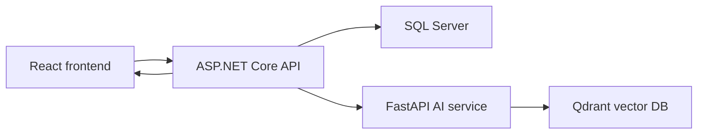

# Galaxiad Cinema Core

Galaxiad Cinema Core is a cinema booking platform with a React frontend, an ASP.NET Core backend, a Python AI recommendation service, SQL Server as the source of truth, Redis for runtime infrastructure, and Qdrant for persistent movie vector search.

## Repository Layout

```text
galaxiad-cinema-core/
├── apps/
│   ├── backend/              # ASP.NET Core 8 API solution
│   │   ├── ApiLayer/         # HTTP controllers, middleware, bootstrapping, hubs
│   │   ├── BusinessLayer/    # entities, DTOs, use cases, app services
│   │   ├── DataAccess/       # EF Core DbContext, repositories, persistence
│   │   └── Shared/           # shared interfaces, enums, helpers
│   └── frontend/             # React + TypeScript + Vite client
│       ├── src/components/   # shared UI components
│       ├── src/contexts/     # app-level context providers
│       ├── src/features/     # feature modules by business area
│       ├── src/i18n/         # translations and i18n wiring
│       ├── src/types/        # TypeScript domain/API types
│       └── src/utils/        # frontend helper functions
├── services/
│   └── ai/                   # FastAPI recommendation service
├── docker-compose.yml        # local multi-service orchestration
└── README.md
```

## Runtime Services

| Service | Purpose | Default Port |
| --- | --- | --- |
| `frontend` | React customer/admin/staff UI | `5173` |
| `api` | ASP.NET Core REST API and SignalR hubs | `8080`, `8081` |
| `ai` | FastAPI embedding and recommendation service | `8000` |
| `qdrant` | Persistent vector database for movie embeddings | `6333`, `6334` |
| `mssql` | SQL Server source-of-truth database | `1433` |
| `redis` | Runtime cache/background infrastructure | `6379` |

## Backend Structure

The backend follows a pragmatic clean architecture:

```text
apps/backend/
├── ApiLayer/
│   ├── Controllers/
│   │   ├── Admin/                  # admin-only APIs
│   │   ├── Customer/
│   │   │   ├── Booking/            # booking and public movie browsing
│   │   │   ├── Catalog/            # public catalog endpoints
│   │   │   ├── Engagement/         # comments, notifications, recommendations
│   │   │   └── Vouchers/           # customer-facing voucher endpoints
│   │   ├── Identity/               # login/register/auth APIs
│   │   ├── Management/
│   │   │   ├── Facilities/         # cinema, auditorium, department management
│   │   │   ├── Movies/             # movie manager APIs
│   │   │   └── Theaters/           # schedules, shifts, theater operations
│   │   └── Staff/                  # staff/cashier APIs
│   ├── Bootstraps/                 # DI and API configuration
│   └── Program.cs                  # app startup
├── BusinessLayer/
│   ├── Dtos/                       # request/response contracts
│   ├── Entities/                   # EF Core domain entities
│   ├── Services/ApplicationServices/
│   │   ├── AiMovieEmbeddingSyncService.cs
│   │   ├── AiMovieEmbeddingStartupService.cs
│   │   └── MovieStatusSyncBackgroundService.cs
│   └── UseCases/                   # business workflows
├── DataAccess/                     # EF Core persistence
└── Shared/                         # common contracts and enums
```

Controller folders are grouped by audience and operational responsibility while preserving public endpoint paths so the frontend remains compatible.

## Frontend Structure

```text
apps/frontend/src/
├── App.tsx                         # route tree
├── components/                     # shared UI, layout, auth guards, modals
├── contexts/                       # app state providers
├── features/
│   ├── admin/                      # admin dashboard and permissions
│   ├── auth/                       # login, register, OAuth callback
│   ├── booking/                    # movie details, showtimes, checkout, account
│   ├── cashier/                    # cashier/POS experience
│   ├── facilities/                 # cinema/auditorium/facilities management
│   ├── movie/                      # movie manager workspace
│   ├── public/                     # homepage, public pages, public movie list
│   ├── schedule/                   # schedule management UI
│   ├── staff/                      # staff portal
│   └── theater/                    # theater manager workspace
├── i18n/                           # English, Vietnamese, Russian translations
├── types/                          # typed API/domain models
└── utils/                          # auth, date/time, toast, theme helpers
```

The homepage calls the recommendation endpoint when a logged-in user is available. The survey modal is optional and no longer blocks the recommendation request.

## AI Recommendation Architecture

Movie data lives in SQL Server. Qdrant stores only the vector index and metadata needed for semantic movie retrieval. The AI service embeds movie text and user profile text with the configured embedding model, then uses Qdrant cosine search.



### Movie Embedding Lifecycle

1. A movie is created or updated in the backend.
2. `AiMovieEmbeddingSyncService.SyncMovieAsync(movieId)` loads the movie from SQL Server.
3. If the movie is active or coming soon, the backend sends one `AiMovieItem` to `POST /embed-movies`.
4. The AI service embeds the movie text and upserts the vector into Qdrant.
5. If the movie is deleted, inactive, or no longer eligible, the backend calls `DELETE /embed-movies/{movie_id}`.
6. `MovieStatusSyncBackgroundService` updates vectors only for movies whose active/expired status changes.
7. Startup/manual reconciliation calls `POST /sync-movies`, which sends the active/coming-soon snapshot and lets AI/Qdrant upsert changed vectors and delete stale vectors.

There is no five-minute full embedding poll. Embedding is event-driven, with startup/manual reconciliation as a safety net.

## Recommendation Endpoint

Frontend endpoint:

```http
GET /api/v1/recommendation/movies
Authorization: Bearer <customer_token>
```

Backend controller:

```text
apps/backend/ApiLayer/Controllers/Customer/Engagement/RecommendationController.cs
```

### High-Level Flow

1. Read `userId` from the JWT claim.
2. Load optional survey preferences.
3. Build a deterministic user behavior profile from survey, views/clicks, bookings, and positive ratings.
4. If no profile signals exist, return popular fallback recommendations.
5. Ensure the AI movie index exists by checking AI `/health`; if Qdrant is empty, run a snapshot sync.
6. Send the generated `userText` to AI `POST /recommend`.
7. AI embeds the `userText` and searches Qdrant for semantically close movie vectors.
8. Backend filters out movies the user already interacted with.
9. Backend loads final movie details from SQL Server.
10. If fewer than 5 movies remain, backend fills the list with fallback popular movies.

## Recommendation Query Algorithm

The algorithm intentionally does not load every click or every comment into memory. SQL Server summarizes behavior first with `GROUP BY`, `COUNT`, `MAX`, and `TOP 8`.

The SQL below is representative pseudo-SQL. EF Core may generate different aliases, joins, and split queries.

### 1. Load Optional Survey

```sql
SELECT TOP (1) *
FROM UserGenreSurvey
WHERE UserId = @userId;
```

If the survey exists, load the selected genre names:

```sql
SELECT MovieGenreName
FROM MovieGenreInfo
WHERE CAST(MovieGenreId AS nvarchar(max)) IN (@genreIds);
```

Generated profile text:

```text
User selected favorite genres: Sci-Fi, Action.
Survey preference description: ...
```

### 2. Load Strongest View/Click Signals

```sql
SELECT TOP (8)
    MovieId,
    COUNT(*) AS Count,
    MAX(ViewedAt) AS LastAt
FROM MovieView
WHERE UserId = @userId
GROUP BY MovieId
ORDER BY Count DESC, LastAt DESC;
```

Then load movie snippets for those movie ids:

```sql
SELECT m.*, mg.*, g.*
FROM MovieInfo m
LEFT JOIN MovieGenreMovieInfo mg ON mg.MovieId = m.MovieId
LEFT JOIN MovieGenreInfo g ON g.MovieGenreId = mg.MovieGenreId
WHERE m.MovieId IN (@viewedMovieIds)
  AND m.IsDeleted = 0;
```

Generated profile text:

```text
User often views/clicks movies: Movie: Dune; genres: Sci-Fi, Adventure; director: Denis Villeneuve; actors: ...
```

### 3. Load Booking Signals

Bookings are stronger than clicks because the user paid for a ticket or completed an order.

```sql
SELECT TOP (8)
    s.MovieId,
    COUNT(*) AS Count,
    MAX(o.OrderDate) AS LastAt
FROM OrderDetails d
JOIN OrderInfo o ON o.OrderId = d.OrderId
JOIN MovieScheduleInfo s ON s.MovieScheduleId = d.MovieScheduleId
WHERE o.UserId = @userId
  AND o.OrderStatus IN ('Booked', 'Completed')
GROUP BY s.MovieId
ORDER BY Count DESC, LastAt DESC;
```

Then load movie snippets:

```sql
SELECT m.*, mg.*, g.*
FROM MovieInfo m
LEFT JOIN MovieGenreMovieInfo mg ON mg.MovieId = m.MovieId
LEFT JOIN MovieGenreInfo g ON g.MovieGenreId = mg.MovieGenreId
WHERE m.MovieId IN (@bookedMovieIds)
  AND m.IsDeleted = 0;
```

Generated profile text:

```text
User has booked tickets for movies: Movie: Oppenheimer; genres: Biography, Drama; director: Christopher Nolan; actors: ...
```

### 4. Load Positive Rating Signals

Only visible root comments with rating `>= 4` are used.

```sql
SELECT TOP (8)
    MovieId,
    COUNT(*) AS Count,
    MAX(CreatedAt) AS LastAt
FROM MovieComment
WHERE UserId = @userId
  AND ParentCommentId IS NULL
  AND Rating IS NOT NULL
  AND Rating >= 4
  AND Status NOT IN ('Deleted', 'Rejected')
GROUP BY MovieId
ORDER BY Count DESC, LastAt DESC;
```

Then load movie snippets:

```sql
SELECT m.*, mg.*, g.*
FROM MovieInfo m
LEFT JOIN MovieGenreMovieInfo mg ON mg.MovieId = m.MovieId
LEFT JOIN MovieGenreInfo g ON g.MovieGenreId = mg.MovieGenreId
WHERE m.MovieId IN (@ratedMovieIds)
  AND m.IsDeleted = 0;
```

Generated profile text:

```text
User rated these movies highly: Movie: Inception; genres: Sci-Fi, Thriller; director: Christopher Nolan; actors: ...
```

### 5. Build User Profile Text

The backend joins all available text parts:

```text
User selected favorite genres: Sci-Fi.
User often views/clicks movies: Movie: Dune; genres: Sci-Fi, Adventure; director: Denis Villeneuve.
User has booked tickets for movies: Movie: Oppenheimer; genres: Biography, Drama; director: Christopher Nolan.
User rated these movies highly: Movie: Inception; genres: Sci-Fi, Thriller; director: Christopher Nolan.
```

The backend also stores every interacted movie id in memory for the current request only:

```text
interactedMovieIds = viewedMovieIds + bookedMovieIds + highlyRatedMovieIds
```

These ids are excluded from the final recommendation result so the user is less likely to see movies they already interacted with.

### 6. Ensure AI Movie Index Exists

Before querying AI, the backend calls:

```http
GET {AiService:BaseUrl}/health
```

If AI reports `embedded_movies_count > 0`, no SQL sync is needed.

If the Qdrant collection is empty or health check fails, the backend loads all eligible movies for snapshot sync:

```sql
SELECT m.*, mg.*, g.*
FROM MovieInfo m
LEFT JOIN MovieGenreMovieInfo mg ON mg.MovieId = m.MovieId
LEFT JOIN MovieGenreInfo g ON g.MovieGenreId = mg.MovieGenreId
WHERE m.IsDeleted = 0
  AND (m.IsActive = 1 OR m.IsCommingSoon = 1);
```

Then it sends:

```http
POST /sync-movies
```

### 7. Query AI/Qdrant

Backend request to AI:

```json
{
  "user_text": "User selected favorite genres: ...",
  "top_k": 12
}
```

AI service algorithm:

1. Embed `user_text`.
2. Query Qdrant collection `cinema_movies`.
3. Return the closest movie ids.
4. Convert Qdrant cosine score into the old API semantics:

```text
distance = 1 - cosine_score
```

Lower `distance` means more similar.

Example AI response:

```json
{
  "results": [
    { "movie_id": "8b8f...", "distance": 0.11 },
    { "movie_id": "2a90...", "distance": 0.18 }
  ]
}
```

### 8. Load Final Movie Details

The backend removes invalid ids and already-interacted ids, then loads display data from SQL Server:

```sql
SELECT
    m.MovieId,
    m.MovieName,
    m.MovieImageUrl,
    m.MovieBannerUrl,
    m.MovieDescription,
    m.MovieDuration,
    m.IsCommingSoon,
    requiredAge.MovieRequiredAgeSymbol,
    genres.MovieGenreName,
    formats.MovieFormatName
FROM MovieInfo m
LEFT JOIN MovieRequiredAge requiredAge ON requiredAge.MovieRequiredAgeId = m.MovieRequiredAgeId
LEFT JOIN MovieGenreMovieInfo mg ON mg.MovieId = m.MovieId
LEFT JOIN MovieGenreInfo genres ON genres.MovieGenreId = mg.MovieGenreId
LEFT JOIN MovieFormatMovieInfo mf ON mf.MovieId = m.MovieId
LEFT JOIN MovieFormatInfo formats ON formats.MovieFormatId = mf.MovieFormatId
WHERE m.MovieId IN (@aiMovieIds)
  AND m.IsDeleted = 0
  AND (m.IsActive = 1 OR m.IsCommingSoon = 1);
```

The API returns up to 5 movies, ordered by the AI result order.

## Fallback Recommendation Algorithm

Fallback is used when:

- the user has no survey and no behavior signals;
- AI service fails;
- Qdrant has no result;
- fewer than 5 valid AI movies remain after filtering.

### 1. Load Candidate Movies

```sql
SELECT display fields
FROM MovieInfo
WHERE IsDeleted = 0
  AND (IsActive = 1 OR IsCommingSoon = 1)
  AND MovieId NOT IN (@excludedMovieIds);
```

### 2. Load Global View Counts From Last 30 Days

```sql
SELECT MovieId, COUNT(*) AS Count
FROM MovieView
WHERE ViewedAt >= @utcNowMinus30Days
GROUP BY MovieId;
```

### 3. Load Global Booking Counts From Last 30 Days

```sql
SELECT s.MovieId, COUNT(*) AS Count
FROM OrderDetails d
JOIN OrderInfo o ON o.OrderId = d.OrderId
JOIN MovieScheduleInfo s ON s.MovieScheduleId = d.MovieScheduleId
WHERE o.OrderDate >= @utcNowMinus30Days
  AND o.OrderStatus IN ('Booked', 'Completed')
GROUP BY s.MovieId;
```

### 4. Load Global Rating Scores

```sql
SELECT
    MovieId,
    AVG(Rating) AS Average,
    COUNT(*) AS Count
FROM MovieComment
WHERE ParentCommentId IS NULL
  AND Rating IS NOT NULL
  AND Status = 'Visible'
GROUP BY MovieId;
```

### 5. Compute Fallback Score In C#

```csharp
score = bookingCount * 3
      + viewCount
      + averageRating * 10
      + ratingCount;
```

Candidates are sorted by:

1. highest fallback score;
2. active movies before coming-soon movies;
3. take the requested number of movies.

## Recommendation Accuracy Notes

The recommendation result is probabilistic, not guaranteed to be 100% correct. The current system uses deterministic profile building and semantic vector search to avoid paying for an LLM summarization step on every request.

Signal strength today:

| Signal | Meaning | Strength |
| --- | --- | --- |
| Survey genres | Explicit preference, optional | Medium |
| Views/clicks | Interest or curiosity | Weak |
| Bookings | Paid/committed behavior | Strong |
| Positive ratings | Explicit satisfaction | Strong |
| Current search intent | Not yet part of this endpoint | Future improvement |

Useful future improvements:

- add recency windows to behavior profile queries, not only fallback;
- weight bookings and positive ratings more heavily in the profile text;
- combine snippet loading into one SQL query instead of up to three;
- add indexes for `MovieView(UserId, MovieId, ViewedAt)`, `OrderInfo(UserId, OrderStatus, OrderDate)`, and `MovieComment(UserId, MovieId, Rating, Status, CreatedAt)`;
- incorporate current search/filter intent when the frontend sends it explicitly.

## API Endpoints For Recommendation

| Endpoint | Owner | Purpose |
| --- | --- | --- |
| `GET /api/v1/recommendation/movies` | Customer | Get personalized or fallback movie recommendations |
| `GET /api/v1/recommendation/survey/status` | Customer | Read optional survey status |
| `POST /api/v1/recommendation/survey` | Customer | Save optional survey preferences |
| `POST /api/v1/recommendation/sync-movies` | Admin | Manual movie-vector reconciliation |
| `POST /embed-movies` | AI service | Upsert one or more movie vectors |
| `DELETE /embed-movies/{movie_id}` | AI service | Delete one movie vector |
| `POST /sync-movies` | AI service | Reconcile a movie snapshot with Qdrant |
| `POST /recommend` | AI service | Embed profile text and query Qdrant |
| `GET /health` | AI service | Check AI/Qdrant health and vector count |

## Development

### Docker

```bash
echo "GOOGLE_API_KEY=your-key" > services/ai/.env
docker compose up --build
```

### Local Backend

```bash
cd apps/backend
dotnet run --project ApiLayer
```

### Local Frontend

```bash
cd apps/frontend
npm install
npm run dev
```

### Local AI Service

```bash
cd services/ai
pip install -r requirements.txt
python main.py
```

## Verification Commands

```bash
dotnet build apps/backend/Backend.sln
cd apps/frontend && npm run build
cd services/ai && python -m py_compile main.py embedder.py config.py models.py
docker compose config --quiet
```
