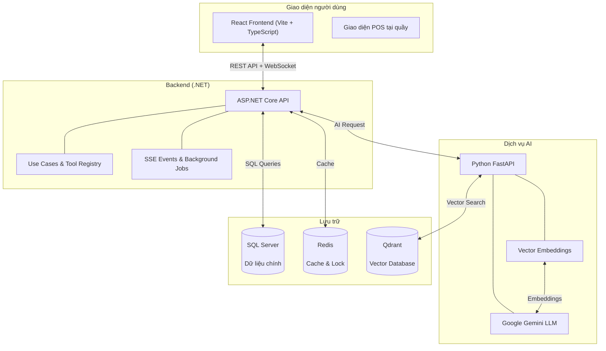

# 🎬 Galaxiad Cinema Core

> Nền tảng quản lý rạp chiếu phim toàn diện — quản lý phòng chiếu, lịch phim, vé, khuyến mãi, nhân viên và AI hỗ trợ — tất cả trên một giao diện duy nhất.

---

## 🚀 Sứ mệnh dự án

**Galaxiad Cinema Core** là một nền tảng quản lý rạp chiếu phim hiện đại, giúp chủ rạp và đội ngũ vận hành quản lý toàn bộ hoạt động kinh doanh — từ đặt vé online, quản lý phòng chiếu, lịch chiếu phim, khuyến mãi, nhân viên, đến chấm công và báo cáo doanh thu — tất cả trên một hệ thống duy nhất.

Hệ thống tích hợp AI để đề xuất lịch chiếu thông minh, chatbot hỗ trợ khách hàng 24/7, và gợi ý phim cá nhân hóa dựa trên hành vi người dùng.

---

## 🏛️ Kiến trúc tổng quan



**Giải thích đơn giản:** Giao diện web (React) nói chuyện với backend (.NET) qua REST API và WebSocket (kết nối bền vững hai chiều cho cập nhật real-time). Backend lưu dữ liệu vào SQL Server, dùng Redis để nhớ nhanh (cache) và khóa trùng lặp, và gọi Python AI Service để phân tích hành vi khách hàng, gợi ý phim và hỗ trợ chatbot.

---

## ✨ Tính năng chính (theo vai trò)

### 👤 Khách hàng (Customer)
- **Đặt vé online**: Chọn phim, chọn ghế real-time (ghế được khóa tạm thời khi có người chọn), thanh toán qua VNPay
- **Chatbot AI**: Hỏi đáp thông minh — tìm phim, xem lịch chiếu, giải đáp thắc mắc
- **Lịch sử & thông báo**: Xem lịch sử đặt vé, nhận thông báo khuyến mãi

### 💵 Thu ngân (Cashier / POS)
- **Bán vé tại quầy**: Tìm khách hàng bằng email, chọn ghế, thanh toán tiền mặt hoặc VNPay
- **Quản lý ca làm việc**: Đăng ký ca, chấm công bằng khuôn mặt (facial recognition)

### 🏢 Quản lý rạp (Facilities Manager)
- **Quản lý cinema & phòng chiếu**: Thêm/sửa rạp, phòng chiếu (auditorium), ghế ngồi
- **Phân khúc giá**: Quản lý giá vé theo đối tượng (Học sinh, Người lớn, VIP...)

### 🎬 Quản lý phim (Movie Manager)
- **Quản lý thông tin phim**: Thêm/sửa phim, lịch chiếu, phân loại độ tuổi (P, K, T13, T16, T18, C)

### 📋 Quản lý rạp (Theater Manager)
- **Quản lý ca nhân viên**: Duyệt ca, xem bảng chấm công
- **Báo cáo doanh thu**: Xem doanh thu, thống kê

### 🔧 Admin
- **Quản lý người dùng & phân quyền**: Tạo tài khoản, gán vai trò, chuyển giao quyền
- **Khuyến mãi & Voucher**: Tạo và quản lý chương trình khuyến mãi, voucher điểm thưởng
- **Audit Log**: Xem nhật ký hoạt động toàn hệ thống
- **Dashboard tổng quan**: Biểu đồ doanh thu, vé bán ra, hoạt động gần đây

---

## 🛠️ Công nghệ sử dụng

| Layer | Công nghệ | Vai trò |
|-------|-----------|---------|
| **Frontend** | React + TypeScript + Vite | Giao diện người dùng (Web) |
| **Backend** | ASP.NET Core 8 | Xử lý nghiệp vụ, REST API, WebSocket |
| **AI Service** | Python FastAPI + Google Gemini | Chatbot, gợi ý phim, phân tích |
| **Database** | SQL Server (MSSQL) | Lưu trữ dữ liệu chính (giao dịch, người dùng, metadata) |
| **Cache** | Redis | Cache nhanh, khóa phân tán (distributed lock) |
| **Vector DB** | Qdrant | Lưu trữ vector embeddings cho gợi ý phim |
| **Real-time** | WebSocket (raw) | Cập nhật trạng thái ghế real-time, thông báo |

---

## 🚀 Cách chạy dự án

### Yêu cầu
- Docker & Docker Compose
- .NET 8.0 SDK (cho backend)
- Node.js 18+ (cho frontend)
- Python 3.10+ (cho AI Service)

### Quick Start (Docker Compose)
```bash
# 1. Clone dự án
git clone <repository-url>
cd galaxiad-cinema-core

# 2. Tạo file .env cho AI service
echo "GOOGLE_API_KEY=your-gemini-api-key" > services/ai/.env

# 3. Chạy toàn bộ hệ thống
docker compose up --build
```

Truy cập: `http://localhost:5173`

### Chạy từng phần riêng lẻ

**Backend:**
```bash
cd apps/backend
dotnet run --project Cinema.Api
```

**Frontend:**
```bash
cd apps/frontend
npm install
npm run dev
```

**AI Service:**
```bash
cd services/ai
pip install -r requirements.txt
# Tạo .env: GOOGLE_API_KEY=your-key
python main.py
```

---

## 📚 Tài liệu chi tiết

### Thuật toán & Kỹ thuật
- [Tổng quan thuật toán](docs/algorithms/README.en.md)
  - [Tìm kiếm phim](docs/algorithms/en/movie-search.md)
  - [Gợi ý phim](docs/algorithms/en/movie-recommendation.md)
  - [Khuyến mãi giá động](docs/algorithms/en/pricing-promotions.md)
  - [Chatbot theo vai trò](docs/algorithms/en/role-aware-chatbot.md)
  - [Redis Cache Strategy](docs/algorithms/en/redis-cache-strategy.md)
  - [Quy tắc xếp lịch ca](docs/algorithms/en/shift-schedule-rules.md)
  - [Khóa ghế Real-time (WebSocket)](docs/algorithms/en/seat-locking.md)

### Quy tắc Kinh doanh
- [Business Rules Reference](docs/business/README.en.md)

### Phát triển (Backend)
<!-- xem endpoints trong docs/features/ -->

### Dịch thuật
- Tài liệu kỹ thuật: [Tiếng Việt](docs/algorithms/vi/README.md) | [Русский](docs/algorithms/ru/README.md)
- Quy tắc kinh doanh: [Tiếng Việt](docs/business/vi/README.md) | [Русский](docs/business/ru/README.md)

---

## Deployment Evidence

| Item | Status | Link |
|------|--------|------|
| CI/CD | GitHub Actions (build + type check) | `.github/workflows/build.yml` |
| Frontend Demo | Live on Vercel | https://galaxiad-cinema-core-gamma.vercel.app/ |
| API Swagger | Live | https://apicinestartplus.runasp.net/swagger |
| Seed Data | Included | 5 movies, 3 cinemas, 6 auditoriums, sample pricing |
| Deployment Guide | [DEPLOYMENT.md](DEPLOYMENT.md) | VPS setup + Docker production config |

### Production Architecture
- **Frontend**: Vercel (auto-deploy from `main` branch)
- **Backend**: runasp.net (ASP.NET Core hosting)
- **AI Service**: Self-hosted with BAAI/bge-m3 local embedding model
- **Database**: SQL Server 2022 + Redis + Qdrant

---

## 🌐 Ngôn ngữ / Languages

- 🇻🇳 [Tiếng Việt](readme.vi.md)
- 🇬🇧 [English](readme.en.md)
- 🇷🇺 [Русский](readme.ru.md)

## 📚 Tài Liệu Chi Tiết

| Tài Liệu | Mô Tả |
|---|---|
| [docs/features/](docs/features/) | Tài liệu chi tiết từng tính năng |
| [docs/algorithms/](docs/algorithms/) | Thuật toán (tìm phim, giá vé, khóa ghế, cache) |
| [docs/business/](docs/business/) | Quy tắc kinh doanh |
| [DEPLOYMENT.md](DEPLOYMENT.md) | Hướng dẫn triển khai production |

---

> ⚡ Galaxiad Cinema Core — Built with ❤️ by the Galaxiad Team
