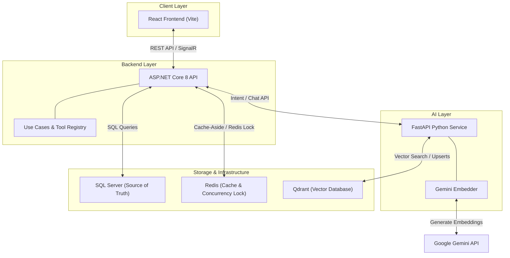

# Galaxiad Cinema Core

Galaxiad Cinema Core is a high-performance cinema booking and management platform built with modern architectural patterns. The platform features an ASP.NET Core backend, a React customer & management portal, and a Python FastAPI AI assistant and recommendation engine.

---

## 🌌 System Scope & Core Features

Galaxiad Cinema Core covers the complete lifecycle of cinema operations:

1. **Customer Ticketing Flow**: Interactive seat selection maps, real-time checkout, ticket reservation holding, and secure checkout integration.
2. **Dynamic Pricing & Promotion Engine**: Auto-applied discount rules, flat-rate pricing adjustments, and priority-based price calculation with automated Cartesian product expansion for multi-format and multi-cinema applicability.
3. **Staff Scheduling & Payroll**: Shift pattern registration, automatic contract constraint validation (full-time vs. part-time hours checks), manager approval workflows, and cashier/manager payroll generation.
4. **Personalized Recommendations**: User behavioral profile synthesis (clicks, bookings, ratings) mapped to Google Gemini semantic embeddings and retrieved via Qdrant persistent vector search.
5. **Role-Aware AI Assistant**: Natural language query routing using FastAPI intent classification, secure C# Tool Registry execution, and centralized system prompt/safety guardrails managed inside the AI service.

---

## 🛠️ Technology Stack

| Layer | Technology | Key Libraries / Ecosystem |
| --- | --- | --- |
| **Frontend** | React 18 (Vite + TypeScript) | Vanilla CSS, Lucide Icons, SignalR Client, React Router |
| **Backend** | ASP.NET Core 8 | Entity Framework Core, Dapper, SignalR Hubs, BCrypt, JWT |
| **AI Service** | FastAPI (Python 3.10+) | Uvicorn, Loguru, Google Generative AI (Gemini), httpx |
| **Databases** | SQL Server (MSSQL 2022) | Primary source of truth for transactions, users, and metadata |
| | Redis (Cache & PubSub) | Key-value store for session locking, cached catalogs, and invalidation |
| | Qdrant | Vector database storing persistent 768-dimensional movie embeddings |

---

## 🏛️ System Architecture

The following diagram illustrates the interaction between services, data flow, and runtime storage roles:



---

## 📂 Repository Layout

```text
galaxiad-cinema-core/
├── apps/
│   ├── backend/                # ASP.NET Core 8 Clean Architecture Solution
│   │   ├── Cinema.Api/         # Controllers, Middlewares, Hubs, Bootstrapping
│   │   ├── Cinema.Application/ # Use Cases, DTOs, Application Interfaces
│   │   ├── Cinema.Infrastructure/# EF Core, Repositories, Redis, External Services
│   │   └── Cinema.Domain/      # Business Entities, Enums, Rules, Policy Interfaces
│   └── frontend/               # React Client (Vite + TypeScript)
│       └── src/
│           ├── components/     # Shared layout, Auth guards, modals
│           ├── features/       # Feature modules (Admin, Customer, Staff, Cashier)
│           └── api/            # API client services & DTO mappings
├── services/
│   └── ai/                     # Python FastAPI service for intent, RAG, and recommendations
└── docs/                       # System documentation and business policies
    ├── algorithms/             # Tech specifications (Pricing, Cache, AI Planner)
    └── business/               # Documented business rules reference
```

---

## 🚀 Getting Started

### Prerequisites
- Docker & Docker Compose
- .NET 8.0 SDK (for local backend development)
- Node.js 18+ (for local frontend development)
- Python 3.10+ (for local AI service development)

### Quick Start (Docker Compose)
To spin up the entire stack (SQL Server, Redis, Qdrant, Frontend, Backend, and AI Service):

1. Create a `.env` file inside `services/ai/` and add your Google Gemini API key:
   ```env
   GOOGLE_API_KEY=your-gemini-api-key
   ```
2. Start the services:
   ```bash
   docker compose up --build
   ```

### Individual Service Setup

#### Local Backend
```bash
cd apps/backend
dotnet run --project Cinema.Api
```

#### Local Frontend
```bash
cd apps/frontend
npm install
npm run dev
```

#### Local AI Service
1. Install dependencies:
   ```bash
   cd services/ai
   pip install -r requirements.txt
   ```
2. Set environment variables (or create a `.env` file):
   ```env
   GOOGLE_API_KEY=your-gemini-api-key
   DEEPSEEK_API_KEY=your-deepseek-api-key
   ```
3. Run the service:
   ```bash
   python main.py
   ```

---

## 🗺️ Documentation Directory

Detailed specifications are organized by language to keep documentation clean:

### Technical Algorithms
- [Algorithms Overview](docs/algorithms/README.md)
  - [Movie Search Algorithm](docs/algorithms/movie-search.md)
  - [Movie Recommendation Algorithm](docs/algorithms/movie-recommendation.md)
  - [Dynamic Pricing Promotion Engine](docs/algorithms/pricing-promotions.md)
  - [Role-Aware Chatbot Implementation](docs/algorithms/role-aware-chatbot.md)
  - [Redis Caching Strategy](docs/algorithms/redis-cache-strategy.md)
  - [Shift Scheduling Rules](docs/algorithms/shift-schedule-rules.md)
- Translations: [Tiếng Việt](docs/algorithms/vi/README.md) | [Русский](docs/algorithms/ru/README.md)

### Business Rules
- [Business Rules Reference](docs/business/README.md)
- Translations: [Tiếng Việt](docs/business/vi/README.md) | [Русский](docs/business/ru/README.md)
