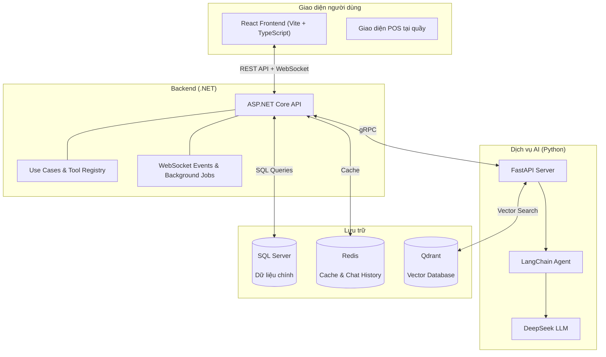

# 🎬 Galaxiad Cinema Core — Hệ Thống Quản Lý Rạp Chiếu Phim Toàn Diện

> **Nền tảng quản lý và vận hành chuỗi rạp chiếu phim chuyên nghiệp — Không đơn thuần là một hệ thống đặt vé.**  
> Giải pháp bao quát toàn diện vòng đời vận hành rạp chiếu phim: từ quản lý phòng chiếu, ma trận ghế ngồi, lịch chiếu thông minh, nhân sự, ca làm việc, chấm công khuôn mặt, quầy bán hàng POS, kho bãi bắp nước, kiểm soát vệ sinh, chính sách giá động & voucher, đến trợ lý AI DeepSeek và phân tích doanh thu.

---

## 🚀 Sứ mệnh dự án

**Galaxiad Cinema Core** là một hệ thống quản lý rạp chiếu phim hiện đại toàn diện (**Comprehensive Cinema Management System**). Dự án được kiến trúc để vượt xa giới hạn của các website đặt vé thông thường, cung cấp một hệ điều hành đồng bộ cho toàn bộ hoạt động của chuỗi rạp chiếu phim:
- **Không đơn thuần là đặt vé**: Hệ thống giải quyết các bài toán vận hành phức tạp của chuỗi rạp — từ quản trị cơ sở vật chất phòng chiếu, thiết lập sơ đồ ghế (Standard, VIP, Sweetbox/Couple), phân ca làm việc cho nhân viên, chấm công sinh trắc học khuôn mặt qua camera, trạm POS bán vé và combo bắp nước tại quầy, quản trị xuất-nhập-tồn kho bãi, điều phối tác vụ dọn dẹp vệ sinh phòng chiếu, cho tới hệ thống chính sách giá động (phụ thu định dạng 3D/IMAX/4DX, suất chiếu sớm, đối tượng khách hàng) và phân tích báo cáo doanh thu chuyên sâu.
- **Tích hợp trí tuệ nhân tạo (AI)**: Đề xuất lịch chiếu tối ưu phòng ngừa xung đột, chatbot hỗ trợ khách hàng và điều phối quy trình đặt vé 24/7 bằng LangChain Agent + DeepSeek LLM, cùng mô hình gợi ý phim cá nhân hóa dựa trên vector embedding Qdrant.
- **Trải nghiệm khách hàng thời gian thực (Realtime Experience)**: Đặt vé mượt mà với cơ chế khóa ghế thời gian thực chống xung đột (Double Booking) qua Redis, thanh toán bảo mật chuẩn VNPay HMAC-SHA512, và tính năng phòng đặt vé nhóm (Social Booking Room) với biểu quyết phương thức thanh toán.

---

## 🏛️ Kiến trúc tổng quan


```mermaid
flowchart TD
    subgraph Client["Giao diện người dùng"]
        FE["React Frontend (Vite + TypeScript)"]
        POS["Giao diện POS tại quầy"]
    end

    subgraph Backend["Backend (.NET)"]
        API["ASP.NET Core API"]
        UC["Use Cases & Tool Registry"]
        Hubs["WebSocket Events & Background Jobs"]
        API --- UC
        API --- Hubs
    end

    subgraph AI["Dịch vụ AI (Python)"]
        FastAPI["FastAPI Server"]
        LangChain["LangChain Agent"]
        DeepSeek["DeepSeek LLM"]
        FastAPI --> LangChain
        LangChain --> DeepSeek
    end

    subgraph Storage["Lưu trữ"]
        SQL[("SQL Server

    Dữ liệu chính")]
        Redis[("Redis

    Cache & Chat History")]
        Qdrant[("Qdrant

    Vector Database")]
    end

    FE <-->|"REST API + WebSocket"| API
    API <-->|"SQL Queries"| SQL
    API <-->|"Cache"| Redis
    API <-->|"gRPC"| FastAPI
    FastAPI <-->|"Vector Search"| Qdrant
```

**Giải thích đơn giản:** Giao diện web (React) nói chuyện với backend (.NET) qua REST API và WebSocket (kết nối bền vững hai chiều cho cập nhật real-time). Backend lưu dữ liệu vào SQL Server, dùng Redis để nhớ nhanh (cache) và lưu lịch sử chat, và gọi Python AI Service qua gRPC để chạy LangChain Agent với DeepSeek LLM cho chatbot, gợi ý phim và đặt vé tự động.

---

## ✨ Tính năng chính (theo vai trò)

### 👤 Khách hàng (Customer)
- **Đặt vé online**: Chọn phim, chọn ghế real-time (ghế được khóa tạm thời khi có người chọn), thanh toán qua VNPay
- **Chatbot AI**: Hỏi đáp thông minh — tìm phim, xem lịch chiếu, gợi ý ghế, đặt vé tự động qua LangChain Agent
- **Lịch sử & thông báo**: Xem lịch sử đặt vé, nhận thông báo khuyến mãi

### 💵 Thu ngân (Cashier / POS)
- **Bán vé tại quầy**: Tìm khách hàng bằng email, chọn ghế, thanh toán tiền mặt hoặc VNPay
- **Quản lý ca làm việc**: Đăng ký ca, chấm công bằng khuôn mặt (facial recognition)

### 🏢 Quản lý rạp (Facilities Manager)
- **Quản lý cinema & phòng chiếu**: Thêm/sửa rạp, phòng chiếu (auditorium), ghế ngồi
- **Phân khúc giá**: Quản lý giá vé theo đối tượng (Học sinh, Người lớn, VIP...)

### 🎬 Quản lý phim (Movie Manager)
- **Danh mục phim chỉ đọc**: Xem phim, quyền khai thác và hồ sơ đã được Admin kích hoạt; không còn thêm/sửa/xóa phim trực tiếp
- **Yêu cầu điều chỉnh**: Đề xuất thay đổi poster, mô tả hoặc metadata để Admin xem diff và phê duyệt

### 📄 Hợp đồng phim & OCR (Movie Contract Workflow)
- **Tiếp nhận hợp đồng**: Admin tải lên PDF, ảnh scan và phụ lục từ đối tác; OCR chạy ngay, sau đó Admin có thể giao MovieManager đối soát; file gốc được lưu bất biến cùng hash và revision
- **OCR và phân tích điều khoản**: Python AI Service ưu tiên đọc PDF text layer, fallback render trang scan bằng `pypdfium2` rồi OCR tiếng Việt/Anh bằng Tesseract; Ollama `qwen3.5:4b` phân tích text theo trang thành JSON có nguồn cho đối tác, phim, mô tả, poster, thời hạn, phạm vi và chia doanh thu. Schema lỗi/thiếu chuyển thành `UNRESOLVED`, không tự đoán dữ liệu.
- **Đối chiếu có nguồn**: Mỗi trường trích xuất giữ trang, đoạn nguồn, trạng thái `SPECIFIED` / `NO_ADDITIONAL_RESTRICTION_CONFIRMED` / `UNRESOLVED`; dữ liệu thiếu không bị tự đoán thành 50/50 hoặc toàn hệ thống
- **Duyệt, ký và kích hoạt**: Admin duyệt revision, ký nội bộ, rồi kích hoạt transaction để tạo/liên kết phim, quyền chiếu và chính sách tài chính; lịch sử hợp đồng không bị xóa
- **Quản trị theo vai trò**: Admin quản lý mẫu, đối tác, ký/kích hoạt và đối soát; MovieManager chỉ xử lý hồ sơ được giao; TheaterManager chỉ lập lịch theo quyền đã kích hoạt

### 📋 Quản lý rạp (Theater Manager)
- **Quản lý ca nhân viên**: Duyệt ca, xem bảng chấm công
- **Báo cáo doanh thu**: Xem doanh thu, thống kê

### 🔧 Admin
- **Quản lý người dùng & phân quyền**: Tạo tài khoản, gán vai trò, chuyển giao quyền
- **Khuyến mãi & Voucher**: Tạo và quản lý chương trình khuyến mãi, voucher điểm thưởng
- **Audit Log**: Xem nhật ký hoạt động toàn hệ thống
- **Dashboard tổng quan**: Biểu đồ doanh thu, vé bán ra, hoạt động gần đây
- **Hợp đồng và tài chính phim**: Quản lý mẫu/hợp đồng theo phiên bản, phê duyệt quyền chiếu, tỷ lệ doanh thu, đối soát và xếp hạng doanh thu theo phim

---

## 🛠️ Công nghệ sử dụng

| Layer | Công nghệ | Vai trò |
|-------|-----------|---------|
| **Frontend** | React + TypeScript + Vite | Giao diện người dùng (Web) |
| **Backend** | ASP.NET Core 8 | Xử lý nghiệp vụ, REST API, WebSocket |
| **AI Service** | Python FastAPI + DeepSeek/Ollama | LangChain Agent, chatbot, OCR hợp đồng, phân tích điều khoản, gợi ý phim |
| **LangChain Agent** | `create_tool_calling_agent` | Điều phối luồng đặt vé: gợi ý ghế, voucher, xác nhận |
| **Communication** | gRPC (protobuf) | Giao tiếp giữa C# backend và Python AI Service |
| **Database** | SQL Server (MSSQL) | Lưu trữ dữ liệu chính (giao dịch, người dùng, metadata) |
| **Cache & Memory** | Redis | Cache nhanh, lưu chat history (TTL 30 phút) |
| **Vector DB** | Qdrant | Lưu trữ vector embeddings cho gợi ý phim |
| **Contract Storage** | MinIO (local/test), storage hiện hữu (production) | Lưu file hợp đồng, phụ lục và asset riêng tư |
| **Real-time** | WebSocket | Cập nhật trạng thái ghế real-time, thông báo |

---

## 🚀 Cách chạy dự án

### Yêu cầu
- Docker & Docker Compose
- .NET 8.0 SDK (cho backend)
- Node.js 18+ (cho frontend)
- Python 3.10+ (cho AI Service)

### Quick Start (Docker Compose)
```bash
# 1. Clone dự án
git clone <repository-url>
cd galaxiad-cinema-core

# 2. Tạo file .env cho AI service
echo "DEEPSEEK_API_KEY=your-deepseek-api-key" > services/ai/.env

# 3. Chạy toàn bộ hệ thống
docker compose up --build
```

Truy cập: `http://localhost:5173`

Môi trường local/test có thể chạy OCR và phân tích hợp đồng bằng Ollama `qwen3.5:4b` trong Docker, không cần API key trả phí. File hợp đồng local/test được lưu trong MinIO; production tiếp tục dùng storage hiện hữu.

### Chạy từng phần riêng lẻ

**Backend:**
```bash
cd apps/backend
dotnet run --project Cinema.Api
```

**Frontend:**
```bash
cd apps/frontend
npm install
npm run dev
```

**AI Service:**
```bash
cd services/ai
pip install -r requirements.txt
# Tạo .env: DEEPSEEK_API_KEY=your-key
python main.py
```

---

## 📚 Tài liệu chi tiết

### Thuật toán & Kỹ thuật
- [Tổng quan thuật toán](docs/algorithms/README.en.md)
  - [Tìm kiếm phim](docs/algorithms/en/movie-search.md)
  - [Gợi ý phim](docs/algorithms/en/movie-recommendation.md)
  - [Khuyến mãi giá động](docs/algorithms/en/pricing-promotions.md)
  - [Chatbot theo vai trò](docs/algorithms/en/role-aware-chatbot.md)
  - [Redis Cache Strategy](docs/algorithms/en/redis-cache-strategy.md)
  - [Quy tắc xếp lịch ca](docs/algorithms/en/shift-schedule-rules.md)
  - [Khóa ghế Real-time (WebSocket)](docs/algorithms/en/seat-locking.md)

### Quy tắc Kinh doanh
- [Business Rules Reference](docs/business/README.en.md)

### Phát triển (Backend)
- [Backend README (VI)](apps/backend/README.md)
- [Backend README (EN)](apps/backend/README.en.md)
- [Backend README (RU)](apps/backend/README.ru.md)
<!-- xem endpoints trong docs/features/ -->

### Dịch thuật
- Tài liệu kỹ thuật: [Tiếng Việt](docs/algorithms/vi/README.md) | [Русский](docs/algorithms/ru/README.md)
- Quy tắc kinh doanh: [Tiếng Việt](docs/business/vi/README.md) | [Русский](docs/business/ru/README.md)
- Hợp đồng phim & OCR: [Tiếng Việt](docs/features/vi/film-contracts.md) | [English](docs/features/en/film-contracts.md) | [Русский](docs/features/ru/film-contracts.md)

---

## AI Recommendation Docs

- Cơ chế gợi ý cá nhân hóa: [docs/algorithms/vi/movie-recommendation.md](docs/algorithms/vi/movie-recommendation.md)
- Benchmark chọn embedding 768 chiều: [docs/benchmarks/embedding-dimension-benchmark.md](docs/benchmarks/embedding-dimension-benchmark.md)
- Script benchmark và output ảnh: [services/ai/benchmarks/](services/ai/benchmarks/)

---

## Deployment Evidence

| Item | Status | Link |
|------|--------|------|
| CI/CD | GitHub Actions (build + type check) | `.github/workflows/build.yml` |
| Frontend Demo | Live on Vercel | https://galaxiad-cinema-core-gamma.vercel.app/ |
| API Swagger | Live | https://apicinestartplus.runasp.net/swagger |
| Seed Data | Included | 5 movies, 3 cinemas, 6 auditoriums, sample pricing |
| Deployment Guide | [DEPLOYMENT.md](DEPLOYMENT.md) | VPS setup + Docker production config |

### Production Architecture
- **Frontend**: Vercel (auto-deploy from `main` branch)
- **Backend**: runasp.net (ASP.NET Core hosting)
- **AI Service**: Self-hosted with DeepSeek LLM + BAAI/bge-m3 local embedding model
- **Database**: SQL Server 2022 + Redis + Qdrant

---

## 🌐 Ngôn ngữ / Languages

- 🇻🇳 [Tiếng Việt](readme.vi.md)
- 🇬🇧 [English](readme.en.md)
- 🇷🇺 [Русский](readme.ru.md)

| Tài Liệu | Mô Tả |
|---|---|
| [docs/test/README.md](docs/test/README.md) | Báo cáo chi tiết kịch bản test & trạng thái kiểm thử (Tiếng Việt) |
| [docs/features/](docs/features/) | Tài liệu chi tiết từng tính năng |
| [docs/algorithms/](docs/algorithms/) | Thuật toán (tìm phim, giá vé, khóa ghế, cache) |
| [docs/business/](docs/business/) | Quy tắc kinh doanh |
| [DEPLOYMENT.md](DEPLOYMENT.md) | Hướng dẫn triển khai production |

---

> ⚡ Galaxiad Cinema Core — Built with ❤️ by the Galaxiad Team
