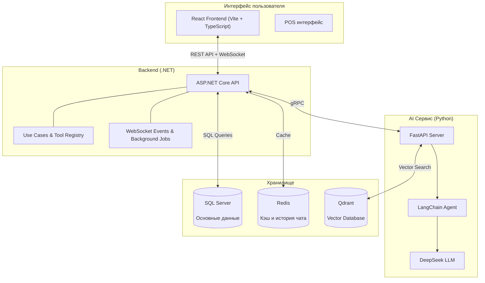

# 🎬 Galaxiad Cinema Core — Комплексная система управления кинотеатром

> **Корпоративная платформа управления и комплексной эксплуатации кинотеатров — Не просто система бронирования билетов.**  
> Сквозное решение, охватывающее полный операционный цикл сети кинотеатров: от конфигурации залов и динамической сетки мест, умного составления расписания, управления сменами персонала и биометрического учёта рабочего времени (Face-Scan), кассовых терминалов POS, складского учёта бара и комбо, координации клининга, динамического ценообразования и ваучеров, до интеллектуального AI-агента DeepSeek и сквозной бизнес-аналитики.

---

## 🚀 Миссия проекта

**Galaxiad Cinema Core** — это комплексная корпоративная система управления кинотеатром (**Comprehensive Cinema Management System**). Архитектура платформы выходит далеко за рамки обычных сайтов по продаже билетов, представляя собой единую операционную систему для сетей кинотеатров:
- **Не просто бронирование билетов**: Система решает весь комплекс прикладных задач кинобизнеса — управление залами и гибкими схемами рассадки (Standard, VIP, Sweetbox/Couple), планирование смен сотрудников и обработка заявок на обмен сменами, биометрический учёт прихода/ухода по распознаванию лиц с камер, стационарные POS-терминалы для продажи билетов и комбо-наборов, учёт складских запасов бара, автоматизированное распределение задач уборки после сеансов, гибкая система тарифов (надбавки за форматы 3D/IMAX/4DX, ранние сеансы, льготные категории) и детальная аналитика финансовых потоков.
- **Глубокая интеграция искусственного интеллекта (AI)**: Интеллектуальное составление бесконфликтного расписания, круглосуточный агент обслуживания клиентов и автоматического бронирования на базе LangChain Agent + DeepSeek LLM, а также персонализированные рекомендации фильмов на векторных эмбеддингах Qdrant.
- **Взаимодействие в реальном времени (Realtime)**: Безупречный выбор мест с распределённой блокировкой в Redis (защита от повторного бронирования / Double Booking), безопасная верификация платежей VNPay с подписью HMAC-SHA512 и комнаты совместного группового бронирования (Social Booking) с голосованием за способ оплаты.

---

## 🏛️ Архитектура



**Простое объяснение:** Веб-интерфейс (React) общается с бэкендом (.NET) через REST API и WebSocket (постоянное двустороннее соединение для обновлений в реальном времени). Бэкенд хранит данные в SQL Server, использует Redis для кэширования и истории чата, и вызывает Python AI Service через gRPC для запуска LangChain Agent с DeepSeek LLM для чат-бота, рекомендаций фильмов и автоматического бронирования.

---

## ✨ Основные функции (по ролям)

### 👤 Клиент (Customer)
- **Онлайн-бронирование**: Выбор фильма, выбор мест в реальном времени (места временно блокируются), оплата через VNPay
- **AI Чат-бот**: Умные ответы — поиск фильмов, расписание, подбор мест, авто-бронирование через LangChain Agent
- **История и уведомления**: Просмотр истории бронирований, получение уведомлений об акциях

### 💵 Кассир (Cashier / POS)
- **Продажа в кассе**: Поиск клиента по email, выбор мест, оплата наличными или VNPay
- **Управление сменами**: Регистрация смен, отметка по лицу (facial recognition)

### 🏢 Управляющий (Facilities Manager)
- **Управление кинотеатром и залами**: Добавление/редактирование кинотеатров, залов, мест
- **Ценовые сегменты**: Управление ценами по категориям (Студент, Взрослый, VIP...)

### 🎬 Менеджер фильмов (Movie Manager)
- **Каталог только для чтения**: Просмотр фильмов, прав показа и активированных Admin досье; прямое создание/изменение/удаление фильмов отключено
- **Запросы на изменения**: Предложение изменений постера, описания или метаданных для сравнения и одобрения Admin

### 📄 Договоры на фильмы и OCR (Movie Contract Workflow)
- **Приём договора**: Admin загружает PDF, сканы и приложения партнёра; OCR запускается сразу, после чего Admin может назначить MovieManager для проверки; исходный файл неизменяем и сохраняется с hash и revision
- **OCR и анализ условий**: Python AI Service сначала читает text layer PDF, а для сканов рендерит страницы через `pypdfium2` и запускает Tesseract `vie+eng`; локальная Ollama `qwen3.5:4b` формирует JSON с источником по страницам для партнёра, фильмов, описаний, постеров, сроков, области и долей. Ошибочные/отсутствующие значения остаются `UNRESOLVED`, без выдуманных данных.
- **Проверка с доказательством**: Каждое поле содержит страницу, источник и состояние `SPECIFIED` / `NO_ADDITIONAL_RESTRICTION_CONFIRMED` / `UNRESOLVED`; пропущенные значения не превращаются автоматически в 50/50 или «вся сеть»
- **Одобрение, подпись и активация**: Admin одобряет revision, подписывает его и активирует одну транзакцию, создающую/связывающую фильм, права показа и финансовую политику; история договоров сохраняется
- **Разделение ролей**: Admin управляет шаблонами, партнёрами, подписью, активацией и расчётами; MovieManager обрабатывает назначенные досье; TheaterManager составляет расписание только по активированным правам

### 📋 Менеджер расписания (Theater Manager)
- **Управление сменами сотрудников**: Утверждение смен, просмотр табеля
- **Отчёты о доходах**: Просмотр доходов и статистики

### 🔧 Admin
- **Управление пользователями и правами**: Создание аккаунтов, назначение ролей, передача прав
- **Акции и ваучеры**: Создание и управление акциями, ваучерами
- **Журнал аудита**: Просмотр логов активности системы
- **Дашборд**: Графики доходов, продажи билетов, недавняя активность
- **Договоры и финансы фильмов**: Версионирование шаблонов/договоров, одобрение прав показа, долей выручки, расчётов и рейтингов дохода по фильмам

---

## 🛠️ Технологический стек

| Слой | Технология | Роль |
|------|-----------|------|
| **Frontend** | React + TypeScript + Vite | Пользовательский интерфейс (Web) |
| **Backend** | ASP.NET Core 8 | Бизнес-логика, REST API, WebSocket |
| **AI Сервис** | Python FastAPI + DeepSeek/Ollama | LangChain Agent, чат-бот, OCR договоров, анализ условий, рекомендации |
| **LangChain Agent** | `create_tool_calling_agent` | Оркестрация бронирования: подбор мест, ваучеры, подтверждение |
| **Связь** | gRPC (protobuf) | C# бэкенд ↔ Python AI Service |
| **База данных** | SQL Server (MSSQL) | Основное хранилище (транзакции, пользователи, метаданные) |
| **Кэш и память** | Redis | Быстрый кэш, история чата (TTL 30 мин) |
| **Vector DB** | Qdrant | Векторные эмбеддинги для рекомендаций фильмов |
| **Хранилище договоров** | MinIO (local/test), существующее storage (production) | Приватные договоры, приложения и assets |
| **Real-time** | WebSocket | Обновления статуса мест в реальном времени |

---

## 🚀 Быстрый старт

### Требования
- Docker & Docker Compose
- .NET 8.0 SDK (для бэкенда)
- Node.js 18+ (для фронтенда)
- Python 3.10+ (для AI сервиса)

### Быстрый старт (Docker Compose)
```bash
# 1. Клонировать проект
git clone <repository-url>
cd galaxiad-cinema-core

# 2. Создать .env для AI сервиса
echo "DEEPSEEK_API_KEY=your-deepseek-api-key" > services/ai/.env

# 3. Запустить всю систему
docker compose up --build
```

Доступ: `http://localhost:5173`

В Docker-средах local/test OCR и анализ договоров работают через Ollama `qwen3.5:4b` без платного API key. В local/test файлы договоров хранятся в MinIO, а production продолжает использовать существующее хранилище.

### Запуск по отдельности

**Бэкенд:**
```bash
cd apps/backend
dotnet run --project Cinema.Api
```

**Фронтенд:**
```bash
cd apps/frontend
npm install
npm run dev
```

**AI Сервис:**
```bash
cd services/ai
pip install -r requirements.txt
# Создать .env: DEEPSEEK_API_KEY=your-key
python main.py
```

---

## 📚 Документация

### Алгоритмы и техники
- [Обзор алгоритмов](docs/algorithms/README.en.md)
  - [Поиск фильмов](docs/algorithms/en/movie-search.md)
  - [Рекомендации фильмов](docs/algorithms/en/movie-recommendation.md)
  - [Динамическое ценообразование](docs/algorithms/en/pricing-promotions.md)
  - [Чат-бот с ролями](docs/algorithms/en/role-aware-chatbot.md)
  - [Стратегия Redis Cache](docs/algorithms/en/redis-cache-strategy.md)
  - [Правила расписания смен](docs/algorithms/en/shift-schedule-rules.md)
  - [Блокировка мест в реальном времени](docs/algorithms/en/seat-locking.md)

### Бизнес-правила
- [Business Rules Reference](docs/business/README.en.md)

### Разработка (Бэкенд)
- [Backend README (VI)](apps/backend/README.md)
- [Backend README (EN)](apps/backend/README.en.md)
- [Backend README (RU)](apps/backend/README.ru.md)
- [Договоры на фильмы и OCR](docs/features/ru/film-contracts.md)

---

## AI Рекомендации

- Движок персонализированных рекомендаций: [docs/algorithms/en/movie-recommendation.md](docs/algorithms/en/movie-recommendation.md)
- Бенчмарк размерности эмбеддингов (768d): [docs/benchmarks/embedding-dimension-benchmark.md](docs/benchmarks/embedding-dimension-benchmark.md)
- Скрипты бенчмарков и изображения: [services/ai/benchmarks/](services/ai/benchmarks/)

---

## Деплой

| Элемент | Статус | Ссылка |
|---------|--------|--------|
| CI/CD | GitHub Actions (build + type check) | `.github/workflows/build.yml` |
| Frontend Demo | Live on Vercel | https://galaxiad-cinema-core-gamma.vercel.app/ |
| API Swagger | Live | https://apicinestartplus.runasp.net/swagger |
| Seed Data | Included | 5 фильмов, 3 кинотеатра, 6 залов |
| Deployment Guide | [DEPLOYMENT.md](DEPLOYMENT.md) | VPS setup + Docker production config |

### Production Архитектура
- **Frontend**: Vercel (auto-deploy from `main`)
- **Backend**: runasp.net (ASP.NET Core hosting)
- **AI Service**: Self-hosted с DeepSeek LLM + BAAI/bge-m3 локальная модель эмбеддингов
- **Database**: SQL Server 2022 + Redis + Qdrant

---

## 🌐 Языки

- 🇻🇳 [Tiếng Việt](README.md)
- 🇬🇧 [English](README.en.md)
- 🇷🇺 [Русский](README.ru.md)

## 📚 Подробные ссылки

| Документ | Описание |
|---|---|
| [docs/features/](docs/features/) | Документация функций |
| [docs/algorithms/](docs/algorithms/) | Алгоритмы (поиск фильмов, цены, блокировка мест, кэш) |
| [docs/business/](docs/business/) | Бизнес-правила |
| [DEPLOYMENT.md](DEPLOYMENT.md) | Руководство по деплою |

---

> ⚡ Galaxiad Cinema Core — Built with ❤️ by the Galaxiad Team
