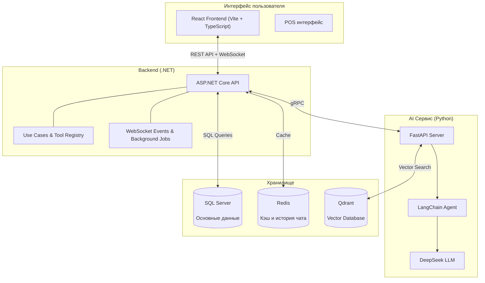

# 🎬 Galaxiad Cinema Core

> Комплексная платформа управления кинотеатром — управление залами, расписанием, билетами, акциями, персоналом и AI-помощником — всё в едином интерфейсе.

---

## 🚀 Миссия проекта

**Galaxiad Cinema Core** — это современная платформа управления кинотеатром, которая помогает владельцам и операционным командам управлять всем бизнесом — от онлайн-бронирования билетов, управления залами, расписания сеансов, акций, персонала, учёта рабочего времени до отчётов о доходах — всё в единой системе.

Платформа интегрирует AI для интеллектуальных рекомендаций расписания, круглосуточный AI-чат-бот на базе LangChain Agent и персонализированные рекомендации фильмов на основе поведения пользователей.

---

## 🏛️ Архитектура



**Простое объяснение:** Веб-интерфейс (React) общается с бэкендом (.NET) через REST API и WebSocket (постоянное двустороннее соединение для обновлений в реальном времени). Бэкенд хранит данные в SQL Server, использует Redis для кэширования и истории чата, и вызывает Python AI Service через gRPC для запуска LangChain Agent с DeepSeek LLM для чат-бота, рекомендаций фильмов и автоматического бронирования.

---

## ✨ Основные функции (по ролям)

### 👤 Клиент (Customer)
- **Онлайн-бронирование**: Выбор фильма, выбор мест в реальном времени (места временно блокируются), оплата через VNPay
- **AI Чат-бот**: Умные ответы — поиск фильмов, расписание, подбор мест, авто-бронирование через LangChain Agent
- **История и уведомления**: Просмотр истории бронирований, получение уведомлений об акциях

### 💵 Кассир (Cashier / POS)
- **Продажа в кассе**: Поиск клиента по email, выбор мест, оплата наличными или VNPay
- **Управление сменами**: Регистрация смен, отметка по лицу (facial recognition)

### 🏢 Управляющий (Facilities Manager)
- **Управление кинотеатром и залами**: Добавление/редактирование кинотеатров, залов, мест
- **Ценовые сегменты**: Управление ценами по категориям (Студент, Взрослый, VIP...)

### 🎬 Менеджер фильмов (Movie Manager)
- **Управление информацией о фильмах**: Добавление/редактирование фильмов, расписаний, возрастных рейтингов

### 📋 Менеджер расписания (Theater Manager)
- **Управление сменами сотрудников**: Утверждение смен, просмотр табеля
- **Отчёты о доходах**: Просмотр доходов и статистики

### 🔧 Admin
- **Управление пользователями и правами**: Создание аккаунтов, назначение ролей, передача прав
- **Акции и ваучеры**: Создание и управление акциями, ваучерами
- **Журнал аудита**: Просмотр логов активности системы
- **Дашборд**: Графики доходов, продажи билетов, недавняя активность

---

## 🛠️ Технологический стек

| Слой | Технология | Роль |
|------|-----------|------|
| **Frontend** | React + TypeScript + Vite | Пользовательский интерфейс (Web) |
| **Backend** | ASP.NET Core 8 | Бизнес-логика, REST API, WebSocket |
| **AI Сервис** | Python FastAPI + DeepSeek LLM | LangChain Agent, чат-бот, рекомендации, авто-бронирование |
| **LangChain Agent** | `create_tool_calling_agent` | Оркестрация бронирования: подбор мест, ваучеры, подтверждение |
| **Связь** | gRPC (protobuf) | C# бэкенд ↔ Python AI Service |
| **База данных** | SQL Server (MSSQL) | Основное хранилище (транзакции, пользователи, метаданные) |
| **Кэш и память** | Redis | Быстрый кэш, история чата (TTL 30 мин) |
| **Vector DB** | Qdrant | Векторные эмбеддинги для рекомендаций фильмов |
| **Real-time** | WebSocket | Обновления статуса мест в реальном времени |

---

## 🚀 Быстрый старт

### Требования
- Docker & Docker Compose
- .NET 8.0 SDK (для бэкенда)
- Node.js 18+ (для фронтенда)
- Python 3.10+ (для AI сервиса)

### Быстрый старт (Docker Compose)
```bash
# 1. Клонировать проект
git clone <repository-url>
cd galaxiad-cinema-core

# 2. Создать .env для AI сервиса
echo "DEEPSEEK_API_KEY=your-deepseek-api-key" > services/ai/.env

# 3. Запустить всю систему
docker compose up --build
```

Доступ: `http://localhost:5173`

### Запуск по отдельности

**Бэкенд:**
```bash
cd apps/backend
dotnet run --project Cinema.Api
```

**Фронтенд:**
```bash
cd apps/frontend
npm install
npm run dev
```

**AI Сервис:**
```bash
cd services/ai
pip install -r requirements.txt
# Создать .env: DEEPSEEK_API_KEY=your-key
python main.py
```

---

## 📚 Документация

### Алгоритмы и техники
- [Обзор алгоритмов](docs/algorithms/README.en.md)
  - [Поиск фильмов](docs/algorithms/en/movie-search.md)
  - [Рекомендации фильмов](docs/algorithms/en/movie-recommendation.md)
  - [Динамическое ценообразование](docs/algorithms/en/pricing-promotions.md)
  - [Чат-бот с ролями](docs/algorithms/en/role-aware-chatbot.md)
  - [Стратегия Redis Cache](docs/algorithms/en/redis-cache-strategy.md)
  - [Правила расписания смен](docs/algorithms/en/shift-schedule-rules.md)
  - [Блокировка мест в реальном времени](docs/algorithms/en/seat-locking.md)

### Бизнес-правила
- [Business Rules Reference](docs/business/README.en.md)

### Разработка (Бэкенд)
- [Backend README (VI)](apps/backend/README.md)
- [Backend README (EN)](apps/backend/README.en.md)
- [Backend README (RU)](apps/backend/README.ru.md)

---

## AI Рекомендации

- Движок персонализированных рекомендаций: [docs/algorithms/en/movie-recommendation.md](docs/algorithms/en/movie-recommendation.md)
- Бенчмарк размерности эмбеддингов (768d): [docs/benchmarks/embedding-dimension-benchmark.md](docs/benchmarks/embedding-dimension-benchmark.md)
- Скрипты бенчмарков и изображения: [services/ai/benchmarks/](services/ai/benchmarks/)

---

## Деплой

| Элемент | Статус | Ссылка |
|---------|--------|--------|
| CI/CD | GitHub Actions (build + type check) | `.github/workflows/build.yml` |
| Frontend Demo | Live on Vercel | https://galaxiad-cinema-core-gamma.vercel.app/ |
| API Swagger | Live | https://apicinestartplus.runasp.net/swagger |
| Seed Data | Included | 5 фильмов, 3 кинотеатра, 6 залов |
| Deployment Guide | [DEPLOYMENT.md](DEPLOYMENT.md) | VPS setup + Docker production config |

### Production Архитектура
- **Frontend**: Vercel (auto-deploy from `main`)
- **Backend**: runasp.net (ASP.NET Core hosting)
- **AI Service**: Self-hosted с DeepSeek LLM + BAAI/bge-m3 локальная модель эмбеддингов
- **Database**: SQL Server 2022 + Redis + Qdrant

---

## 🌐 Языки

- 🇻🇳 [Tiếng Việt](README.md)
- 🇬🇧 [English](README.en.md)
- 🇷🇺 [Русский](README.ru.md)

## 📚 Подробные ссылки

| Документ | Описание |
|---|---|
| [docs/features/](docs/features/) | Документация функций |
| [docs/algorithms/](docs/algorithms/) | Алгоритмы (поиск фильмов, цены, блокировка мест, кэш) |
| [docs/business/](docs/business/) | Бизнес-правила |
| [DEPLOYMENT.md](DEPLOYMENT.md) | Руководство по деплою |

---

> ⚡ Galaxiad Cinema Core — Built with ❤️ by the Galaxiad Team
