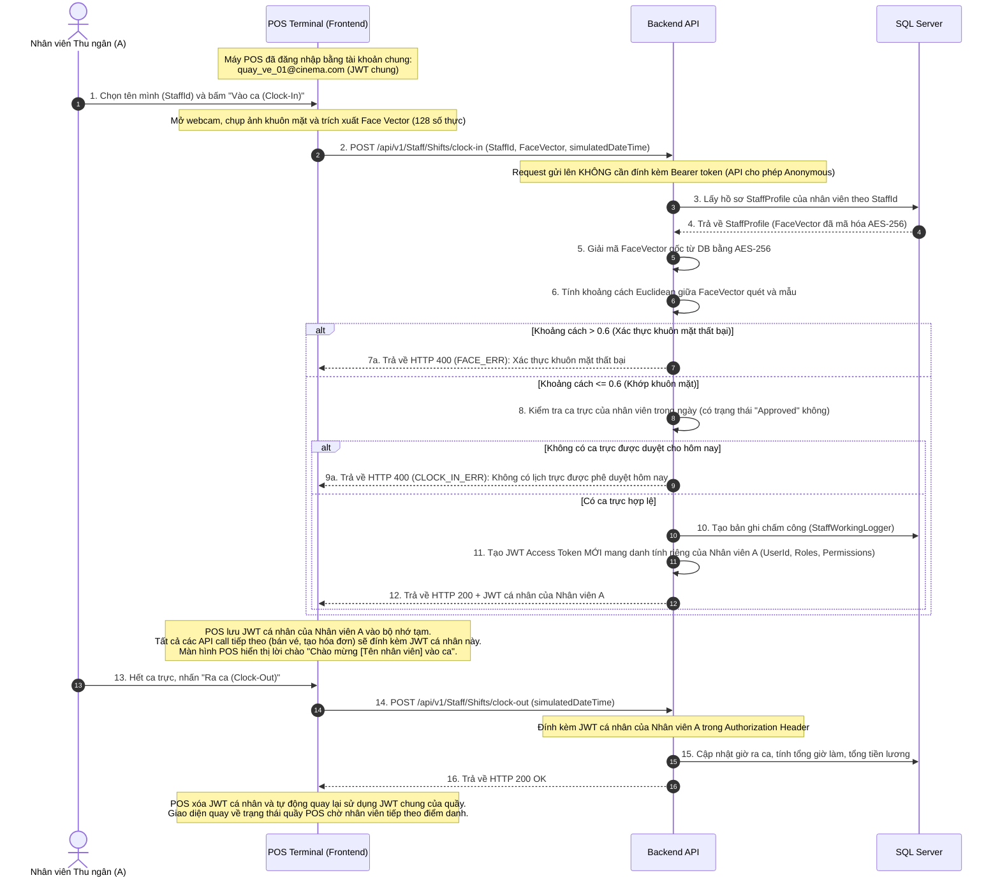

# Hướng dẫn Tích hợp API cho Frontend (FE Integration Guide)
## Quản lý Ca Trực, Điểm danh Khuôn mặt, Tiền lương & Thông báo SSE

Tài liệu này cung cấp hướng dẫn đầy đủ về cách Frontend (FE) tích hợp các tính năng nâng cao liên quan đến phân quyền JWT, chống trùng lặp đăng ký ca làm bằng Redis Lock, đăng ký nhận diện khuôn mặt, luồng đăng nhập máy POS chung, chuyển đổi phiên làm việc, quản lý tiền lương nhân sự và nhận thông báo thời gian thực qua Server-Sent Events (SSE).

---

## 1. Cơ chế Phân quyền Claim-based JWT mới

Hệ thống đã chuyển đổi sang cơ chế phân quyền dựa trên Claims chi tiết thay vì chỉ kiểm tra Roles chung chung. 

### A. Cấu trúc JWT Payload (Giải mã bằng `jwt-decode` ở FE)
Khi người dùng (hoặc quầy POS) đăng nhập thành công, token chứa danh sách `role` (vai trò) và `permission` (quyền hạn cụ thể):
```json
{
  "email": "quay_ve_01@cinema.com",
  "sid": "f9c3b8a1-8d24-42f5-b28f-e9c8f6153a01",
  "name": "Quầy Vé 01",
  "role": ["Cashier"],
  "permission": [
    "SellTicket",
    "BookTicket",
    "ViewHistory",
    "ClockIn",
    "ClockOut",
    "RegisterShift",
    "ViewCinema",
    "ViewSchedule",
    "ViewPayroll"
  ],
  "iss": "http://localhost:5229",
  "aud": "http://localhost:5229",
  "exp": 1718298000
}
```

### B. Hàm Helper kiểm tra Quyền ở FE
FE nên định nghĩa một helper function để bật/tắt hoặc ẩn/hiển thị các phần tử giao diện:
```typescript
import { jwtDecode } from 'jwt-decode';

export const hasPermission = (token: string | null, requiredPermission: string): boolean => {
  if (!token) return false;
  try {
    const decoded: any = jwtDecode(token);
    const permissions: string[] = decoded.permission || [];
    return permissions.includes(requiredPermission);
  } catch {
    return false;
  }
};

// Ví dụ sử dụng:
// { hasPermission(accessToken, 'ApproveShift') && <button>Duyệt ca trực</button> }
```

---

## 2. Luồng Nghiệp vụ POS Shared Terminal & Session Switching

Để tối ưu hóa vận hành, máy POS tại quầy vai trò thu ngân/bắp nước được bật sẵn suốt ngày bằng **Tài khoản POS chung**. Khi nhân viên thu ngân vào ca làm việc, họ sẽ sử dụng tính năng quét khuôn mặt để chuyển đổi sang phiên làm việc của riêng mình mà không cần đăng xuất tài khoản POS chung.

### Sơ đồ Luồng hoạt động tại Quầy POS:



---

## 3. Khóa chống trùng lặp ca trực (Redis Distributed Lock)

Khi nhân viên đăng ký ca trực (`POST /api/v1/Staff/Shifts/register`) hoặc quản lý gán ca trực tiếp (`POST /api/v1/TheaterManager/Shifts/assign`), Backend sẽ khóa tài nguyên ca trực theo ngày (`lock:shift:{ShiftTemplateId}:{Date:yyyyMMdd}`) để ngăn chặn hiện tượng tranh chấp làm vượt quá `MaxStaff`.

*   **HTTP Status Code khi bị xung đột:** `409 Conflict` (với `errorCode: "SHIFT_ERR"`).
*   **Xử lý ở FE:** Khi nhận mã lỗi `409 Conflict`, hãy hiển thị thông điệp: *"Hệ thống đang bận xử lý yêu cầu cho ca trực này. Vui lòng thử lại sau vài giây."* thay vì báo lỗi hệ thống.

---

## 4. Nhận thông báo thời gian thực Server-Sent Events (SSE)

Hệ thống cung cấp kênh Server-Sent Events (SSE) để Frontend đăng ký lắng nghe và hiển thị thông báo ngay lập tức cho nhân viên khi có sự thay đổi về lịch làm việc hoặc tiền lương.

### Thiết lập kết nối SSE ở FE:
```javascript
const eventSource = new EventSource("http://localhost:8080/api/v1/Staff/Shifts/notifications/sse", {
  withCredentials: true // Gửi kèm cookie JWT nếu có
});

eventSource.onmessage = (event) => {
  const data = JSON.parse(event.data);
  console.log("Notification:", data);
  
  if (data.status === "connected") {
    console.log("SSE connected successfully!");
    return;
  }
  
  // Hiển thị popup toast thông báo trực quan trên giao diện
  showToastNotification(data.title, data.message, data.type);
};

eventSource.onerror = (err) => {
  console.error("SSE connection error, retrying...", err);
};
```

### Các sự kiện Notification được đẩy từ Server:

1.  **Duyệt ca làm (`type: "ShiftApproved"`)**: Đẩy về khi Quản lý duyệt ca trực nhân viên tự đăng ký.
2.  **Từ chối ca làm (`type: "ShiftRejected"`)**: Đẩy về khi Quản lý từ chối duyệt ca trực (kèm theo lý do nếu có).
3.  **Hủy ca đã duyệt (`type: "ShiftCancelled"`)**: Đẩy về khi Quản lý hủy ca làm đã duyệt của nhân viên (kèm lý do xin nghỉ).
4.  **Gán ca trực trực tiếp (`type: "ShiftAssigned"`)**: Đẩy về khi Quản lý chủ động phân công nhân sự vào một ca làm mới.
5.  **Thanh toán tiền lương (`type: "PayrollProcessed"`)**: Đẩy về khi Quản lý xác nhận thanh toán bảng lương.

---

## 5. Chi tiết các API dành cho Nhân viên (Staff APIs)

Base Route: `/api/v1/Staff/Shifts` (Yêu cầu Authorization Header ngoại trừ Clock-In)
Compatibility note: backend vẫn giữ alias cũ `/api/Staff/Shifts`, nhưng FE mới nên dùng route canonical `/api/v1/Staff/Shifts`.

### A. Xem danh sách ca làm trống tại chi nhánh rạp của mình
*   **Method & Route:** `GET /api/v1/Staff/Shifts/available`
*   **Query Parameters:**
    *   `date`: Ngày muốn xem `yyyy-MM-dd` (ví dụ `2026-06-13`).
*   **Response (200 OK):**
    ```json
    {
      "isSuccess": true,
      "message": null,
      "data": [
        {
          "shiftTemplateId": "a2b3c4d5-e6f7-8a9b-0c1d-2e3f4a5b6c7d",
          "cinemaId": "c1d2e3f4-a5b6-7c8d-9e0f-1a2b3c4d5e6f",
          "cinemaName": "CGV Vincom Bà Triệu",
          "shiftName": "Ca Sáng Thu Ngân",
          "startTime": "08:00:00",
          "endTime": "16:00:00",
          "maxStaff": 2,
          "registeredCount": 1,
          "roleId": "1a8f7b9c-d4e5-4f6a-b7c8-9d0e1f2a3b4c",
          "roleName": "Cashier"
        }
      ]
    }
    ```

### B. Đăng ký ca trực theo dải ngày (Hỗ trợ kéo thả trên Calendar)
Hỗ trợ đăng ký một ca làm cho cả một khoảng thời gian (từ ngày này đến ngày kia) kèm lời nhắn tự chọn gửi đến quản lý.
*   **Method & Route:** `POST /api/v1/Staff/Shifts/register`
*   **Request Body:**
    ```json
    {
      "shiftTemplateId": "a2b3c4d5-e6f7-8a9b-0c1d-2e3f4a5b6c7d",
      "startDate": "2026-06-15T00:00:00Z",
      "endDate": "2026-06-21T00:00:00Z",
      "notes": "Đăng ký làm ca sáng từ thứ 2 đến chủ nhật."
    }
    ```
*   **Response (200 OK):**
    ```json
    {
      "isSuccess": true,
      "message": "Đăng ký ca trực thành công cho 7 ngày đã chọn, đang chờ Quản lý phê duyệt.",
      "data": true
    }
    ```
    *Lưu ý:* Nếu có ngày bị trùng lặp hoặc đầy chỗ, server sẽ tự động loại trừ và trả ra thông báo chi tiết trong trường `message` về các ngày đăng ký thành công/thất bại.

### C. Xem lịch sử đăng ký ca trực cá nhân
*   **Method & Route:** `GET /api/v1/Staff/Shifts/my-registrations`
*   **Response (200 OK):**
    ```json
    {
      "isSuccess": true,
      "message": null,
      "data": [
        {
          "shiftRegistrationId": "b3c4d5e6-f7a8-9b0c-1d2e-3f4a5b6c7d8e",
          "staffId": "e9c8f615-3a01-42f5-b28f-f9c3b8a18d24",
          "staffName": "Trần Anh Đức",
          "shiftTemplateId": "a2b3c4d5-e6f7-8a9b-0c1d-2e3f4a5b6c7d",
          "shiftName": "Ca Sáng Thu Ngân",
          "startTime": "08:00:00",
          "endTime": "16:00:00",
          "registrationDate": "2026-06-13T00:00:00",
          "status": "Approved",
          "approvedAt": "2026-06-13T07:15:30",
          "notes": "Đã phê duyệt"
        }
      ]
    }
    ```

### D. Xem thông tin bảng lương tích lũy (Hiển thị ở Profile cá nhân)
Nhân viên xem lịch sử các kỳ nhận lương đã chi trả hoặc đang chờ duyệt thanh toán.
*   **Method & Route:** `GET /api/v1/Staff/Shifts/my-payroll`
*   **Response (200 OK):**
    ```json
    {
      "isSuccess": true,
      "message": null,
      "data": [
        {
          "salaryTotalLoggerId": "e9c8f615-3a01-42f5-b28f-ffffffffffff",
          "totalReceived": 1600000.00,
          "receivedDay": "2026-06-13T12:00:00",
          "staffId": "e9c8f615-3a01-42f5-b28f-f9c3b8a18d24",
          "staffName": "Trần Anh Đức",
          "paidByUserId": "1a8f7b9c-d4e5-4f6a-b7c8-9d0e1f2a3b4c",
          "paidByName": "Quản lý Nguyễn Văn A",
          "paymentStatus": "Paid",
          "workingLogs": [
            {
              "staffWorkingLoggerId": "c4d5e6f7-a8b9-0c1d-2e3f-4a5b6c7d8e9f",
              "salaryPerHour": 25000.00,
              "workingHour": 8.00,
              "startedShiftTime": "2026-06-12T08:00:00",
              "endedShiftTime": "2026-06-12T16:00:00",
              "workingDate": "2026-06-12T00:00:00",
              "totalReceived": 200000.00
            }
          ]
        }
      ]
    }
    ```

### E. Đăng ký mẫu khuôn mặt (Face Vector)
*   **Method & Route:** `POST /api/v1/Staff/Shifts/{staffId}/register-face`
*   **Request Body:**
    ```json
    {
      "faceVector": [
        0.0124, -0.0843, 0.1245, 0.0031, // ...128 số thực đặc trưng...
        -0.0341, 0.0562, -0.1192, 0.0821
      ]
    }
    ```
*   **Response (200 OK):**
    ```json
    {
      "isSuccess": true,
      "message": "Đăng ký nhận diện khuôn mặt thành công.",
      "data": true
    }
    ```

### F. Chấm công vào ca (Clock-In)
*   **Method & Route:** `POST /api/v1/Staff/Shifts/clock-in`
*   **Request Body:**
    ```json
    {
      "staffId": "e9c8f615-3a01-42f5-b28f-f9c3b8a18d24",
      "faceVector": [
        0.0120, -0.0840, 0.1250, 0.0030, // ...128 số thực quét từ webcam...
        -0.0345, 0.0560, -0.1190, 0.0820
      ],
      "simulatedDateTime": "2026-06-13T08:05:00Z"
    }
    ```
*   **Response (200 OK):**
    ```json
    {
      "isSuccess": true,
      "message": "Điểm danh vào ca thành công! Chào mừng Trần Anh Đức vào ca làm việc.",
      "data": {
        "accessToken": "eyJhbGciOiJIUzI1NiIsInR5cCI6IkpXVCJ9...",
        "staffName": "Trần Anh Đức"
      }
    }
    ```

### G. Chấm công ra ca (Clock-Out)
*   **Method & Route:** `POST /api/v1/Staff/Shifts/clock-out`
*   **Request Body:**
    ```json
    {
      "simulatedDateTime": "2026-06-13T16:02:00Z"
    }
    ```
*   **Response (200 OK):**
    ```json
    {
      "isSuccess": true,
      "message": "Điểm danh ra ca trực thành công! Số giờ làm việc: 8.0 giờ. Lương nhận được: 200,000 VNĐ.",
      "data": true
    }
    ```

---

## 6. Chi tiết các API dành cho Quản lý & Admin (Theater Manager APIs)

Base Route: `/api/v1/TheaterManager/Shifts` (Yêu cầu quyền truy cập của vai trò `TheaterManager` hoặc `Admin`)
Compatibility note: backend vẫn giữ alias cũ `/api/TheaterManager/Shifts`, nhưng FE mới nên dùng route canonical `/api/v1/TheaterManager/Shifts`.

### A. Duyệt ca trực của nhân viên
*   **Method & Route:** `POST /api/v1/TheaterManager/Shifts/registrations/{id}/approve`
*   **Request Body:**
    ```json
    {
      "notes": "Phê duyệt làm ca sáng"
    }
    ```
*   **Response (200 OK):**
    ```json
    {
      "isSuccess": true,
      "message": "Phê duyệt ca trực thành công.",
      "data": true
    }
    ```

### B. Từ chối yêu cầu đăng ký ca trực (Kèm lý do từ chối)
*   **Method & Route:** `POST /api/v1/TheaterManager/Shifts/registrations/{id}/reject`
*   **Request Body:**
    ```json
    {
      "notes": "Ca làm này hôm nay đã đủ 2 nhân sự đăng ký trước đó."
    }
    ```
*   **Response (200 OK):**
    ```json
    {
      "isSuccess": true,
      "message": "Từ chối yêu cầu đăng ký ca trực.",
      "data": true
    }
    ```

### C. Hủy ca trực đã được phê duyệt (Nhân viên xin nghỉ đột xuất)
*   **Method & Route:** `POST /api/v1/TheaterManager/Shifts/registrations/{id}/cancel`
*   **Request Body:**
    ```json
    {
      "notes": "Nhân viên Nguyễn Văn A báo ốm đột xuất."
    }
    ```
*   **Response (200 OK):**
    ```json
    {
      "isSuccess": true,
      "message": "Hủy ca làm việc đã phê duyệt thành công. Vị trí ca làm hiện đã trống cho người khác đăng ký.",
      "data": true
    }
    ```

### D. Gán trực tiếp nhân viên vào ca trực
*   **Method & Route:** `POST /api/v1/TheaterManager/Shifts/assign`
*   **Request Body:**
    ```json
    {
      "staffId": "e9c8f615-3a01-42f5-b28f-f9c3b8a18d24",
      "shiftTemplateId": "a2b3c4d5-e6f7-8a9b-0c1d-2e3f4a5b6c7d",
      "registrationDate": "2026-06-13T00:00:00Z"
    }
    ```

### E. Tính toán bảng lương cho nhân viên
Tổng hợp tất cả các ca trực đã hoàn thành nhưng chưa được kết toán lương của một nhân viên tính tới thời điểm được chọn, gộp lại thành hóa đơn lương trạng thái `Pending`.
*   **Method & Route:** `POST /api/v1/TheaterManager/Shifts/payroll/calculate`
*   **Request Body:**
    ```json
    {
      "staffId": "e9c8f615-3a01-42f5-b28f-f9c3b8a18d24",
      "upToDate": "2026-06-15T00:00:00Z"
    }
    ```
*   **Response (200 OK):**
    ```json
    {
      "isSuccess": true,
      "message": "Tính lương thành công! Tổng số ca làm: 8, tổng số tiền: 1,600,000 VNĐ.",
      "data": {
        "salaryTotalLoggerId": "e9c8f615-3a01-42f5-b28f-ffffffffffff",
        "totalReceived": 1600000.00,
        "receivedDay": "2026-06-13T12:00:00",
        "staffId": "e9c8f615-3a01-42f5-b28f-f9c3b8a18d24",
        "staffName": "Trần Anh Đức",
        "paidByUserId": null,
        "paidByName": null,
        "paymentStatus": "Pending",
        "workingLogs": []
      }
    }
    ```

### F. Xác nhận đã thực trả lương (Đóng bảng lương)
*   **Method & Route:** `POST /api/v1/TheaterManager/Shifts/payroll/{id}/pay` (với `id` là `salaryTotalLoggerId`)
*   **Request Body:** Không có.
*   **Response (200 OK):**
    ```json
    {
      "isSuccess": true,
      "message": "Xác nhận thanh toán thành công số tiền 1,600,000 VNĐ.",
      "data": true
    }
    ```

### G. Xem lịch sử bảng lương của một nhân viên cụ thể
*   **Method & Route:** `GET /api/v1/TheaterManager/Shifts/payroll/staff/{staffId}`
*   **Response (200 OK):** Trả về mảng danh sách `ResPayrollDto` của nhân viên đó.

### H. Xem lịch sử bảng lương của toàn bộ nhân viên thuộc chi nhánh Rạp
*   **Method & Route:** `GET /api/v1/TheaterManager/Shifts/payroll/cinema/{cinemaId}`
*   **Response (200 OK):** Trả về danh sách lương của toàn bộ nhân sự tại chi nhánh.

---

## 7. Bảng mã lỗi nghiệp vụ đặc thù

| HTTP Code | Error Code | Mô tả | Hướng xử lý ở FE |
| :--- | :--- | :--- | :--- |
| `400 Bad Request` | `CLOCK_IN_ERR` | Không có lịch trực được duyệt hôm nay hoặc điểm danh sai giờ | Hiển thị cảnh báo lịch trực lỗi. |
| `400 Bad Request` | `FACE_ERR` | Nhận dạng khuôn mặt thất bại (Độ lệch > 0.6) | Đề nghị căn chỉnh mặt trước camera. |
| `400 Bad Request` | `PAYROLL_ERR` | Không tìm thấy ca làm việc nào chưa tính lương hoặc bảng lương đã thanh toán trước đó | Hiển thị thông báo tương ứng. |
| `409 Conflict` | `SHIFT_ERR` | Redis lock từ chối đăng ký do quá tải | Đề xuất chờ 2-3 giây rồi thử lại. |
| `403 Forbidden` | `PAYROLL_ERR` / `SHIFT_ERR` | Quản lý rạp thao tác chéo sang rạp khác không có thẩm quyền | Hiển thị thông báo chặn truy cập. |
