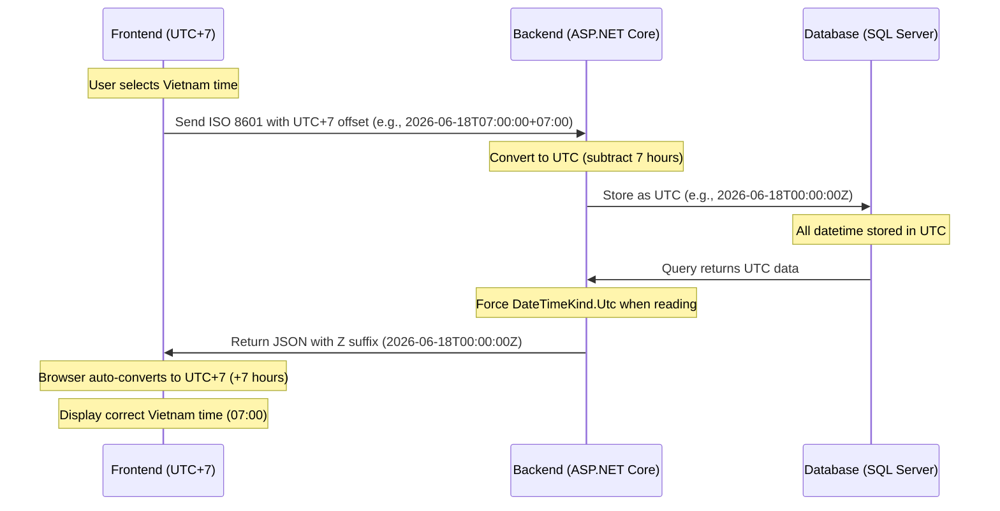

# Timezone Rules — English

> **Purpose:** To ensure consistent time display between Manager screens and Public screens, the entire system must strictly follow the timezone processing rules below.

## Why this matters

Vietnam uses **UTC+7** timezone. All cinema operations (showtimes, shifts) are planned in local Vietnam time. However, our backend stores all timestamps in **UTC** to avoid ambiguity. Converting between UTC and Vietnam time correctly is critical to avoid off-by-one-hour errors in showtime display.

## Flow Diagram



## 1. Frontend (React / TypeScript)

- **Sending to Backend**: Always send time with Vietnam timezone offset (`+07:00`). Do **not** strip the offset before sending.
- **Receiving from Backend**: Backend returns UTC with `Z` suffix. Use `new Date(utcString)` — the browser automatically converts to the user's local timezone (Vietnam = UTC+7).

## 2. Backend (ASP.NET Core)

- **Receiving Data**: ASP.NET Core Model Binder automatically converts received `+07:00` offset strings to UTC.
- **Storing in DB**: All datetime fields must be stored in UTC.
- **Reading from DB**: Entity Framework Core does not assign `DateTimeKind` by default. Use a **Value Converter** to force `DateTimeKind.Utc`:
  ```csharp
  var utcConverter = new ValueConverter<DateTime, DateTime>(
      v => v,
      v => DateTime.SpecifyKind(v, DateTimeKind.Utc));
  ```
- **Serializing to JSON**: The JSON serializer automatically appends the `Z` suffix for UTC times.

## 3. Quick Search Date Filter

- When filtering showtimes by date (e.g., `date=2026-06-18`), the frontend sends a `YYYY-MM-DD` string.
- Backend treats this as the start of the day in Vietnam time (`00:00:00 VN`), then converts to a UTC range (`17:00:00 UTC previous day` to `17:00:00 UTC same day`) before querying the database.
