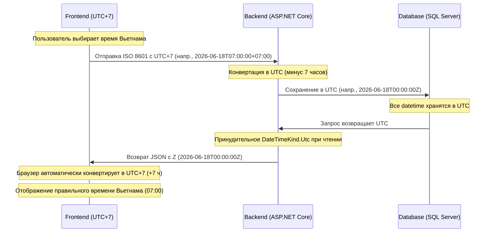

# Правила Часового Пояса — Русский

> **Цель:** Для обеспечения единообразного отображения времени между страницами менеджера и публичными страницами вся система должна строго соблюдать правила обработки часового пояса, описанные ниже.

## Почему это важно

Вьетнам использует часовой пояс **UTC+7**. Все операции кинотеатра (сеансы, смены) планируются по местному вьетнамскому времени. Однако наш бэкенд хранит все метки времени в формате **UTC**, чтобы избежать неоднозначности. Правильное преобразование между UTC и вьетнамским временем критически важно — ошибка в 1 час приведет к неправильному отображению расписания.

## Диаграмма потока



## 1. Frontend (React / TypeScript)

- **Отправка на Backend**: Всегда отправляйте время со смещением часового пояса Вьетнама (`+07:00`). **Не** удаляйте смещение перед отправкой.
- **Получение с Backend**: Backend возвращает UTC с суффиксом `Z`. Используйте `new Date(utcString)` — браузер автоматически конвертирует в местный часовой пояс (Вьетнам = UTC+7).

## 2. Backend (ASP.NET Core)

- **Получение данных**: Model Binder ASP.NET Core автоматически конвертирует строки со смещением `+07:00` в UTC.
- **Хранение в БД**: Все поля datetime должны храниться в UTC.
- **Чтение из БД**: Entity Framework Core по умолчанию не назначает `DateTimeKind`. Используйте **Value Converter** для принудительного `DateTimeKind.Utc`:
  ```csharp
  var utcConverter = new ValueConverter<DateTime, DateTime>(
      v => v,
      v => DateTime.SpecifyKind(v, DateTimeKind.Utc));
  ```
- **Сериализация в JSON**: JSON serializer автоматически добавляет суффикс `Z` для времени UTC.

## 3. Фильтр Поиска Сеансов по Дате

- При фильтрации сеансов по дате (напр., `date=2026-06-18`) фронтенд отправляет строку `YYYY-MM-DD`.
- Backend рассматривает эту дату как начало дня по вьетнамскому времени (`00:00:00 VN`), затем преобразует в диапазон UTC (`17:00:00 UTC предыдущего дня` до `17:00:00 UTC текущего дня`) перед выполнением запроса к БД.
