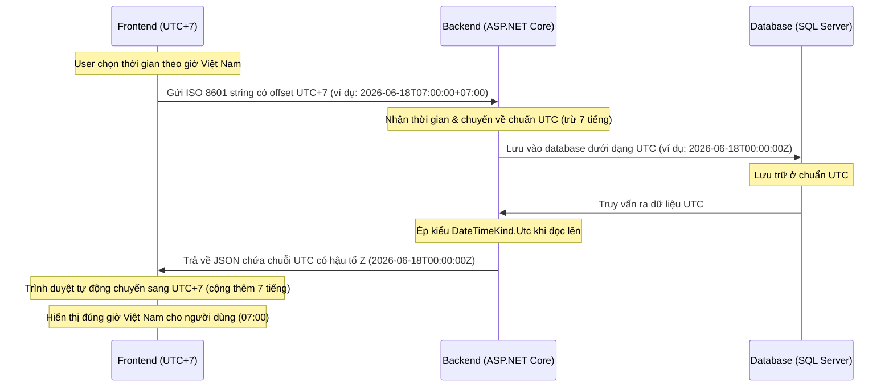

# Quy Tắc Bắt Buộc Về Múi Giờ (Timezone Rules)

Để tránh các sai lệch về thời gian hiển thị lịch chiếu giữa trang quản trị (Manager) và trang công chúng (Public), toàn bộ hệ thống phải tuân thủ nghiêm ngặt quy trình xử lý múi giờ sau đây:



## 1. Phía Frontend (React / TypeScript)
* **Gửi dữ liệu lên Backend**:
  - Khi gửi thời gian lên backend (ví dụ: tạo lịch chiếu mới), phải giữ nguyên múi giờ địa phương kèm offset của Việt Nam (`+07:00`).
  - **Không** tự ý chuyển đổi thời gian sang chuỗi cục bộ không chứa offset hoặc timezone khác trước khi gửi.
* **Nhận dữ liệu từ Backend**:
  - Backend trả về thời gian định dạng ISO chuẩn UTC với hậu tố `Z` (ví dụ: `2026-06-18T00:00:00Z`).
  - Frontend sử dụng `new Date(utcString)` để trình duyệt tự động chuyển đổi sang múi giờ của người dùng (Việt Nam UTC+7, tự động cộng thêm 7 tiếng khi hiển thị).

## 2. Phía Backend (ASP.NET Core)
* **Nhận Dữ Liệu**:
  - Khi Model Binder nhận thời gian từ request payload, ASP.NET Core sẽ tự động chuyển đổi sang UTC nếu chuỗi chứa offset `+07:00`.
* **Lưu Trữ Trong DB**:
  - Tất cả các trường ngày giờ trong database phải được lưu trữ theo chuẩn UTC.
* **Truy Vấn & Đọc Dữ Liệu**:
  - Entity Framework Core khi đọc dữ liệu kiểu `DateTime` hoặc `DateTime?` từ SQL Server mặc định không gán `DateTimeKind`. Phải áp dụng **Value Converter** trong `DbContext` để ép kiểu thành `DateTimeKind.Utc` cho tất cả các cột datetime:
    ```csharp
    var utcConverter = new ValueConverter<DateTime, DateTime>(
        v => v,
        v => DateTime.SpecifyKind(v, DateTimeKind.Utc));
    ```
  - Khi serialize sang JSON trả về cho Frontend, thư viện JSON serializer sẽ tự động thêm chữ `Z` vào cuối chuỗi thời gian biểu thị chuẩn UTC.

## 3. Quy Tắc Lọc Suất Chiếu Nhanh (Quick Search)
* Khi lọc nhanh suất chiếu theo ngày (ví dụ: `date=2026-06-18`), Frontend gửi chuỗi ngày dạng `YYYY-MM-DD`.
* Backend sẽ coi ngày này là bắt đầu ngày theo giờ Việt Nam (`00:00:00 VN`), sau đó chuyển đổi sang khoảng thời gian UTC tương ứng (`17:00:00 UTC` của ngày hôm trước tới `17:00:00 UTC` của ngày hôm sau) trước khi thực hiện truy vấn so sánh thời gian trong DB.
