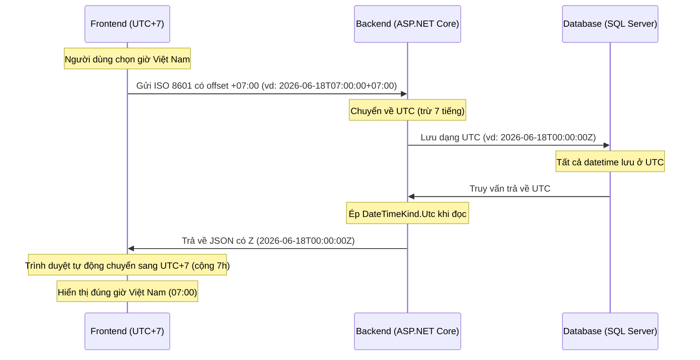

# Quy tắc Múi giờ — Tiếng Việt

> **Mục đích:** Để đảm bảo thời gian hiển thị nhất quán giữa trang quản trị và trang công chúng, toàn bộ hệ thống phải tuân thủ nghiêm ngặt quy trình xử lý múi giờ sau đây.

## Tại sao quy tắc này quan trọng?

Việt Nam sử dụng múi giờ **UTC+7**. Tất cả hoạt động của rạp phim (lịch chiếu, ca làm việc) đều được lên kế hoạch theo giờ Việt Nam. Tuy nhiên, backend của chúng tôi lưu tất cả dấu thời gian (timestamp) theo chuẩn **UTC** để tránh nhầm lẫn. Việc chuyển đổi đúng giữa UTC và giờ Việt Nam là rất quan trọng, nếu sai 1 tiếng sẽ hiển thị sai lịch chiếu.

## Sơ đồ luồng



## 1. Frontend (React / TypeScript)

- **Gửi lên Backend**: Luôn gửi thời gian kèm offset Việt Nam (`+07:00`). **Không** bỏ offset trước khi gửi.
- **Nhận từ Backend**: Backend trả về UTC với `Z`. Dùng `new Date(utcString)` — trình duyệt tự động chuyển sang giờ địa phương (Việt Nam = UTC+7).

## 2. Backend (ASP.NET Core)

- **Nhận dữ liệu**: ASP.NET Core Model Binder tự động chuyển chuỗi có offset `+07:00` sang UTC.
- **Lưu trong DB**: Tất cả trường datetime phải lưu ở UTC.
- **Đọc từ DB**: Entity Framework Core mặc định không gán `DateTimeKind`. Dùng **Value Converter** để ép thành `DateTimeKind.Utc`:
  ```csharp
  var utcConverter = new ValueConverter<DateTime, DateTime>(
      v => v,
      v => DateTime.SpecifyKind(v, DateTimeKind.Utc));
  ```
- **Serialize sang JSON**: JSON serializer tự động thêm hậu tố `Z` cho thời gian UTC.

## 3. Lọc Suất Chiếu Theo Ngày

- Khi lọc suất chiếu theo ngày (vd: `date=2026-06-18`), frontend gửi chuỗi `YYYY-MM-DD`.
- Backend coi ngày này là bắt đầu ngày theo giờ Việt Nam (`00:00:00 VN`), sau đó chuyển thành khoảng UTC (`17:00:00 UTC hôm trước` đến `17:00:00 UTC hôm sau`) trước khi truy vấn DB.
