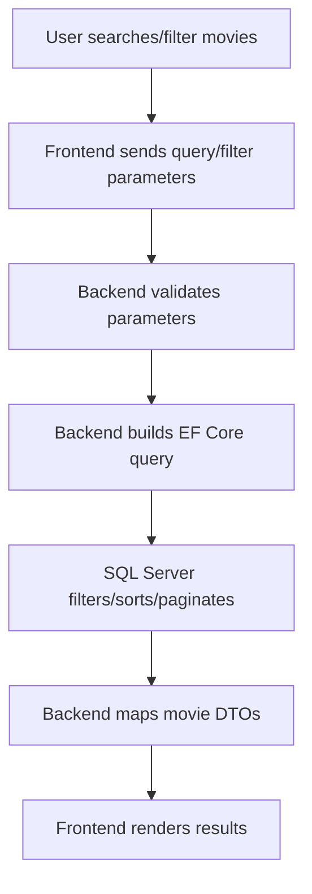

# Movie Search Algorithm

Movie search is primarily a structured SQL problem. It should not use embeddings unless the user asks by vague meaning or similarity.

## Standard Search Flow



## Typical Inputs

- keyword;
- genre;
- format;
- cinema;
- show date;
- now-showing or coming-soon;
- age rating;
- pagination and sorting.

## SQL-Oriented Query Shape

Representative pseudo-SQL:

```sql
SELECT
    m.MovieId,
    m.MovieName,
    m.MovieImageUrl,
    m.MovieBannerUrl,
    m.MovieDescription,
    m.MovieDuration,
    m.IsCommingSoon
FROM MovieInfo m
LEFT JOIN MovieGenreMovieInfo mg ON mg.MovieId = m.MovieId
LEFT JOIN MovieGenreInfo g ON g.MovieGenreId = mg.MovieGenreId
LEFT JOIN MovieFormatMovieInfo mf ON mf.MovieId = m.MovieId
LEFT JOIN MovieFormatInfo f ON f.MovieFormatId = mf.MovieFormatId
WHERE m.IsDeleted = 0
  AND (m.IsActive = 1 OR m.IsCommingSoon = 1)
  AND (@keyword IS NULL OR m.MovieName LIKE '%' + @keyword + '%')
  AND (@genreId IS NULL OR g.MovieGenreId = @genreId)
  AND (@formatId IS NULL OR f.MovieFormatId = @formatId)
ORDER BY m.MovieName
OFFSET @skip ROWS FETCH NEXT @take ROWS ONLY;
```

## Hot Movies Query

For "hot today" or "popular this week", use booking/view/rating metrics instead of embeddings.

```sql
SELECT TOP (10)
    m.MovieId,
    m.MovieName,
    COUNT(od.OrderDetailId) AS BookingCount
FROM MovieInfo m
JOIN MovieScheduleInfo s ON s.MovieId = m.MovieId
LEFT JOIN OrderDetails od ON od.MovieScheduleId = s.MovieScheduleId
LEFT JOIN OrderInfo o ON o.OrderId = od.OrderId
WHERE s.ShowDate = @date
  AND m.IsDeleted = 0
  AND m.IsActive = 1
  AND o.OrderStatus IN ('Booked', 'Completed')
GROUP BY m.MovieId, m.MovieName
ORDER BY BookingCount DESC;
```

## When To Use Semantic Search

Use semantic search only for requests like:

- "movies with the same feeling as Interstellar";
- "something funny but not childish";
- "movies similar to a dark mystery thriller";
- "films people describe as slow or confusing".

Those requests do not map cleanly to exact SQL fields, so vector search can help.
