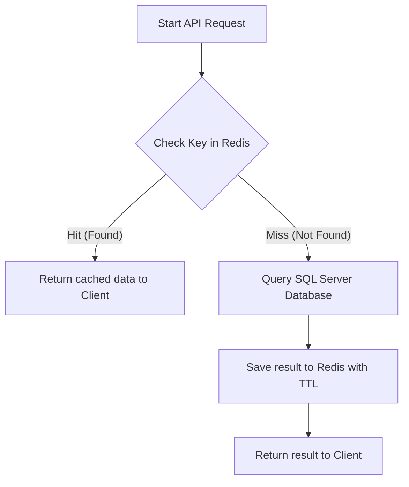

# Redis Caching Algorithms & Strategies

This document describes the caching strategy, storage schemas, and invalidation algorithms implemented in the Galaxiad Cinema Core platform.

---

## 1. Design Goals

- **Latency Minimization**: Serve static or slow-changing catalogs (e.g. movies, user profiles, order histories) directly from Redis in-memory storage rather than executing SQL Server queries.
- **Database Load Reduction**: Prevent expensive aggregation queries (e.g., `AVG()` ratings, reviews counts, pagination queries) from hitting SQL Server.
- **Data Consistency**: Ensure client interfaces display fresh data using an **Active Invalidation** mechanism triggered by admin write events or customer checkouts.

---

## 2. Cache-Aside Pattern (Lazy Loading)

All data retrieval APIs apply the Cache-Aside pattern:



### Key Schemas and Time-To-Live (TTL)

| Cached Data | Scope | Redis Key Format | TTL |
| --- | --- | --- | --- |
| **Now Showing Movies** | Paginated list | `movies:showing:keyword:{keyword}:page:{pageIndex}:size:{pageSize}` | 30 minutes |
| **Coming Soon Movies** | Paginated list | `movies:upcoming:keyword:{keyword}:page:{pageIndex}:size:{pageSize}` | 30 minutes |
| **Movie Details** | Detailed metadata + Ratings | `movie:detail:{movieId}` | 30 minutes |
| **User Order History** | Booking history list | `user:bookings:{userId}` | 30 minutes |
| **User Profile** | Details + Reward points | `user:profile:{userId}` | 30 minutes |

---

## 3. Active Invalidation Algorithms

To prevent stale cache data, the backend automatically clears matching keys when write events occur:

```text
               [ Write Event ]
                      │
         ┌────────────┼────────────┐
         ▼            ▼            ▼
   [ Movie Edit ] [ Review Post ] [ New Booking ]
         │            │            │
         ▼            ▼            ▼
     Clear Cache  Clear Cache  Clear Cache
     Home lists   Movie Detail  User Bookings
```

1. **Movie or Showtime Updates (Admin Portal)**:
   - Triggers `ClearMovieCatalogCacheAsync()`.
   - Scans and deletes wildcard patterns (`movies:showing:*` and `movies:upcoming:*`) to clear paginated home page listings.
   - Deletes the specific movie details key `movie:detail:{movieId}`.

2. **Customer Reviews and Moderation Approvals**:
   - Posting a comment or changing comment status to `Visible`/`Deleted` changes the movie's average rating (`AverageRating`) and review count.
   - Workflow: Save review/comment to SQL database ➔ call `ClearMovieDetailCacheAsync(movieId)`.
   - The subsequent movie detail request recalculates the metrics and re-warms the cache.

3. **New Ticket Bookings / Successful VNPay Payments**:
   - A customer booking increments their tickets list and alters their `RewardPoints`.
   - Workflow: Call `ClearUserCacheAsync(userId)` to evict both `user:bookings:{userId}` and `user:profile:{userId}`.

---

## 4. Fault Tolerance

- All Redis cache read, write, and invalidation calls are wrapped in robust **`try-catch`** blocks.
- This ensures that transient Redis network drops or service timeouts do not crash the primary API endpoints or block critical financial transactions (like booking checkouts).
