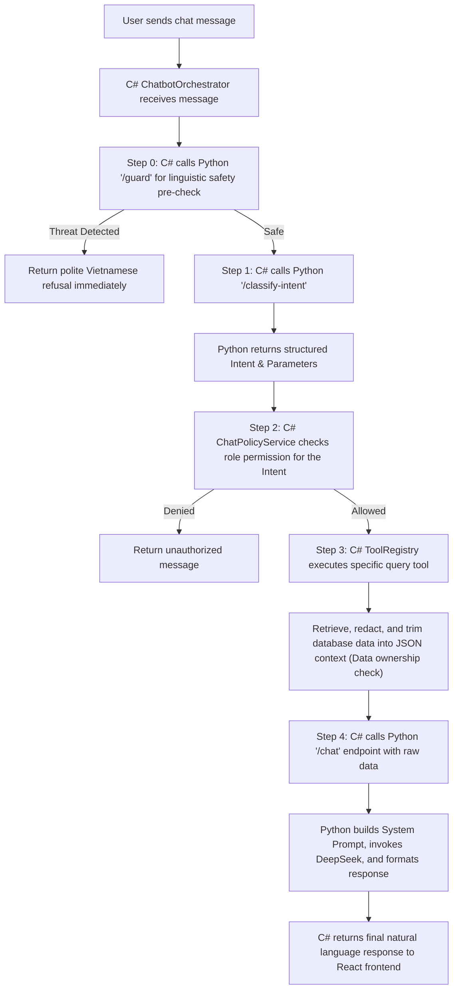

# Role-Aware Chatbot Implementation

This document describes the implementation of the personalized chatbot with strict role-based data boundaries, automated intent classification, and a multi-layered security architecture.

## Design Principles

1. **LLM Does Not Access DB Directly**: The LLM never writes or executes arbitrary SQL queries.
2. **Deterministic Authorization**: The .NET backend validates roles and permissions before executing any tool or returning context.
3. **Data Redaction & Trimming**: Predefined C# tools retrieve only the minimum required fields from the database and format them as strict JSON context.
4. **Python Safety & Guardrail Ownership**: Linguistic threat detection (prompt injection, code misuse, system probing) is delegated to the Python AI service, while data-level authorization remains strictly on the C# backend.

---

## Architecture Flow

---

## Role Scopes & Predefined Intents

| Role | Predefined Intent | C# Query Tool | Data Scope / Action |
| --- | --- | --- | --- |
| **Guest** / All | `GetMovies` | `GetMoviesTool` | Public movie listings, genres, active status. |
| **Guest** / All | `GetShowtimes` | `GetShowtimesTool` | Showtimes, schedules, auditorium formats. |
| **Guest** / All | `GetPromotions` | `GetPromotionsTool` | Publicly active promotions, deals, and vouchers. |
| **Guest** / All | `GetCinemaLocations` | `GetCinemaLocationsTool` | Public cinema locations, addresses, filtered by city. |
| **Guest** / All | `GetAvailableSeats` | `GetAvailableSeatsTool` | Safe seat availability check via movie, date, and time. |
| **Guest** / All | `SearchMoviesSemantic` | `SearchMoviesSemanticTool` | Semantic natural language search powered by Qdrant. |
| **Customer** | `GetMyBookings` | `GetMyBookingsTool` | Customer's own bookings, order dates, and ticket status. |
| **Customer** | `GetBookingStatus` | `GetBookingStatusTool` | Query order status by Booking Code (`GXD-XXXXXXXX`). |
| **TheaterManager** / Admin | `GetCinemaStatistics` | `GetCinemaStatisticsTool` | Revenue metrics, tickets sold, active users. |
| **TheaterManager** / Admin | `GetShowtimeRecommendations` | `GetShowtimeRecommendationsTool` | AI showtime planner & schedule suggestions. |
| **Admin** | `GetSystemAuditLogs` | `GetSystemAuditLogsTool` | Staff activity and operational audit logs. |
| **All** | `GeneralFAQ` | *None* | Basic greetings, Q&A, fallback responses. |

---

## Three-Layered Security Architecture

The system enforces safety across three distinct boundaries:

### Layer 1: Linguistic Security (Python `/guard` Pre-Check)
Before classification or database queries begin, the user's raw message is evaluated by an LLM-driven security gate in Python running at `temperature=0.0`:
- **Prompt Injection Prevention**: Detects and blocks attempts to hijack AI system instructions (e.g., `"Ignore previous instructions..."`).
- **Sensitive Data Fishing**: Blocks explicit requests for bulk user details, payment records, or databases.
- **LLM Misuse Protection**: Detects and refuses non-cinema requests like writing code, solving math formulas, or translating unrelated texts.
- **System Probing**: Blocks requests searching for internal system prompts, database schemas, or API keys.
- **Off-Topic / Harmful Filters**: Restricts bạo lực, chính trị, or extreme profanity.

### Layer 2: Structural Policy Gate (`ChatPolicyService` in C#)
Once the intent is determined, the backend checks the authenticated role:
- Guest users cannot query `GetMyBookings`, `GetBookingStatus`, `GetCinemaStatistics`, or `GetSystemAuditLogs`.
- Role-based checking blocks customers from accessing audit logs or statistics.

### Layer 3: Data-Level & Ownership Security (Predefined C# Tools)
Each query tool strictly filters output fields and executes runtime ownership validation:
- **`GetBookingStatusTool`**: Checks if the booking's `UserId` matches the caller's authenticated `UserId`.
- **Anonymized Responses**: If the lookup code does not exist or does not belong to the user, the tool returns a generic `"Booking not found"` error (Security by Obscurity) to prevent order enumeration attacks.

---

## Intent Classification & Semantic Search Algorithms

### 1. Zero-Shot Intent Classification (`/classify-intent`)
The Python AI service acts as a semantic classification engine:
- Maps natural language inquiries into one of the 12 supported intents.
- Extracts arguments (such as converting `"ngày mai"` into `yyyy-MM-dd` and `"Avengers"` into `movieName`).
- Validates classification against a strict C# fallback whitelist.

### 2. Hybrid Semantic Search (`SearchMoviesSemanticTool`)
When users ask open-ended questions like `"tìm phim phiêu lưu không gian buồn"`, the system bypasses rigid SQL genre mapping:
1. Calls Qdrant vector database via `/recommend` using a descriptive text embedding generated from the query.
2. Returns a list of candidate movie IDs ranked by cosine similarity distance.
3. C# fetches the corresponding movies from SQL Server and applies temporal filters (Now Showing/Coming Soon).
4. Retains Qdrant similarity scores and orders the final results accordingly.

---

## Component Map

### ASP.NET Core Backend
- **`ChatbotController`**: Entry point handling JWT validation and starting the orchestration.
- **`ChatbotOrchestrator`**: Coordinates `/guard`, `/classify-intent`, `ChatPolicyService` validation, `ChatToolRegistry` invocation, and `/chat`.
- **`IChatToolRegistry`**: Maps string intents to target `IChatTool` instances.
- **`DeepSeekChatLlmClient`**: Handles downstream calls to `/chat` and `/guard`.
- **`AiSemanticSearchClient`**: Calls `/recommend` for semantic movie suggestions.

### FastAPI AI Service
- **`/guard`**: Zero-shot safety filter analyzing incoming messages.
- **`/classify-intent`**: Returns structured JSON intents & parameters.
- **`/recommend`**: Conducts Qdrant vector queries.
- **`/chat`**: Performs final natural-language message synthesis.
