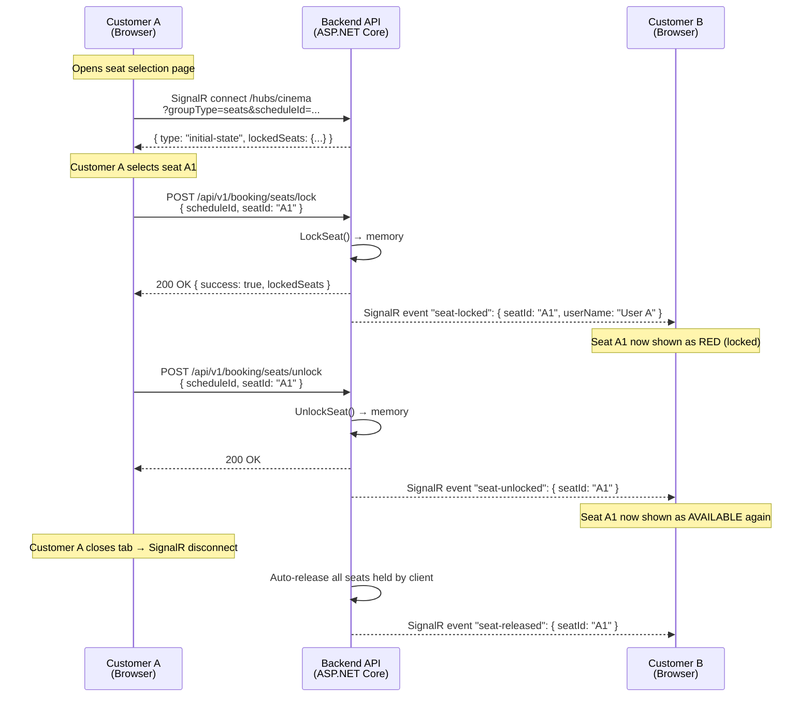

# Seat Locking Real-time (Temporary Seat Hold)

> **Why this matters:** When a customer selects a seat on the booking screen, that seat must be temporarily locked so that other customers cannot select the same seat. Without this mechanism, two people could book the same seat — causing duplicate bookings, customer disputes, and loss of trust in the cinema.

---

## How It Works (Non-Technical Explanation)

When **you** select a seat on the screen, the system immediately tells **everyone else** viewing the same showtime that this seat is now taken (shown in red). If you do not complete payment within **10 minutes**, the seat is automatically released for others to book. If you close your browser tab, the system also releases your seats within seconds.

**Think of it like a shopping cart:** you put an item in your cart, it's reserved for you for a limited time, then goes back on the shelf if you don't check out.

---

## Technical Architecture: SignalR Hub

We chose **SignalR** for all real-time communication. It provides a unified bidirectional channel with automatic reconnection, group management, and transport fallback.

### Why SignalR?

| Aspect | SignalR (Selected) | Raw WebSocket (Previous) |
|--------|-------------------|--------------------------|
| Reconnect | ✅ Built-in (`withAutomaticReconnect`) | ❌ Manual implementation |
| Group management | ✅ Built-in (`Groups.AddToGroupAsync`) | ❌ Manual `ConcurrentDictionary` |
| Transport | WebSocket + SSE + Long Polling (auto-fallback) | WebSocket only |
| Scaling (multi-instance) | ✅ Redis Backplane support | ❌ Requires custom solution |
| Client library | ✅ `@microsoft/signalr` (npm) | ❌ Native WebSocket API |
| Hub negotiation | ✅ Automatic protocol negotiation | ❌ N/A |
| **Our use case** | **Unified Hub for seats, payment, and group booking** | Was simpler but missing reconnect/group features |

### Three Channel Types

The system uses a single **unified Hub** (`/hubs/cinema`) with query-based routing:

| Channel | `groupType` | Purpose |
|---------|-------------|---------|
| **Seats** | `seats` | Real-time seat state broadcast per `scheduleId` |
| **Payment** | `payment` | Payment result notification per `orderId` |
| **Group** | `group` | Group booking state/vote/chat broadcast per `groupSessionId` |

---

## Flow Diagram



---

## API Endpoints

| Method | Endpoint | Description |
|--------|----------|-------------|
| `POST` | `/api/v1/booking/seats/lock` | Lock a seat temporarily |
| `POST` | `/api/v1/booking/seats/unlock` | Release a locked seat |
| `GET` | `/hubs/cinema` | **SignalR Hub** — real-time updates (query params: `groupType=seats&scheduleId=...`) |

### POST /api/v1/booking/seats/lock

**Request:**
```json
{
  "scheduleId": "guid",
  "seatId": "A1",
  "userName": "Nguyen Van A",
  "clientId": "seat-client-uuid"
}
```

**Response (200 — success):**
```json
{
  "success": true,
  "message": "Seat locked successfully",
  "lockedSeats": { "A1": "Nguyen Van A", "A2": "Tran Van B" }
}
```

**Response (409 — conflict):**
```json
{
  "success": false,
  "message": "Seat is locked by another user",
  "lockedSeats": { "A1": "Tran Van B" }
}
```

### POST /api/v1/booking/seats/unlock

**Request:**
```json
{
  "scheduleId": "guid",
  "seatId": "A1",
  "clientId": "seat-client-uuid"
}
```

**Response:**
```json
{
  "success": true,
  "message": "Seat unlocked successfully",
  "lockedSeats": {}
}
```

### SignalR Hub at `/hubs/cinema`

The Hub replaces the old raw WebSocket endpoint (`GET /seats/ws/{scheduleId}`, which is now **removed**).

**Connection:**
```
/hubs/cinema?groupType=seats&scheduleId={scheduleId}&clientId={clientId}
```

**Features:**
- Built-in automatic reconnection (retry delays: 0s, 2s, 5s, 10s, 30s)
- No authentication required for seat connections
- `clientId` query parameter for identifying the client across reconnects
- Automatic cleanup on disconnect: all seats held by the client are released

---

## SignalR Events (Server → Client)

| Event Name | When It Fires | Data |
|------------|--------------|------|
| `initial-state` | Client first connects | `{ lockedSeats: { "a1": "User" } }` |
| `seat-locked` | Someone locked a seat | `{ seatId: "A1", userName: "User", lockedSeats: {...} }` |
| `seat-unlocked` | Someone released a seat | `{ seatId: "A1", lockedSeats: {...} }` |
| `seat-released` | Client disconnect cleanup | `{ seatId: "A1", lockedSeats: {...} }` |

> **Note:** Unlike raw WebSocket which wrapped all messages in a `{ type: "...", data: ... }` envelope, SignalR events are **named events** (`connection.on('seat-locked', ...)`). The event name IS the type.

---

## Automatic Cleanup

| Situation | What Happens | Mechanism |
|-----------|-------------|-----------|
| **No payment in 10 min** | Pending order auto-cancelled, seats released | Hangfire recurring job (runs every 5 min) |
| **Client tab closes** | All seats held by that client released | SignalR `OnDisconnectedAsync` → `ReleaseSeatsByClient()` |
| **Server restart** | Clients auto-reconnect via SignalR built-in retry | SignalR client detects disconnect → retry with backoff |

---

## Key Technical Components

| Component | Location | Role |
|-----------|----------|------|
| `CinemaHub` (Hub) | `Cinema.Api/Hubs/` | **Single unified SignalR Hub** — handles seat/payment/group connections, `OnConnectedAsync` routing, `OnDisconnectedAsync` cleanup |
| `SignalRSeatBroadcaster` | `Cinema.Api/Hubs/` | SignalR implementation of `ISeatBroadcaster` — broadcasts seat events to a SignalR group (`seats-{scheduleId}`) |
| `SignalRGroupBroadcaster` | `Cinema.Api/Hubs/` | SignalR implementation of `IGroupBroadcaster` — broadcasts group events to a SignalR group (`group-{groupSessionId}`) |
| `SeatLockManager` | `Cinema.Infrastructure/ExternalServices/Notifications/` | Atomic seat lock state management (`ConcurrentDictionary<string, LockEntry>`) |
| `SeatLockerNotificationService` | `Cinema.Api/Hubs/` | Bridge between Hangfire background job and SignalR broadcasters |
| `PendingOrderCancellationJob` | `Cinema.Infrastructure/BackgroundJobs/` | Auto-cancels orders > 10 min pending |
| `signalrClient` factory | `apps/frontend/src/api/signalrClient.ts` | Creates `HubConnection` instances for seats, payment, and group channels |
| `useSeatWs` hook | `apps/frontend/src/hooks/useSeatWs.ts` | React hook wrapping SignalR + lock/unlock API |

### Frontend Integration (React)

The `useSeatWs` hook uses `@microsoft/signalr` under the hood:

```typescript
import { useSeatWs } from '../../hooks/useSeatWs';

function SeatMap({ scheduleId }: { scheduleId: string }) {
  const { lockedSeats, lockSeat, unlockSeat, isConnected } = useSeatWs(scheduleId);
  
  // lockedSeats: Record<string, string> — { "a1": "UserName", ... }
  // lockSeat(seatId, userName) → Promise<boolean>
  // unlockSeat(seatId) → Promise<boolean>
  // isConnected: boolean — SignalR connection status
}
```

**Important:** The hook normalizes all seat IDs to lowercase for consistent key matching.

---

## Error Handling

| Scenario | Behavior |
|----------|----------|
| **Network loss** | SignalR fires `onreconnecting` → `isConnected` becomes `false`; auto-reconnect retries (0s, 2s, 5s, 10s, 30s) |
| **Server restart** | SignalR fails to reconnect → `onclose` fires; `useSeatWs` cleanup releases all client's seats via HTTP unlock |
| **Race condition (2 users lock same seat)** | Atomic `TryAdd` in `SeatLockManager` — only 1 succeeds, the other gets `409 Conflict` |
| **User opens multiple tabs** | Each tab has its own `clientId`. Locking the same seat from different tabs counts as "another user" |
| **Tab forgotten (idle)** | SignalR connection times out → `OnDisconnectedAsync` → cleanup releases all seats for that client |
