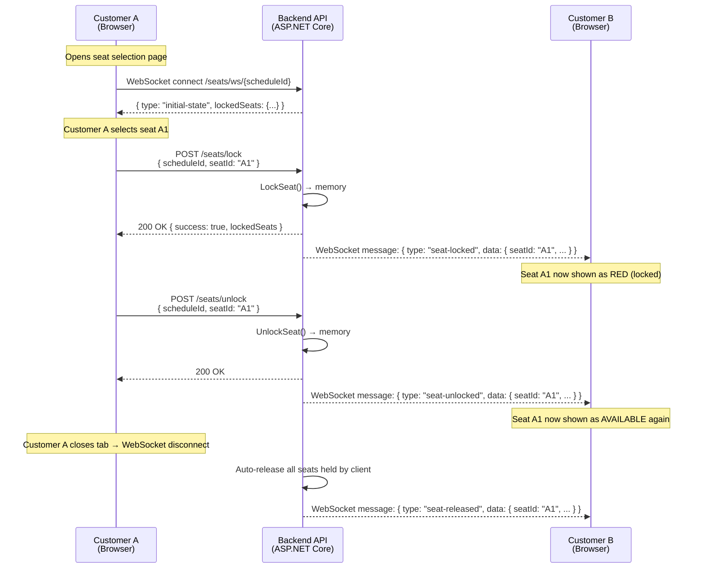

# Seat Locking Real-time (Temporary Seat Hold)

> **Why this matters:** When a customer selects a seat on the booking screen, that seat must be temporarily locked so that other customers cannot select the same seat. Without this mechanism, two people could book the same seat — causing duplicate bookings, customer disputes, and loss of trust in the cinema.

---

## How It Works (Non-Technical Explanation)

When **you** select a seat on the screen, the system immediately tells **everyone else** viewing the same showtime that this seat is now taken (shown in red). If you do not complete payment within **10 minutes**, the seat is automatically released for others to book. If you close your browser tab, the system also releases your seats within seconds.

**Think of it like a shopping cart:** you put an item in your cart, it's reserved for you for a limited time, then goes back on the shelf if you don't check out.

---

## Technical Architecture: Raw WebSocket + HTTP POST

We chose **raw WebSocket** over SignalR. Here's why:

- **WebSocket** is a bidirectional persistent connection between server and client. The server pushes real-time seat state changes without the client asking repeatedly.
- **HTTP POST** is used for client → server actions (lock/unlock a seat). The WebSocket connection primarily handles **server → client** broadcasts (state change notifications).
- **In-memory storage:** Lock data is stored in the server's RAM (`ConcurrentDictionary`), not in a database. If the server restarts, locks are lost — but this is acceptable because locks only last a maximum of 10 minutes. When clients reconnect, they receive the latest state.

### Why raw WebSocket instead of SignalR?

| Aspect | Raw WebSocket + HTTP POST | SignalR |
|--------|---------------------------|---------|
| Complexity | Minimal — uses `System.Net.WebSockets` directly | Higher — hub negotiation, protocol abstraction |
| Dependency | No extra NuGet package | Requires `Microsoft.AspNetCore.SignalR` |
| Bidirectional | Yes (we only use server→client) | Yes (built-in) |
| Transport fallback | None (WebSocket only) | Auto-fallback to SSE, long polling |
| **Our choice** | ✅ **Selected** | ❌ Avoided for simplicity |

---

## Flow Diagram



---

## API Endpoints

| Method | Endpoint | Description |
|--------|----------|-------------|
| `POST` | `/api/v1/booking/seats/lock` | Lock a seat temporarily |
| `POST` | `/api/v1/booking/seats/unlock` | Release a locked seat |
| `GET` | `/api/v1/booking/seats/ws/{scheduleId}` | WebSocket endpoint — receive real-time updates (no auth required) |
| `GET` | `/api/v1/booking/seats/state/{scheduleId}` | HTTP fallback — get current locked state (for polling or initial load) |

### POST /api/v1/booking/seats/lock

**Request:**
```json
{
  "scheduleId": "guid",
  "seatId": "A1",
  "userName": "Nguyen Van A",
  "clientId": "seat-client-uuid"
}
```

**Response (200 — success):**
```json
{
  "success": true,
  "message": "Seat locked successfully",
  "lockedSeats": { "A1": "Nguyen Van A", "A2": "Tran Van B" }
}
```

**Response (409 — conflict):**
```json
{
  "success": false,
  "message": "Seat is locked by another user",
  "lockedSeats": { "A1": "Tran Van B" }
}
```

### POST /api/v1/booking/seats/unlock

**Request:**
```json
{
  "scheduleId": "guid",
  "seatId": "A1",
  "clientId": "seat-client-uuid"
}
```

**Response:**
```json
{
  "success": true,
  "message": "Seat unlocked successfully",
  "lockedSeats": {}
}
```

### GET /api/v1/booking/seats/ws/{scheduleId}

This is a raw WebSocket endpoint. Opens a long-lived persistent connection. No authentication required.

**Supports:**
- `clientId` query parameter for identifying the client across reconnects
- Automatic cleanup on disconnect (all seats held by the client are released)

---

## WebSocket Messages

The WebSocket sends JSON messages **from server to client**:

| Message Type | When It Fires | Data |
|-------------|--------------|------|
| `initial-state` | Client first connects | `{ type: "initial-state", lockedSeats: { "A1": "User" } }` |
| `seat-locked` | Someone locked a seat | `{ type: "seat-locked", data: { seatId: "A1", userName: "User", lockedSeats: {...} } }` |
| `seat-unlocked` | Someone released a seat | `{ type: "seat-unlocked", data: { seatId: "A1", lockedSeats: {...} } }` |
| `seat-released` | Client disconnect cleanup | `{ type: "seat-released", data: { seatId: "A1", lockedSeats: {...} } }` |

---

## Automatic Cleanup

| Situation | What Happens | Mechanism |
|-----------|-------------|-----------|
| **No payment in 10 min** | Pending order auto-cancelled, seats released | Hangfire recurring job (runs every 5 min) |
| **Client tab closes** | All seats held by that client released | WebSocket disconnect → `RemoveConnection()` + `ReleaseSeatsByClient()` |
| **Server restart** | All in-memory locks lost → clients reconnect | Clients detect disconnect via `onclose` → browser can auto-reconnect |

---

## Key Technical Components

| Component | Location | Role |
|-----------|----------|------|
| `SeatWsManager` (Singleton) | `Cinema.Infrastructure/ExternalServices/Notifications/` | In-memory seat lock state + WebSocket subscriber management (`ConcurrentDictionary<string, ConcurrentDictionary<string, WebSocket>>`) |
| `SeatLockManager` | `Cinema.Infrastructure/ExternalServices/Notifications/` | Atomic seat lock state management (`ConcurrentDictionary<string, LockEntry>`) |
| `BookingController.GetSeatWebSocket` | `Cinema.Api/Controllers/Customer/Booking/` | WebSocket accept + initial state + read loop |
| `SeatLockerNotificationService` | `Cinema.Api/Hubs/` | Bridge between Hangfire job and `SeatWsManager` |
| `PendingOrderCancellationJob` | `Cinema.Infrastructure/BackgroundJobs/` | Auto-cancels orders > 10 min pending |
| `useSeatWs` hook | `apps/frontend/src/hooks/useSeatWs.ts` | React hook wrapping WebSocket + lock/unlock API |

### Frontend Integration (React)

The `useSeatWs` hook provides everything you need:

```typescript
import { useSeatWs } from '../../hooks/useSeatWs';

function SeatMap({ scheduleId }: { scheduleId: string }) {
  const { lockedSeats, lockSeat, unlockSeat, isConnected } = useSeatWs(scheduleId);
  
  // lockedSeats: Record<string, string> — { "a1": "UserName", ... }
  // lockSeat(seatId, userName) → Promise<boolean>
  // unlockSeat(seatId) → Promise<boolean>
  // isConnected: boolean — WebSocket connection status
}
```

**Important:** The hook normalizes all seat IDs to lowercase for consistent key matching.

---

## Error Handling

| Scenario | Behavior |
|----------|----------|
| **Network loss** | WebSocket fires `onclose` → `isConnected` becomes `false`; component can attempt reconnect |
| **Server restart** | All locks lost; clients reconnect and get fresh state via `initial-state` message |
| **Race condition (2 users lock same seat)** | Atomic `TryAdd` in `SeatLockManager` — only 1 succeeds, the other gets `409 Conflict` |
| **User opens multiple tabs** | Each tab has its own `clientId`. Locking the same seat from different tabs counts as "another user" |
| **Tab forgotten (idle)** | WebSocket connection times out → server `ReceiveAsync` throws → cleanup releases all seats for that client |
