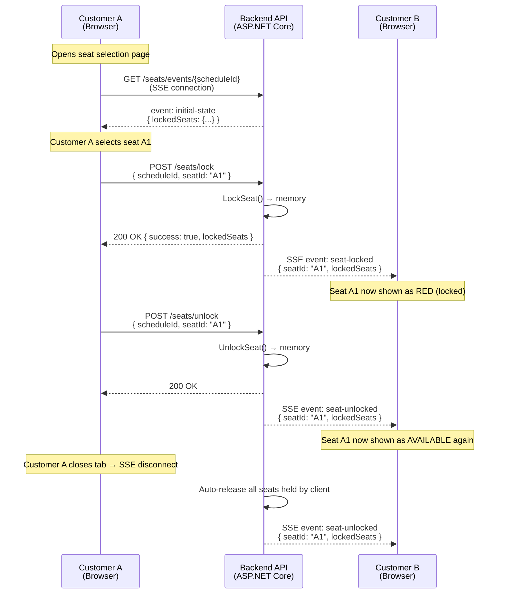

# Seat Locking Real-time (Temporary Seat Hold)

> **Why this matters:** When a customer selects a seat on the booking screen, that seat must be temporarily locked so that other customers cannot select the same seat. Without this mechanism, two people could book the same seat — causing duplicate bookings, customer disputes, and loss of trust in the cinema.

---

## How It Works (Non-Technical Explanation)

When **you** select a seat on the screen, the system immediately tells **everyone else** viewing the same showtime that this seat is now taken (shown in red). If you do not complete payment within **10 minutes**, the seat is automatically released for others to book. If you close your browser tab, the system also releases your seats within seconds.

**Think of it like a shopping cart:** you put an item in your cart, it's reserved for you for a limited time, then goes back on the shelf if you don't check out.

---

## Technical Architecture: SSE + HTTP POST

We chose **SSE (Server-Sent Events)** over WebSocket (SignalR). Here's why:

- **SSE** is a one-way channel from server → client. The server pushes real-time data without the client asking repeatedly.
- **HTTP POST** is used for client → server actions (lock/unlock a seat). SSE cannot send data from client to server, so we use regular REST API calls for that.
- **In-memory storage:** Lock data is stored in the server's RAM (memory), not in a database. If the server restarts, locks are lost — but this is acceptable because locks only last a maximum of 10 minutes. When clients reconnect, they receive the latest state.

### Why SSE instead of WebSocket (SignalR)?

| Aspect | SSE + HTTP POST | SignalR / WebSocket |
|--------|----------------|-------------------|
| Complexity | Simple — uses browser's native `EventSource` API | Complex — needs WebSocket negotiation, fallback transports |
| Auto-reconnect | Built-in (browser handles it) | Manual implementation needed |
| CDN / Proxy friendly | Works through most CDNs (e.g., Cloudflare) | Some proxies block WebSocket |
| Scalability | No sticky session needed (can broadcast) | Needs Redis backplane for multi-instance |
| Bidirectional | No (uses HTTP POST for that) | Yes (built-in) |
| **Our choice** | ✅ **Selected** | ❌ Avoided |

---

## Flow Diagram



---

## API Endpoints

| Method | Endpoint | Description |
|--------|----------|-------------|
| `POST` | `/api/v1/booking/seats/lock` | Lock a seat temporarily |
| `POST` | `/api/v1/booking/seats/unlock` | Release a locked seat |
| `GET` | `/api/v1/booking/seats/events/{scheduleId}` | SSE stream — receive real-time updates (no auth required) |

### POST /api/v1/booking/seats/lock

**Request:**
```json
{
  "scheduleId": "guid",
  "seatId": "A1",
  "userName": "Nguyen Van A"
}
```

**Response (200 — success):**
```json
{
  "success": true,
  "message": "Seat locked successfully",
  "lockedSeats": { "A1": "Nguyen Van A", "A2": "Tran Van B" }
}
```

**Response (409 — conflict):**
```json
{
  "success": false,
  "message": "Seat is locked by another user",
  "lockedSeats": { "A1": "Tran Van B" }
}
```

### POST /api/v1/booking/seats/unlock

**Request:**
```json
{
  "scheduleId": "guid",
  "seatId": "A1"
}
```

**Response:**
```json
{
  "success": true,
  "message": "Seat unlocked successfully",
  "lockedSeats": {}
}
```

### GET /api/v1/booking/seats/events/{scheduleId}

This is an SSE (text/event-stream) endpoint. Opens a long-lived connection. No authentication required.

**Supports:**
- Auto-reconnect via `Last-Event-ID` header
- Heartbeat every 15 seconds (`: heartbeat`)

---

## SSE Events

| Event Type | When It Fires | Data |
|-----------|--------------|------|
| `initial-state` | Client first connects | `{ event: "initial-state", lockedSeats: { "A1": "User" } }` |
| `seat-locked` | Someone locked a seat | `{ event: "seat-locked", seatId: "A1", userName: "User", lockedSeats: {...} }` |
| `seat-unlocked` | Someone released a seat | `{ event: "seat-unlocked", seatId: "A1", lockedSeats: {...} }` |

---

## Automatic Cleanup

| Situation | What Happens | Mechanism |
|-----------|-------------|-----------|
| **No payment in 10 min** | Pending order auto-cancelled, seats released | Hangfire recurring job (runs every 5 min) |
| **Client tab closes** | All seats held by that client released | SSE disconnect → `ReleaseSeatsByClient()` |
| **Server restart** | All in-memory locks lost → clients reconnect | `EventSource` auto-reconnect → receives fresh state |

---

## Key Technical Components

| Component | Location | Role |
|-----------|----------|------|
| `SeatSseManager` (Singleton) | `Cinema.Infrastructure/ExternalServices/Notifications/` | In-memory seat lock state + SSE subscriber management |
| `BookingController` | `Cinema.Api/Controllers/Customer/Booking/` | Exposes lock/unlock/events endpoints |
| `SeatLockerNotificationService` | `Cinema.Api/Hubs/` | Bridge between Hangfire job and `SeatSseManager` |
| `PendingOrderCancellationJob` | `Cinema.Infrastructure/BackgroundJobs/` | Auto-cancels orders > 10 min pending |
| `useSeatSse` hook | `apps/frontend/src/hooks/` | React hook wrapping SSE + lock/unlock API |

### Frontend Integration (React)

The `useSeatSse` hook provides everything you need:

```typescript
import { useSeatSse } from '../../hooks/useSeatSse';

function SeatMap({ scheduleId }: { scheduleId: string }) {
  const { lockedSeats, lockSeat, unlockSeat, isConnected } = useSeatSse(scheduleId);
  
  // lockedSeats: Record<string, string> — { "A1": "UserName", ... }
  // lockSeat(seatId, userName) → Promise<boolean>
  // unlockSeat(seatId) → Promise<boolean>
  // isConnected: boolean — SSE connection status
}
```

---

## Error Handling

| Scenario | Behavior |
|----------|----------|
| **Network loss** | SSE auto-reconnects via browser's built-in `EventSource` reconnection |
| **Server restart** | All locks lost; clients reconnect and get fresh state via `initial-state` event |
| **Race condition (2 users lock same seat)** | Atomic `TryAdd` — only 1 succeeds, the other gets `409 Conflict` |
| **User opens multiple tabs** | Each tab has its own `clientId`. Locking the same seat from different tabs counts as "another user" |
| **Tab forgotten (idle)** | SSE connection times out → server releases all seats for that client |
