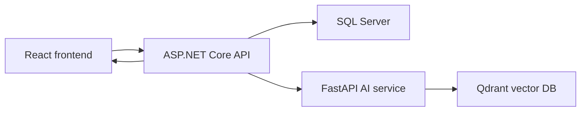

# Movie Recommendation Algorithm

The recommendation system combines deterministic behavior profiling in the backend with semantic vector search in the AI service.

## Architecture



SQL Server is the source of truth. Qdrant stores persistent movie vectors only. User profile vectors are generated per request and are not stored.

## Hybrid Strategy (Cơ chế Lai - Embedding vs. Fallback)

Hệ thống gợi ý phim hoạt động linh hoạt theo hai cơ chế tùy thuộc vào trạng thái cấu hình của hệ thống AI:

1. **Khi có Embedding (Gemini API Key hợp lệ)**:
   Hệ thống hiểu ngữ nghĩa sở thích của người dùng bằng cách phân tích văn bản mô tả (được tổng hợp từ khảo sát, lịch sử xem, lịch sử đặt vé, đánh giá) và chuyển thành vector 768 chiều. Sau đó, hệ thống sử dụng cơ sở dữ liệu vector Qdrant để so khớp khoảng cách và tìm các bộ phim tương ứng có nội dung tương đồng ngữ nghĩa nhất.

2. **Khi không có Embedding (Cơ chế Dự phòng - Fallback)**:
   Hệ thống chạy thuật toán thống kê hành vi trực tiếp bằng SQL Server cục bộ. Thuật toán này tự động loại bỏ các bộ phim người dùng đã từng tương tác (xem, đặt vé, rate tốt), sau đó tính toán điểm số độ hot của các phim còn lại theo công thức:
   
   ```text
   SimilarityScore = (Số lượt đặt vé * 3) + (Số lượt xem/click * 1) + (Điểm đánh giá trung bình * 10) + (Số lượng đánh giá * 1)
   ```
   
   Và đề xuất các phim có điểm cao nhất để đảm bảo gợi ý cá nhân hóa và bắt kịp xu hướng.

## Endpoint

```http
GET /api/v1/recommendation/movies
Authorization: Bearer <customer_token>
```

## High-Level Flow

1. Read `userId` from JWT.
2. Load optional survey preferences.
3. Build a user behavior profile from survey, views/clicks, bookings, and positive ratings.
4. If no profile signals exist, return fallback popular movies.
5. Ensure the AI movie index exists.
6. Send `userText` to AI `POST /recommend`.
7. AI embeds `userText` and searches Qdrant.
8. Backend filters already-interacted movies.
9. Backend loads final movie details from SQL Server.
10. If fewer than 5 movies remain, fill with fallback popular movies.

## Behavior Profile Queries

### Optional Survey

```sql
SELECT TOP (1) *
FROM UserGenreSurvey
WHERE UserId = @userId;
```

```sql
SELECT MovieGenreName
FROM MovieGenreInfo
WHERE CAST(MovieGenreId AS nvarchar(max)) IN (@genreIds);
```

### View/Click Signals

```sql
SELECT TOP (8)
    MovieId,
    COUNT(*) AS Count,
    MAX(ViewedAt) AS LastAt
FROM MovieView
WHERE UserId = @userId
GROUP BY MovieId
ORDER BY Count DESC, LastAt DESC;
```

### Booking Signals

```sql
SELECT TOP (8)
    s.MovieId,
    COUNT(*) AS Count,
    MAX(o.OrderDate) AS LastAt
FROM OrderDetails d
JOIN OrderInfo o ON o.OrderId = d.OrderId
JOIN MovieScheduleInfo s ON s.MovieScheduleId = d.MovieScheduleId
WHERE o.UserId = @userId
  AND o.OrderStatus IN ('Booked', 'Completed')
GROUP BY s.MovieId
ORDER BY Count DESC, LastAt DESC;
```

### Positive Rating Signals

```sql
SELECT TOP (8)
    MovieId,
    COUNT(*) AS Count,
    MAX(CreatedAt) AS LastAt
FROM MovieComment
WHERE UserId = @userId
  AND ParentCommentId IS NULL
  AND Rating IS NOT NULL
  AND Rating >= 4
  AND Status NOT IN ('Deleted', 'Rejected')
GROUP BY MovieId
ORDER BY Count DESC, LastAt DESC;
```

### Movie Snippets

For each signal group, the backend loads movie details and genres:

```sql
SELECT m.*, mg.*, g.*
FROM MovieInfo m
LEFT JOIN MovieGenreMovieInfo mg ON mg.MovieId = m.MovieId
LEFT JOIN MovieGenreInfo g ON g.MovieGenreId = mg.MovieGenreId
WHERE m.MovieId IN (@movieIds)
  AND m.IsDeleted = 0;
```

Then it builds text like:

```text
User selected favorite genres: Sci-Fi.
User often views/clicks movies: Movie: Dune; genres: Sci-Fi, Adventure; director: Denis Villeneuve.
User has booked tickets for movies: Movie: Oppenheimer; genres: Biography, Drama; director: Christopher Nolan.
User rated these movies highly: Movie: Inception; genres: Sci-Fi, Thriller; director: Christopher Nolan.
```

## AI/Qdrant Query

Backend request:

```json
{
  "user_text": "User selected favorite genres: ...",
  "top_k": 12
}
```

AI service:

1. Embeds the user text.
2. Queries Qdrant collection `cinema_movies`.
3. Returns movie ids and distance.
4. Converts cosine score into legacy distance semantics:

```text
distance = 1 - cosine_score
```

Lower distance means more similar.

## Final Movie Detail Query

```sql
SELECT
    m.MovieId,
    m.MovieName,
    m.MovieImageUrl,
    m.MovieBannerUrl,
    m.MovieDescription,
    m.MovieDuration,
    m.IsCommingSoon,
    requiredAge.MovieRequiredAgeSymbol,
    genres.MovieGenreName,
    formats.MovieFormatName
FROM MovieInfo m
LEFT JOIN MovieRequiredAge requiredAge ON requiredAge.MovieRequiredAgeId = m.MovieRequiredAgeId
LEFT JOIN MovieGenreMovieInfo mg ON mg.MovieId = m.MovieId
LEFT JOIN MovieGenreInfo genres ON genres.MovieGenreId = mg.MovieGenreId
LEFT JOIN MovieFormatMovieInfo mf ON mf.MovieId = m.MovieId
LEFT JOIN MovieFormatInfo formats ON formats.MovieFormatId = mf.MovieFormatId
WHERE m.MovieId IN (@aiMovieIds)
  AND m.IsDeleted = 0
  AND (m.IsActive = 1 OR m.IsCommingSoon = 1);
```

## Fallback Algorithm

Fallback is used when the user has no signals, AI fails, Qdrant returns no results, or the final AI list has fewer than 5 movies.

```sql
SELECT display fields
FROM MovieInfo
WHERE IsDeleted = 0
  AND (IsActive = 1 OR IsCommingSoon = 1)
  AND MovieId NOT IN (@excludedMovieIds);
```

```sql
SELECT MovieId, COUNT(*) AS Count
FROM MovieView
WHERE ViewedAt >= @utcNowMinus30Days
GROUP BY MovieId;
```

```sql
SELECT s.MovieId, COUNT(*) AS Count
FROM OrderDetails d
JOIN OrderInfo o ON o.OrderId = d.OrderId
JOIN MovieScheduleInfo s ON s.MovieScheduleId = d.MovieScheduleId
WHERE o.OrderDate >= @utcNowMinus30Days
  AND o.OrderStatus IN ('Booked', 'Completed')
GROUP BY s.MovieId;
```

```sql
SELECT
    MovieId,
    AVG(Rating) AS Average,
    COUNT(*) AS Count
FROM MovieComment
WHERE ParentCommentId IS NULL
  AND Rating IS NOT NULL
  AND Status = 'Visible'
GROUP BY MovieId;
```

C# score:

```csharp
score = bookingCount * 3
      + viewCount
      + averageRating * 10
      + ratingCount;
```

## Notes

- Survey is optional.
- Clicks/views are weak signals.
- Bookings and positive ratings are stronger signals.
- The current user profile is embedded at request time and is not stored in Qdrant.
- Future improvements should add recency windows, stronger weights, and one combined snippet query.
