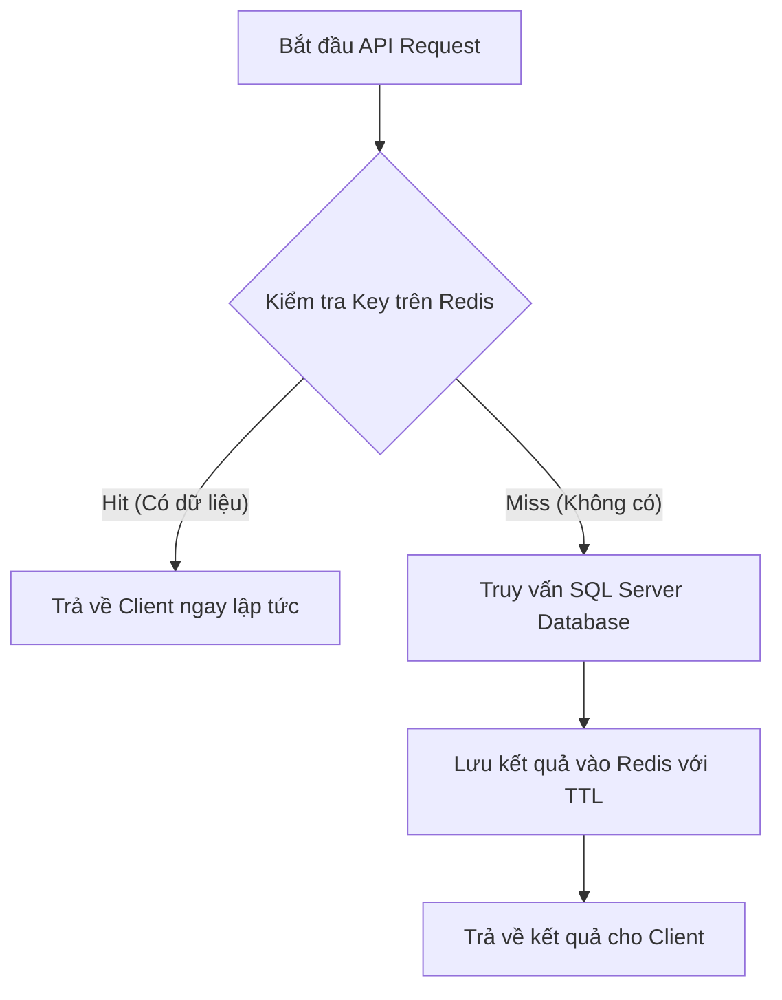

# Thuật Toán & Chiến Lược Redis Cache

Tài liệu này mô tả chi tiết chiến lược cache, cấu trúc lưu trữ và giải thuật xóa cache (invalidation) được áp dụng trên nền tảng Galaxiad Cinema.

---

## 1. Mục Tiêu Thiết Kế
- **Tối ưu hóa thời gian phản hồi (Latency)**: Đọc dữ liệu tĩnh hoặc dữ liệu ít thay đổi trực tiếp từ RAM (Redis) thay vì truy vấn SQL Server.
- **Giảm tải Database (DB Bottleneck)**: Hạn chế các câu lệnh tổng hợp nặng như `AVG()`, `COUNT()` và truy vấn phân trang khi danh sách phim/lịch sử không thay đổi.
- **Tính nhất quán dữ liệu (Consistency)**: Đảm bảo dữ liệu trên Web/Mobile luôn mới nhất nhờ cơ chế Invalidation chủ động (Active Invalidation) khi có thay đổi từ phía quản trị viên hoặc hành động đặt vé của người dùng.

---

## 2. Các Giải Thuật & Cấu Trúc Cache

### A. Giải Thuật Cache-Aside (Lazy Loading)
Tất cả các API lấy dữ liệu đều tuân theo giải thuật:


### B. Cấu Trúc Key và TTL (Time-To-Live)

| Dữ Liệu | Loại Cache | Định Dạng Key | TTL |
| --- | --- | --- | --- |
| **Phim đang chiếu** | Danh sách phân trang | `movies:showing:keyword:{keyword}:page:{pageIndex}:size:{pageSize}` | 30 phút |
| **Phim sắp chiếu** | Danh sách phân trang | `movies:upcoming:keyword:{keyword}:page:{pageIndex}:size:{pageSize}` | 30 phút |
| **Chi tiết bộ phim** | Dữ liệu chi tiết + Sao đánh giá | `movie:detail:{movieId}` | 30 phút |
| **Lịch sử đặt vé** | Danh sách đặt vé của User | `user:bookings:{userId}` | 30 phút |
| **Thông tin cá nhân** | Profile + Điểm thưởng của User | `user:profile:{userId}` | 30 phút |

---

## 3. Thuật Toán Xóa Cache Chủ Động (Active Invalidation)

Để tránh hiện tượng lệch dữ liệu, hệ thống tự động xóa cache khi xảy ra các sự kiện ghi (Write Events):

```text
               [ Sự Kiện Ghi ]
                      │
        ┌─────────────┼─────────────┐
        ▼             ▼             ▼
  [ Quản Trị Phim ] [ Duyệt Review ] [ Đơn Vé Mới ]
        │             │             │
        ▼             ▼             ▼
  Xóa Cache     Xóa Cache     Xóa Cache
  Home List     Phim Chi Tiết  User Bookings
```

1. **Khi Quản trị viên cập nhật Phim hoặc Lịch chiếu**:
   - Gọi phương thức `ClearMovieCatalogCacheAsync()`.
   - Sử dụng giải thuật quét `SCAN / KeysAsync` với pattern wildcard `movies:showing:*` và `movies:upcoming:*` để giải phóng bộ nhớ cache danh sách trang chủ.
   - Xóa key chi tiết của phim bị tác động `movie:detail:{movieId}`.

2. **Khi Người dùng đánh giá hoặc Moderator phê duyệt bình luận**:
   - Khi bình luận chuyển sang trạng thái `Visible` (Được duyệt) hoặc bị xóa (`Deleted`), điểm trung bình (`AverageRating`) và tổng số đánh giá sẽ thay đổi.
   - Giải thuật: Ghi nhận đánh giá vào DB -> Gọi `ClearMovieDetailCacheAsync(movieId)`.
   - Lượt truy cập chi tiết phim tiếp theo sẽ tự động tính toán lại điểm số chuẩn xác từ DB và nạp lại vào cache.

3. **Khi Đặt vé mới / Thanh toán thành công qua VNPay**:
   - Điểm tích lũy (`RewardPoints`) và trạng thái đơn hàng của người dùng thay đổi.
   - Giải thuật: Gọi `ClearUserCacheAsync(userId)` để xóa sạch cache `user:bookings:{userId}` và `user:profile:{userId}`.

---

## 4. Biện Pháp An Toàn (Fault Tolerance)
- Mọi hoạt động xóa/ghi cache Redis đều được bọc trong khối **`try-catch`** để đảm bảo lỗi kết nối Redis (mạng chập chờn, Redis quá tải) **không làm sập luồng nghiệp vụ chính** của người dùng hoặc các giao dịch tài chính.
