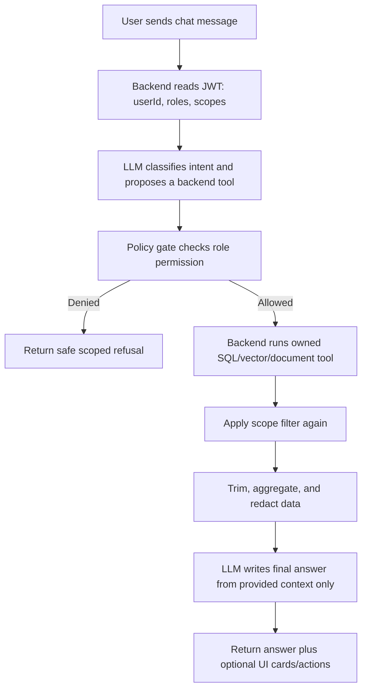

# Role-Aware Chatbot Plan

This is the planned design for a personalized chatbot with strict role-based data boundaries. It is a roadmap, not a completed implementation.

## Design Principles

1. The LLM must not directly access the database.
2. The LLM must not decide final authorization.
3. Backend policy checks must run before and after every tool/query call.
4. SQL should be used for structured business questions.
5. Semantic search/RAG should be used only when the request requires meaning-based retrieval.
6. Raw private data should be minimized before being sent to the LLM.
7. Every response must be generated only from data already allowed for the current user role.

## Role Scopes

| Role | Chatbot Data Scope |
| --- | --- |
| Guest | Public movies, cinemas, showtimes, public vouchers, basic FAQ |
| Customer | Public data plus the customer's own bookings, tickets, vouchers, comments, profile-safe information |
| Cashier/Staff | Staff workflows, shift-related information, POS-safe order lookup, cinema operations within assigned scope |
| TheaterManager | Schedules, auditoriums, shifts, staff operations, and reports for assigned cinema scope |
| MovieManager | Movie metadata, genres, formats, posters, banners, movie lifecycle and content-management tasks |
| FacilitiesManager | Cinemas, auditoriums, seat maps, departments, facility-management data |
| Admin | System-wide operational and analytics data |

## Planned Chat Flow



## Retrieval Modes

### 1. Structured SQL Mode

Use this mode when the user asks for facts that map cleanly to database fields.

Examples:

- "What movies are hot today?"
- "Which showtimes are available at this cinema tonight?"
- "What are the top booked movies this week?"
- "How many tickets were sold today?"

The LLM classifies intent and extracts parameters. The backend runs predefined tools only.

```sql
SELECT TOP (10)
    m.MovieId,
    m.MovieName,
    COUNT(od.OrderDetailId) AS BookingCount
FROM MovieInfo m
JOIN MovieScheduleInfo s ON s.MovieId = m.MovieId
LEFT JOIN OrderDetails od ON od.MovieScheduleId = s.MovieScheduleId
LEFT JOIN OrderInfo o ON o.OrderId = od.OrderId
WHERE s.ShowDate = @today
  AND m.IsDeleted = 0
  AND m.IsActive = 1
  AND o.OrderStatus IN ('Booked', 'Completed')
GROUP BY m.MovieId, m.MovieName
ORDER BY BookingCount DESC;
```

### 2. Analytical SQL Plus LLM Summary Mode

Use this mode when the user asks for an explanation based on structured metrics and a limited set of text rows.

Examples:

- "Which popular movie today has the most negative feedback, and why?"
- "Which movie has high bookings but low ratings?"
- "What are customers complaining about for this movie?"

The backend queries aggregated metrics, then loads a bounded sample of relevant comments. The LLM summarizes only that allowed context.

```sql
SELECT TOP (5)
    m.MovieId,
    m.MovieName,
    COUNT(DISTINCT od.OrderDetailId) AS BookingCount,
    AVG(CAST(c.Rating AS float)) AS AvgRating,
    SUM(CASE WHEN c.Rating <= 2 THEN 1 ELSE 0 END) AS NegativeCount
FROM MovieInfo m
JOIN MovieScheduleInfo s ON s.MovieId = m.MovieId
LEFT JOIN OrderDetails od ON od.MovieScheduleId = s.MovieScheduleId
LEFT JOIN OrderInfo o ON o.OrderId = od.OrderId
LEFT JOIN MovieComment c ON c.MovieId = m.MovieId
WHERE s.ShowDate = @today
  AND m.IsDeleted = 0
  AND m.IsActive = 1
  AND c.Status = 'Visible'
GROUP BY m.MovieId, m.MovieName
ORDER BY BookingCount DESC, NegativeCount DESC;
```

```sql
SELECT TOP (20)
    CommentText,
    Rating,
    CreatedAt
FROM MovieComment
WHERE MovieId = @movieId
  AND Status = 'Visible'
  AND Rating <= 2
ORDER BY CreatedAt DESC;
```

### 3. Semantic Search / RAG Mode

Use this mode when the user asks by meaning, similarity, vague preference, policy text, or natural language that does not map cleanly to a fixed SQL query.

Examples:

- "Find movies with the same feeling as Interstellar."
- "Which movies are good for someone who likes plot twists?"
- "Which movie are people describing as slow or confusing?"
- "What is the refund policy for my ticket?"

Potential RAG indexes:

- movie embeddings in Qdrant;
- selected visible comment/review embeddings, if implemented later;
- public FAQ and policy documents;
- internal operational documents, scoped by staff/admin roles.

## Planned Backend Components

```text
ChatbotController
├── receives user messages
├── reads authenticated user context
└── returns final assistant response

ChatIntentClassifier
├── calls a small LLM prompt for intent/tool classification
└── outputs structured intent JSON

ChatPolicyService
├── checks role permissions before tool execution
├── applies user/cinema/department scope
└── blocks unsafe or out-of-scope requests

ChatToolRegistry
├── exposes predefined backend-owned tools
├── maps intent names to SQL/vector/document handlers
└── prevents arbitrary SQL execution

ChatContextBuilder
├── trims result rows
├── redacts private fields
├── aggregates metrics where possible
└── builds final context for the LLM

ChatResponseService
├── asks the LLM to answer from the supplied context only
└── returns text plus optional frontend action cards
```

## Planned Frontend Behavior

```text
ChatBot component
├── sends message to backend with current auth token
├── renders text answer
├── renders optional movie/showtime/order cards
├── hides actions that are not valid for the current role
└── handles scoped refusal messages cleanly
```

## Safety Rules

The chatbot should reject or safely narrow:

- requests for another user's private data;
- customer requests for revenue, staff, audit logs, or admin analytics;
- staff requests outside assigned cinema/department scope;
- prompts asking the model to ignore role rules;
- requests that require raw secrets, tokens, passwords, or payment data;
- arbitrary SQL generation or execution requested by the user;
- mass export of comments, orders, or user data.

## Implementation Phases

1. Add backend chat endpoint and role-aware policy service.
2. Add a fixed tool registry for public movie/showtime queries.
3. Add customer-owned booking/ticket tools.
4. Add staff/manager/admin scoped tools.
5. Add analytical SQL plus bounded LLM summary for comments and ratings.
6. Add RAG indexes for public FAQ/policy documents.
7. Add optional semantic search over selected movie/comment text.
8. Add audit logging for tool calls, denied requests, and high-risk prompts.
