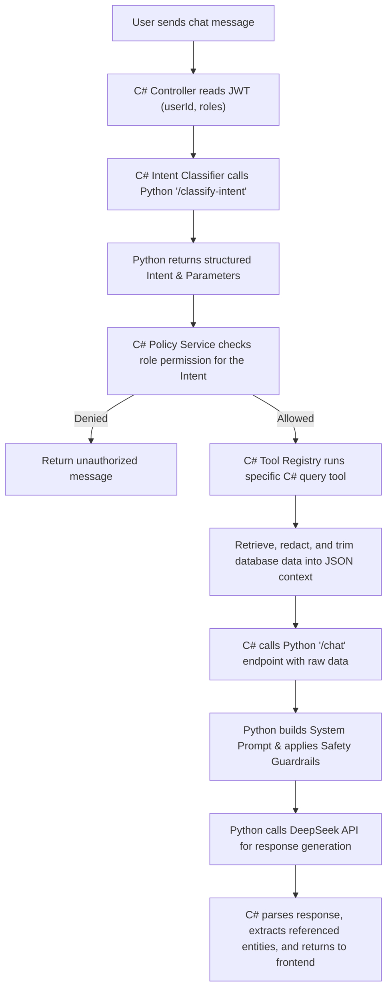

# Role-Aware Chatbot Implementation

This document describes the implementation of the personalized chatbot with strict role-based data boundaries. It details how the C# backend and Python AI service work together to ensure safety and precision.

## Design Principles

1. **LLM Does Not Access DB Directly**: The LLM never writes or executes arbitrary SQL queries.
2. **Deterministic Authorization**: The .NET backend validates roles and permissions before executing any tool or returning context.
3. **Data Redaction & Trimming**: Predefined C# tools retrieve only the minimum required fields from the database and format them as strict JSON context.
4. **Python Prompt & Safety Ownership**: The System Prompt and safety rules reside entirely in the Python AI Service, ensuring clean separation of concerns and easier prompt engineering updates.

---

## Architecture Flow

---

## Role Scopes & Predefined Intents

| Role | Predefined Intent | C# Query Tool | Data Scope / Action |
| --- | --- | --- | --- |
| **Guest** / All | `GetMovies` | `GetMoviesTool` | Public movie listings, genres, active status. |
| **Guest** / All | `GetShowtimes` | `GetShowtimesTool` | Showtimes, schedules, auditorium formats. |
| **Customer** | `GetMyBookings` | `GetMyBookingsTool` | Customer's own bookings, order dates, pricing, and ticket status. |
| **TheaterManager** / Admin | `GetCinemaStatistics` | `GetCinemaStatisticsTool` | Revenue metrics, tickets sold, active users. |
| **TheaterManager** / Admin | `GetShowtimeRecommendations` | `GetShowtimeRecommendationsTool` | AI showtime planner & schedule suggestions. |
| **Admin** | `GetSystemAuditLogs` | `GetSystemAuditLogsTool` | Staff activity and operational audit logs. |
| **All** | `GeneralFAQ` | *None* | Basic greetings, Q&A, fallback responses. |

---

## Safety Guardrails & Implementation Details

The system enforces safety at multiple layers:

### 1. Intent Policy Gate (`ChatPolicyService` in C#)
Before executing a tool, the C# backend checks if the authenticated user's role is allowed to invoke the classified intent:
- Customers cannot invoke `GetCinemaStatistics` or `GetSystemAuditLogs`.
- Unauthenticated (Guest) users are restricted to `GetMovies` and `GetShowtimes`.

### 2. Context Safety and Injection Protection (Python AI Service)
The Python AI Service `/chat` endpoint is responsible for constructing the LLM prompt. It encapsulates the system prompt and inserts safeguards against **Prompt Injection** (e.g. users attempting to override system behavior inside the database context text):
- The model is instructed to only answer based on the provided `[Context]` section.
- If the `[Context]` is empty or insufficient, it politely informs the user without hallucinating.

### 3. Content Moderation
User comments and input texts are moderated via the `/moderate` endpoint in the Python AI Service (using a DeepSeek zero-shot moderation filter) to detect and block severe profanity, insults, or hate speech.

---

## Backend & Frontend Component Map

### ASP.NET Core Backend
- **`ChatbotController`**: Receives messages, fetches user identity from context, and manages response flow.
- **`IChatIntentClassifier`**: Dispatches the user message to Python's `/classify-intent` to extract the target intent and parameters.
- **`IChatToolRegistry`**: Maps intents to specific C# implementation classes (`IChatTool`).
- **`IChatLlmClient`**: Connects C# to Python's `/chat` endpoint, passing the extracted parameters.

### FastAPI AI Service
- **`/classify-intent`**: Returns structured JSON containing the classified intent and parsed parameters.
- **`/chat`**: Receives the raw query response context, user role, and user ID, renders the System Prompt template, and generates the natural-language response.
- **`/moderate`**: Performs sentiment and moderation analysis.

### React Frontend Client
- **`ChatBot` Component**: Embeds the conversational assistant widget.
- **Rich Cards**: Receives the backend response along with extracted entity references (like `ReferencedMovies` and `ReferencedSchedules`) to display interactive, clickable UI elements for movies and showtimes directly in the chat panel.

