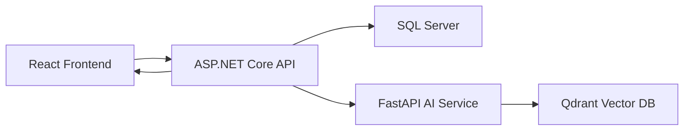

# Алгоритм рекомендаций фильмов

Система рекомендаций фильмов сочетает в себе детерминированное профилирование поведения пользователей на бэкенде с семантическим векторным поиском в сервисе AI.

## Архитектура системы



SQL Server является единым источником истины (Source of Truth). Qdrant хранит только фиксированные векторы фильмов. Вектор предпочтений пользователя создается динамически для каждого запроса и не сохраняется.

---

## Гибридная стратегия (Hybrid Strategy — Внедрение против Резервного копирования)

Система рекомендаций фильмов работает гибко в зависимости от конфигурации API-ключа Gemini:

### 1. С векторными представлениями (Gemini API Key активен)
Система преобразует описание предпочтений пользователя (опросник по жанрам, история просмотров, заказы, положительные отзывы с оценкой >= 4) в 768-мерный вектор. Qdrant находит наиболее семантически похожие фильмы на основе косинусного расстояния.

Метрика `SimilarityScore` представляет собой косинусное расстояние: меньше = лучше.  
Чтобы рассчитать визуальный процент соответствия (`MatchPercentage`):

```text
MatchPercentage = (1 - SimilarityScore / MaxScore) * 100%
```

### 2. Без векторных представлений (Резервный алгоритм SQL)
Система запускает детерминированный расчет на базе SQL Server, исключая уже просмотренные фильмы и суммируя показатели популярности:

```text
SimilarityScore = (bookingCount × 3) + (viewCount × 1) + (avgRating × 10) + (ratingCount × 1)
```

Затем применяется **Min-Max нормализация** для перевода в шкалу от 0% до 100%:

```text
MatchPercentage = (SimilarityScore - MinScore) / (MaxScore - MinScore) * 100%
```

---

## Рекомендации похожих фильмов (Related Movies Recommendation)

Для отображения блока похожих фильмов на странице детального описания (`GET /api/v1/public/movies/{movieId}/similar`) используется гибридный поиск:

### 1. Кэширование
Результаты кэшируются в Redis с ключом `movies:similar:{movieId}:{limit}` на 30 минут.

### 2. Пул кандидатов
Бэкенд предварительно загружает из базы данных SQL Server до 100 активных сеансов (Now Showing) и 100 будущих фильмов (Coming Soon), исключая текущий фильм.

### 3. Семантическое сходство AI
Бэкенд генерирует текстовое описание текущего фильма:
```text
Tên phim: {MovieName}. Thể loại: {Genres}. Mô tả: {Description}. Đạo diễn: {Director}. Diễn viên: {Actors}
```
Этот текст отправляется в Python AI Service `/recommend`. Сервис векторизует текст и ищет в Qdrant наиболее схожие фильмы. Бэкенд C# сопоставляет результаты с пулом кандидатов, сохраняя порядок релевантности.

### 4. Резервный поиск по жанрам (SQL Fallback)
Если сервис AI недоступен, бэкенд находит кандидатов с наибольшим совпадением жанров, сортируя их по количеству общих жанров (по убыванию) и дате окончания показа (по убыванию).

### 5. Финальное заполнение
Если результатов всё ещё не хватает до указанного лимита, список дополняется случайными активными фильмами из пула кандидатов.
