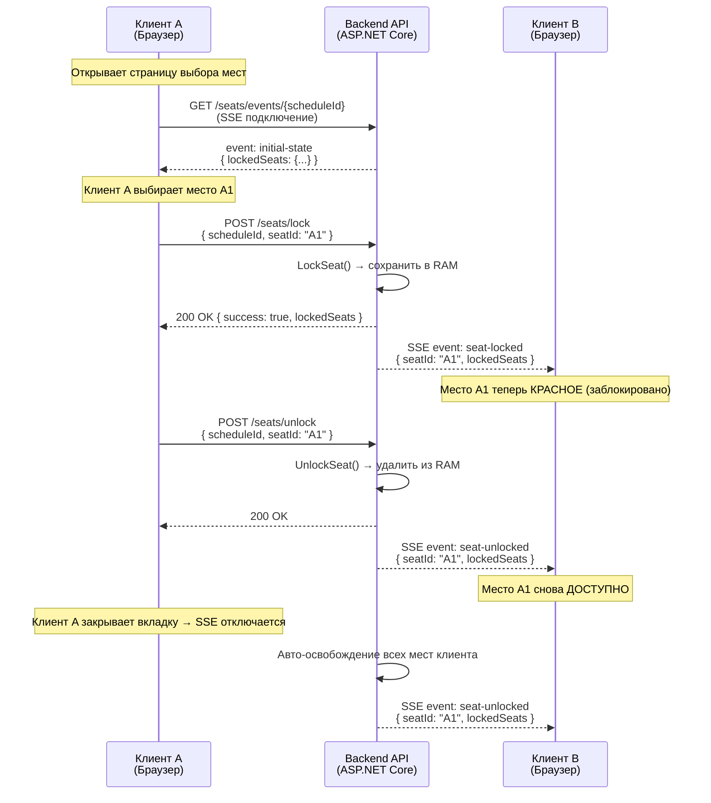

# Блокировка мест в реальном времени (Временное удержание мест)

> **Почему это важно:** Когда посетитель выбирает место на экране бронирования, это место должно быть **временно заблокировано**, чтобы другие посетители не могли выбрать его. Без этого механизма два человека могут забронировать одно и то же место — что приводит к двойным бронированиям, жалобам и потере доверия к кинотеатру.

---

## Как это работает (простое объяснение)

Когда **Вы** выбираете место на экране, система немедленно сообщает **всем остальным пользователям**, просматривающим этот же сеанс, что место занято (показывается красным). Если Вы не завершите оплату в течение **10 минут**, место автоматически освобождается для других. Если Вы закроете вкладку браузера, система также освободит Ваши места через несколько секунд.

**Представьте себе корзину в интернет-магазине:** Вы кладете товар в корзину, он резервируется за Вами на ограниченное время, а затем возвращается на полку, если Вы не оформляете заказ.

---

## Техническая архитектура: SSE + HTTP POST

Мы выбрали **SSE (Server-Sent Events)** вместо WebSocket (SignalR). Вот почему:

- **SSE** — односторонний канал от сервера к клиенту. Сервер отправляет данные в реальном времени без повторных запросов клиента.
- **HTTP POST** — используется для действий клиент → сервер (блокировка/разблокировка мест). SSE не может отправлять данные от клиента к серверу, поэтому мы используем обычные REST API вызовы.
- **Хранение в памяти:** Данные о блокировке хранятся в оперативной памяти (RAM) сервера, а не в базе данных. Если сервер перезагружается, блокировки теряются — но это приемлемо, поскольку блокировки действуют максимум 10 минут. Когда клиенты переподключаются, они получают актуальное состояние.

### Почему SSE вместо WebSocket (SignalR)?

| Критерий | SSE + HTTP POST | SignalR / WebSocket |
|----------|----------------|-------------------|
| Сложность | Простой — использует встроенный `EventSource` браузера | Сложный — требуется согласование WebSocket, резервные транспорты |
| Авто-переподключение | Встроено (браузер обрабатывает) | Требуется ручная реализация |
| Совместимость с CDN | Работает (например, Cloudflare) | Некоторые прокси блокируют WebSocket |
| Масштабирование | Не требуется sticky session | Нужен Redis backplane |
| Двусторонность | Нет (используется HTTP POST) | Да (встроено) |
| **Наш выбор** | ✅ **Выбран** | ❌ Отклонен |

---

## Диаграмма потока



---

## API Endpoints

| Метод | Endpoint | Описание |
|-------|----------|---------|
| `POST` | `/api/v1/booking/seats/lock` | Временно заблокировать место |
| `POST` | `/api/v1/booking/seats/unlock` | Освободить заблокированное место |
| `GET` | `/api/v1/booking/seats/events/{scheduleId}` | SSE поток — получать обновления в реальном времени (без аутентификации) |

### POST /api/v1/booking/seats/lock

**Request:**
```json
{
  "scheduleId": "guid",
  "seatId": "A1",
  "userName": "Nguyen Van A"
}
```

**Response (200 — успех):**
```json
{
  "success": true,
  "message": "Seat locked successfully",
  "lockedSeats": { "A1": "Nguyen Van A", "A2": "Tran Van B" }
}
```

**Response (409 — конфликт):**
```json
{
  "success": false,
  "message": "Seat is locked by another user",
  "lockedSeats": { "A1": "Tran Van B" }
}
```

### POST /api/v1/booking/seats/unlock

**Request:**
```json
{
  "scheduleId": "guid",
  "seatId": "A1"
}
```

**Response:**
```json
{
  "success": true,
  "message": "Seat unlocked successfully",
  "lockedSeats": {}
}
```

### GET /api/v1/booking/seats/events/{scheduleId}

SSE endpoint (text/event-stream). Открывает длительное соединение. Аутентификация не требуется.

**Поддерживает:**
- Авто-переподключение через `Last-Event-ID`
- Heartbeat каждые 15 секунд (`: heartbeat`)

---

## SSE события

| Тип события | Когда отправляется | Данные |
|------------|-------------------|--------|
| `initial-state` | Клиент только что подключился | `{ event: "initial-state", lockedSeats: { "A1": "User" } }` |
| `seat-locked` | Кто-то заблокировал место | `{ event: "seat-locked", seatId: "A1", userName: "User", lockedSeats: {...} }` |
| `seat-unlocked` | Кто-то освободил место | `{ event: "seat-unlocked", seatId: "A1", lockedSeats: {...} }` |

---

## Автоматическая очистка

| Ситуация | Обработка | Механизм |
|---------|----------|---------|
| **Нет оплаты в течение 10 мин** | Pending заказ отменяется, места освобождаются | Hangfire recurring job (каждые 5 мин) |
| **Закрытие вкладки браузера** | Все места этого клиента освобождаются | SSE отключение → `ReleaseSeatsByClient()` |
| **Перезагрузка сервера** | Потеря всех блокировок в RAM → клиенты переподключаются | `EventSource` авто-переподключение → получение нового состояния |

---

## Основные технические компоненты

| Компонент | Расположение | Роль |
|-----------|-------------|------|
| `SeatSseManager` (Singleton) | `Cinema.Infrastructure/ExternalServices/Notifications/` | Управление блокировками мест + подписчиками SSE |
| `BookingController` | `Cinema.Api/Controllers/Customer/Booking/` | API endpoints lock/unlock/events |
| `SeatLockerNotificationService` | `Cinema.Api/Hubs/` | Мост между Hangfire job и `SeatSseManager` |
| `PendingOrderCancellationJob` | `Cinema.Infrastructure/BackgroundJobs/` | Авто-отмена Pending заказов > 10 мин |
| `useSeatSse` hook | `apps/frontend/src/hooks/` | React хук для SSE + lock/unlock |

### Интеграция с Frontend

Хук `useSeatSse` предоставляет всё необходимое:

```typescript
import { useSeatSse } from '../../hooks/useSeatSse';

function SeatMap({ scheduleId }: { scheduleId: string }) {
  const { lockedSeats, lockSeat, unlockSeat, isConnected } = useSeatSse(scheduleId);
  
  // lockedSeats: Record<string, string> — { "A1": "UserName", ... }
  // lockSeat(seatId, userName) → Promise<boolean>
  // unlockSeat(seatId) → Promise<boolean>
  // isConnected: boolean — статус SSE подключения
}
```

---

## Обработка ошибок

| Сценарий | Поведение |
|---------|----------|
| **Потеря сети** | SSE авто-переподключается через встроенный `EventSource` браузера |
| **Перезагрузка сервера** | Все блокировки теряются; клиенты переподключаются и получают свежее состояние через `initial-state` |
| **Состояние гонки (2 пользователя блокируют одно место)** | Атомарный `TryAdd` — только 1 успевает, второй получает `409 Conflict` |
| **Несколько вкладок** | Каждая вкладка имеет свой `clientId`. Блокировка одного места из разных вкладок считается "другим пользователем" |
| **Забытая вкладка** | SSE соединение истекает → сервер освобождает все места этого клиента |
