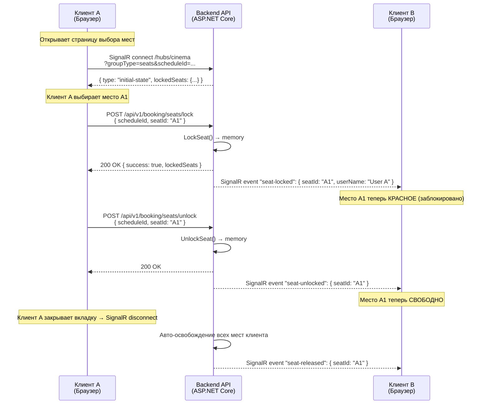

# Блокировка мест в реальном времени (Временное удержание мест)

> **Почему это важно:** Когда посетитель выбирает место на экране бронирования, это место должно быть **временно заблокировано**, чтобы другие посетители не могли выбрать его. Без этого механизма два человека могут забронировать одно и то же место — что приводит к двойным бронированиям, жалобам и потере доверия к кинотеатру.

---

## Как это работает (простое объяснение)

Когда **Вы** выбираете место на экране, система немедленно сообщает **всем остальным пользователям**, просматривающим этот же сеанс, что место занято (показывается красным). Если Вы не завершите оплату в течение **10 минут**, место автоматически освобождается для других. Если Вы закроете вкладку браузера, система также освободит Ваши места через несколько секунд.

**Представьте себе корзину в интернет-магазине:** Вы кладете товар в корзину, он резервируется за Вами на ограниченное время, а затем возвращается на полку, если Вы не оформляете заказ.

---

## Техническая архитектура: SignalR Hub

Мы выбрали **SignalR** для всей коммуникации в реальном времени. Он предоставляет единый двунаправленный канал с автоматическим переподключением, управлением группами и резервными транспортами.

### Почему SignalR?

| Критерий | SignalR (Выбран) | Raw WebSocket (Ранее) |
|----------|------------------|------------------------|
| Авто-переподключение | ✅ Built-in (`withAutomaticReconnect`) | ❌ Ручная реализация |
| Управление группами | ✅ Built-in (`Groups.AddToGroupAsync`) | ❌ Ручной `ConcurrentDictionary` |
| Транспорт | WebSocket + SSE + Long Polling (авто-фолбэк) | Только WebSocket |
| Масштабирование | ✅ Redis Backplane | ❌ Требует кастомного решения |
| Клиентская библиотека | ✅ `@microsoft/signalr` (npm) | ❌ Native WebSocket API |
| **Наш сценарий** | **Единый Hub для мест, оплаты и групп** | Был проще, но без переподключения/групп |

### Три канала

Система использует **один Hub** (`/hubs/cinema`) с маршрутизацией через query-параметр:

| Канал | `groupType` | Назначение |
|-------|-------------|------------|
| **Места** | `seats` | Трансляция статуса мест по `scheduleId` |
| **Оплата** | `payment` | Уведомление о результате оплаты по `orderId` |
| **Группа** | `group` | Трансляция статуса группы/голосования/чата по `groupSessionId` |

---

## Диаграмма потока



---

## API Endpoints

| Method | Endpoint | Описание |
|--------|----------|---------|
| `POST` | `/api/v1/booking/seats/lock` | Временно заблокировать место |
| `POST` | `/api/v1/booking/seats/unlock` | Освободить заблокированное место |
| `GET` | `/hubs/cinema` | **SignalR Hub** — обновления в реальном времени (query: `groupType=seats&scheduleId=...`) |

### POST /api/v1/booking/seats/lock

**Request:**
```json
{
  "scheduleId": "guid",
  "seatId": "A1",
  "userName": "Nguyen Van A",
  "clientId": "seat-client-uuid"
}
```

**Response (200 — успех):**
```json
{
  "success": true,
  "message": "Seat locked successfully",
  "lockedSeats": { "A1": "Nguyen Van A", "A2": "Tran Van B" }
}
```

**Response (409 — конфликт):**
```json
{
  "success": false,
  "message": "Seat is locked by another user",
  "lockedSeats": { "A1": "Tran Van B" }
}
```

### POST /api/v1/booking/seats/unlock

**Request:**
```json
{
  "scheduleId": "guid",
  "seatId": "A1",
  "clientId": "seat-client-uuid"
}
```

**Response:**
```json
{
  "success": true,
  "message": "Seat unlocked successfully",
  "lockedSeats": {}
}
```

### SignalR Hub по адресу `/hubs/cinema`

Hub заменяет старый raw WebSocket endpoint (`GET /seats/ws/{scheduleId}`, который **удалён**).

**Подключение:**
```
/hubs/cinema?groupType=seats&scheduleId={scheduleId}&clientId={clientId}
```

**Возможности:**
- Встроенное автоматическое переподключение (задержки: 0с, 2с, 5с, 10с, 30с)
- Аутентификация не требуется для подключения мест
- `clientId` для идентификации клиента при переподключении
- Автоматическая очистка при отключении

---

## SignalR Events (Сервер → Клиент)

| Event Name | Когда отправляется | Данные |
|------------|-------------------|--------|
| `initial-state` | Клиент только что подключился | `{ lockedSeats: { "a1": "User" } }` |
| `seat-locked` | Кто-то заблокировал место | `{ seatId: "A1", userName: "User", lockedSeats: {...} }` |
| `seat-unlocked` | Кто-то освободил место | `{ seatId: "A1", lockedSeats: {...} }` |
| `seat-released` | Очистка при отключении клиента | `{ seatId: "A1", lockedSeats: {...} }` |

> **Примечание:** В отличие от raw WebSocket (обёртка в `{ type, data }`), SignalR использует **именованные события** (`connection.on('seat-locked', ...)`). Имя события и есть тип.

---

## Автоматическая очистка

| Ситуация | Что происходит | Механизм |
|----------|---------------|----------|
| **Нет оплаты через 10 мин** | Pending заказ отменяется, места освобождаются | Hangfire recurring job (каждые 5 мин) |
| **Закрытие вкладки браузера** | Все места клиента освобождаются | SignalR `OnDisconnectedAsync` → `ReleaseSeatsByClient()` |
| **Перезагрузка сервера** | Клиенты автоматически переподключаются | SignalR клиент retry с backoff |

---

## Ключевые компоненты

| Компонент | Расположение | Роль |
|-----------|-------------|------|
| `CinemaHub` (Hub) | `Cinema.Api/Hubs/` | **Единый SignalR Hub** — обработка seat/payment/group подключений, `OnConnectedAsync`, `OnDisconnectedAsync` |
| `SignalRSeatBroadcaster` | `Cinema.Api/Hubs/` | Реализация `ISeatBroadcaster` — трансляция событий мест в SignalR группу (`seats-{scheduleId}`) |
| `SignalRGroupBroadcaster` | `Cinema.Api/Hubs/` | Реализация `IGroupBroadcaster` — трансляция групповых событий в SignalR группу (`group-{groupSessionId}`) |
| `SeatLockManager` | `Cinema.Infrastructure/ExternalServices/Notifications/` | Атомарное управление состоянием блокировок (`ConcurrentDictionary<string, LockEntry>`) |
| `SeatLockerNotificationService` | `Cinema.Api/Hubs/` | Мост между Hangfire job и SignalR broadcasters |
| `PendingOrderCancellationJob` | `Cinema.Infrastructure/BackgroundJobs/` | Авто-отмена Pending заказов > 10 мин |
| `signalrClient` factory | `apps/frontend/src/api/signalrClient.ts` | Создание `HubConnection` для seats/payment/group |
| `useSeatWs` hook | `apps/frontend/src/hooks/useSeatWs.ts` | React hook, оборачивающий SignalR + lock/unlock API |

### Frontend Integration (React)

Хук `useSeatWs` использует `@microsoft/signalr` внутри:

```typescript
import { useSeatWs } from '../../hooks/useSeatWs';

function SeatMap({ scheduleId }: { scheduleId: string }) {
  const { lockedSeats, lockSeat, unlockSeat, isConnected } = useSeatWs(scheduleId);
  
  // lockedSeats: Record<string, string> — { "a1": "UserName", ... }
  // lockSeat(seatId, userName) → Promise<boolean>
  // unlockSeat(seatId) → Promise<boolean>
  // isConnected: boolean — статус SignalR подключения
}
```

**Важно:** Хук нормализует все seatId в нижний регистр для единообразного сравнения ключей.

---

## Обработка ошибок

| Сценарий | Поведение |
|----------|----------|
| **Потеря сети** | SignalR вызывает `onreconnecting` → `isConnected = false`; авто-повтор (0с, 2с, 5с, 10с, 30с) |
| **Перезагрузка сервера** | SignalR retry не удаётся → `onclose`; хук освобождает места клиента через HTTP unlock |
| **Race condition (2 пользователя блокируют одно место)** | Атомарный `TryAdd` в `SeatLockManager` — только 1 успевает, другой получает `409 Conflict` |
| **Несколько вкладок** | У каждой вкладки свой `clientId`. Блокировка одного места из разных вкладок считается как "другой пользователь" |
| **Вкладка забыта (idle)** | SignalR connection timeout → `OnDisconnectedAsync` → очистка освобождает все места клиента |
