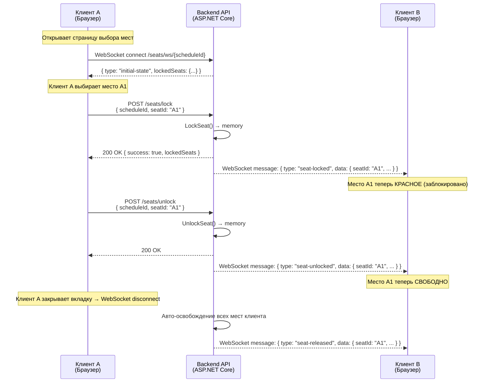

# Блокировка мест в реальном времени (Временное удержание мест)

> **Почему это важно:** Когда посетитель выбирает место на экране бронирования, это место должно быть **временно заблокировано**, чтобы другие посетители не могли выбрать его. Без этого механизма два человека могут забронировать одно и то же место — что приводит к двойным бронированиям, жалобам и потере доверия к кинотеатру.

---

## Как это работает (простое объяснение)

Когда **Вы** выбираете место на экране, система немедленно сообщает **всем остальным пользователям**, просматривающим этот же сеанс, что место занято (показывается красным). Если Вы не завершите оплату в течение **10 минут**, место автоматически освобождается для других. Если Вы закроете вкладку браузера, система также освободит Ваши места через несколько секунд.

**Представьте себе корзину в интернет-магазине:** Вы кладете товар в корзину, он резервируется за Вами на ограниченное время, а затем возвращается на полку, если Вы не оформляете заказ.

---

## Техническая архитектура: Raw WebSocket + HTTP POST

Мы выбрали **raw WebSocket** вместо SignalR. Вот почему:

- **WebSocket** — двустороннее постоянное соединение между сервером и клиентом. Сервер отправляет обновления состояния мест в реальном времени без повторных запросов клиента.
- **HTTP POST** — используется для действий клиент → сервер (блокировка/разблокировка мест). WebSocket-соединение в основном обрабатывает **сервер → клиент** broadcast (уведомления об изменении состояния).
- **Хранение в памяти:** Данные о блокировке хранятся в `ConcurrentDictionary` в оперативной памяти (RAM) сервера, а не в базе данных. Если сервер перезагружается, блокировки теряются — но это приемлемо, поскольку блокировки действуют максимум 10 минут. Когда клиенты переподключаются, они получают актуальное состояние.

### Почему raw WebSocket вместо SignalR?

| Критерий | Raw WebSocket + HTTP POST | SignalR |
|----------|---------------------------|---------|
| Сложность | Минимальная — использует `System.Net.WebSockets` напрямую | Выше — согласование Hub, слой абстракции протокола |
| Зависимости | Не требует дополнительных NuGet пакетов | Требует `Microsoft.AspNetCore.SignalR` |
| Двусторонность | Да (мы используем только сервер→клиент) | Да (встроено) |
| Резервные транспорты | Нет (только WebSocket) | Авто-переключение на SSE, long polling |
| **Наш выбор** | ✅ **Выбран** | ❌ Отклонен |

---

## Диаграмма потока



---

## API Endpoints

| Method | Endpoint | Описание |
|--------|----------|---------|
| `POST` | `/api/v1/booking/seats/lock` | Временно заблокировать место |
| `POST` | `/api/v1/booking/seats/unlock` | Освободить заблокированное место |
| `GET` | `/api/v1/booking/seats/ws/{scheduleId}` | WebSocket endpoint — получать обновления в реальном времени (без аутентификации) |
| `GET` | `/api/v1/booking/seats/state/{scheduleId}` | HTTP fallback — получить текущее состояние блокировок |

### POST /api/v1/booking/seats/lock

**Request:**
```json
{
  "scheduleId": "guid",
  "seatId": "A1",
  "userName": "Nguyen Van A",
  "clientId": "seat-client-uuid"
}
```

**Response (200 — успех):**
```json
{
  "success": true,
  "message": "Seat locked successfully",
  "lockedSeats": { "A1": "Nguyen Van A", "A2": "Tran Van B" }
}
```

**Response (409 — конфликт):**
```json
{
  "success": false,
  "message": "Seat is locked by another user",
  "lockedSeats": { "A1": "Tran Van B" }
}
```

### POST /api/v1/booking/seats/unlock

**Request:**
```json
{
  "scheduleId": "guid",
  "seatId": "A1",
  "clientId": "seat-client-uuid"
}
```

**Response:**
```json
{
  "success": true,
  "message": "Seat unlocked successfully",
  "lockedSeats": {}
}
```

### GET /api/v1/booking/seats/ws/{scheduleId}

Endpoint WebSocket. Открывает долгоживущее постоянное соединение. Без аутентификации.

**Поддерживает:**
- Параметр запроса `clientId` для идентификации клиента при переподключении
- Автоматическая очистка при отключении (все места клиента освобождаются)

---

## Сообщения WebSocket

WebSocket отправляет JSON **от сервера к клиенту**:

| Тип сообщения | Когда отправляется | Данные |
|--------------|-------------------|--------|
| `initial-state` | Клиент только что подключился | `{ type: "initial-state", lockedSeats: { "a1": "User" } }` |
| `seat-locked` | Кто-то заблокировал место | `{ type: "seat-locked", data: { seatId: "A1", userName: "User", lockedSeats: {...} } }` |
| `seat-unlocked` | Кто-то освободил место | `{ type: "seat-unlocked", data: { seatId: "A1", lockedSeats: {...} } }` |
| `seat-released` | Очистка при отключении клиента | `{ type: "seat-released", data: { seatId: "A1", lockedSeats: {...} } }` |

---

## Автоматическая очистка

| Ситуация | Что происходит | Механизм |
|----------|---------------|----------|
| **Нет оплаты через 10 мин** | Pending заказ отменяется, места освобождаются | Hangfire recurring job (каждые 5 мин) |
| **Закрытие вкладки браузера** | Все места клиента освобождаются | WebSocket disconnect → `RemoveConnection()` + `ReleaseSeatsByClient()` |
| **Перезагрузка сервера** | Все блокировки в памяти теряются → клиенты переподключаются | Клиент обнаруживает `onclose` → может автоматически переподключиться |

---

## Ключевые компоненты

| Компонент | Расположение | Роль |
|-----------|-------------|------|
| `SeatWsManager` (Singleton) | `Cinema.Infrastructure/ExternalServices/Notifications/` | Управление блокировками мест + WebSocket подписчики (`ConcurrentDictionary<string, ConcurrentDictionary<string, WebSocket>>`) |
| `SeatLockManager` | `Cinema.Infrastructure/ExternalServices/Notifications/` | Атомарное управление состоянием блокировок (`ConcurrentDictionary<string, LockEntry>`) |
| `BookingController.GetSeatWebSocket` | `Cinema.Api/Controllers/Customer/Booking/` | WebSocket accept + начальное состояние + цикл чтения |
| `SeatLockerNotificationService` | `Cinema.Api/Hubs/` | Мост между Hangfire job и `SeatWsManager` |
| `PendingOrderCancellationJob` | `Cinema.Infrastructure/BackgroundJobs/` | Авто-отмена Pending заказов > 10 мин |
| `useSeatWs` hook | `apps/frontend/src/hooks/useSeatWs.ts` | React hook для WebSocket + lock/unlock API |

### Frontend Integration (React)

Хук `useSeatWs` предоставляет всё необходимое:

```typescript
import { useSeatWs } from '../../hooks/useSeatWs';

function SeatMap({ scheduleId }: { scheduleId: string }) {
  const { lockedSeats, lockSeat, unlockSeat, isConnected } = useSeatWs(scheduleId);
  
  // lockedSeats: Record<string, string> — { "a1": "UserName", ... }
  // lockSeat(seatId, userName) → Promise<boolean>
  // unlockSeat(seatId) → Promise<boolean>
  // isConnected: boolean — статус WebSocket подключения
}
```

**Важно:** Хук нормализует все seatId в нижний регистр для единообразного сравнения ключей.

---

## Обработка ошибок

| Сценарий | Поведение |
|----------|----------|
| **Потеря сети** | WebSocket вызывает `onclose` → `isConnected = false`; компонент может попытаться переподключиться |
| **Перезагрузка сервера** | Все блокировки теряются; клиенты переподключаются и получают свежее состояние через `initial-state` |
| **Race condition (2 пользователя блокируют одно место)** | Атомарный `TryAdd` в `SeatLockManager` — только 1 успевает, другой получает `409 Conflict` |
| **Несколько вкладок** | У каждой вкладки свой `clientId`. Блокировка одного места из разных вкладок считается как "другой пользователь" |
| **Вкладка забыта (idle)** | WebSocket соединение истекает → `ReceiveAsync` выбрасывает исключение → очистка освобождает все места клиента |
