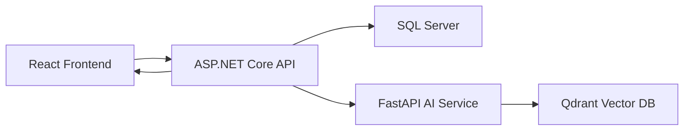

# Thuật Toán Đề Xuất Phim

Hệ thống đề xuất phim kết hợp giữa phân tích hành vi người dùng bằng SQL Server ở backend và tìm kiếm vector ngữ nghĩa (semantic search) ở dịch vụ AI.

## Kiến Trúc Hệ Thống



SQL Server là nguồn dữ liệu chuẩn (Source of Truth). Qdrant chỉ lưu trữ các vector phim cố định. Vector sở thích của người dùng được tạo động trên mỗi yêu cầu và không được lưu lại.

---

## Cơ Chế Lai (Hybrid Strategy — Embedding vs. Fallback)

Hệ thống gợi ý phim hoạt động linh hoạt theo hai cơ chế tùy thuộc vào trạng thái cấu hình của hệ thống AI (Gemini API key):

### 1. Khi Có Embedding (Gemini API Key Hợp Lệ)
Hệ thống phân tích các văn bản mô tả sở thích của người dùng (tổng hợp từ khảo sát sở thích, lịch sử xem phim, lịch sử đặt vé, đánh giá tích cực) và chuyển thành vector 768 chiều. Sau đó, hệ thống sử dụng cơ sở dữ liệu vector Qdrant để tính khoảng cách Cosine và tìm các bộ phim tương đồng ngữ nghĩa nhất.

Điểm `SimilarityScore` lúc này là **khoảng cách** (distance): nhỏ hơn = khớp hơn.  
Để hiển thị `% Phù hợp` (`MatchPercentage`) trực quan cho người dùng, backend thực hiện đảo ngược khoảng cách:

```text
MatchPercentage = (1 - SimilarityScore / MaxScore) * 100%
```

### 2. Khi Không Có Embedding (Cơ Chế Dự Phòng — Fallback)
Hệ thống tự động chạy thuật toán thống kê hành vi trực tiếp bằng SQL Server. Thuật toán này tự động lọc bỏ các phim người dùng đã xem hoặc đặt vé trước đó, sau đó tính điểm số độ hot của các phim còn lại:

```text
SimilarityScore = (bookingCount × 3) + (viewCount × 1) + (avgRating × 10) + (ratingCount × 1)
```

Cuối cùng, backend áp dụng **chuẩn hóa Min-Max** để đưa điểm số về thang 0–100%:

```text
MatchPercentage = (SimilarityScore - MinScore) / (MaxScore - MinScore) * 100%
```

*(Lưu ý: Nếu tất cả phim có điểm bằng nhau, toàn bộ sẽ nhận MatchPercentage = 100%).*

---

## Luồng Xử Lý Gợi Ý Cá Nhân Hóa (Personalized Recommendation Flow)

1. Đọc `userId` từ token JWT.
2. Tải thông tin khảo sát thể loại phim ưa thích của người dùng.
3. Tổng hợp hồ sơ hành vi người dùng từ khảo sát, lịch sử click xem phim, lịch sử đặt vé thành công, và các bình luận/đánh giá tích cực (rating >= 4 sao).
4. Nếu người dùng mới hoàn toàn (chưa có tín hiệu hành vi), trả về danh sách phim hot dự phòng.
5. Tạo chuỗi văn bản mô tả sở thích người dùng và gửi tới endpoint `POST /recommend` của Python AI Service.
6. AI Service tạo vector embedding cho chuỗi này và tìm kiếm trong Qdrant.
7. Backend lọc bỏ các phim người dùng đã tương tác gần đây.
8. Tải thông tin chi tiết các bộ phim phù hợp nhất từ SQL Server.
9. Nếu số lượng phim gợi ý chưa đủ 5, bù thêm bằng các bộ phim hot từ cơ chế dự phòng.

---

## Gợi Ý Phim Liên Quan (Related Movies Recommendation)

Để hiển thị danh sách các phim tương tự trên trang chi tiết phim (`GET /api/v1/public/movies/{movieId}/similar`), hệ thống áp dụng luồng tìm kiếm hỗn hợp:

### 1. Tầng Cache
Kết quả truy vấn phim liên quan được cache trong Redis với key:
`movies:similar:{movieId}:{limit}` trong 30 phút để giảm tải hệ thống.

### 2. Danh Sách Ứng Viên (Candidate Pool)
Backend tải trước danh sách ứng viên gồm tối đa 100 phim đang chiếu (Now Showing) và 100 phim sắp chiếu (Coming Soon) từ SQL Server (loại trừ chính bộ phim đang xem).

### 3. Tìm Kiếm Ngữ Nghĩa (AI Semantic Similarity)
Backend tạo đoạn văn bản mô tả thông tin bộ phim hiện tại:
```text
Tên phim: {MovieName}. Thể loại: {Genres}. Mô tả: {Description}. Đạo diễn: {Director}. Diễn viên: {Actors}
```
Gửi đoạn văn bản này sang Python AI Service `/recommend`. AI Service tạo vector embedding và truy vấn Qdrant để tìm các phim có độ tương đồng cao nhất. Backend C# sau đó lọc và ánh xạ các kết quả này khớp với danh sách ứng viên đã tải trước đó mà vẫn giữ nguyên thứ tự tương đồng của AI.

### 4. Dự Phòng Bằng Khớp Thể Loại (Genre-Matching Fallback)
Nếu dịch vụ AI gặp lỗi hoặc không trả đủ kết quả, hệ thống tự động kích hoạt thuật toán dự phòng bằng SQL:
- Tìm các bộ phim trong danh sách ứng viên có chung ít nhất 1 thể loại với phim hiện tại.
- Sắp xếp thứ tự ưu tiên theo số lượng thể loại trùng khớp (giảm dần), và thời điểm kết thúc chiếu phim (giảm dần) để ưu tiên các phim mới.

### 5. Dự Phòng Cuối Cùng
Nếu danh sách vẫn chưa đủ số lượng yêu cầu (`limit`), hệ thống sẽ lấy ngẫu nhiên các bộ phim đang hoạt động khác trong danh sách ứng viên để bù vào.
