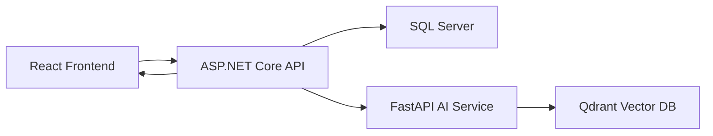

# Thuật Toán Đề Xuất Phim

Hệ thống đề xuất phim kết hợp giữa phân tích hành vi người dùng bằng SQL Server ở backend và tìm kiếm vector ngữ nghĩa (semantic search) ở dịch vụ AI.

## Kiến Trúc Hệ Thống


```mermaid
flowchart LR
    FE["React Frontend"] --> API["ASP.NET Core API"]
    API --> SQL["SQL Server"]
    API --> AI["FastAPI AI Service"]
    AI --> QDRANT["Qdrant Vector DB"]
    API --> FE
```

SQL Server là nguồn dữ liệu chuẩn (Source of Truth). Qdrant chỉ lưu trữ các vector phim cố định. Vector sở thích của người dùng được tạo động trên mỗi yêu cầu và không được lưu lại.

---

## Cơ Chế Lai (Hybrid Strategy — Embedding vs. Fallback)

Hệ thống gợi ý phim hoạt động linh hoạt theo hai cơ chế tùy thuộc vào trạng thái cấu hình của hệ thống AI (Gemini API key):

### 1. Khi Có Embedding (Gemini API Key Hợp Lệ)
Hệ thống phân tích các văn bản mô tả sở thích/phim nguồn và chuyển thành vector 768 chiều. Mốc 768 được chọn sau benchmark nội bộ: `semantic_score@5 = 1.4037`, `hit@5 = 0.975`, hard-negative giữ ở `0.04`, latency trung bình `3.96ms`, trong khi giảm khoảng 25% bộ nhớ vector so với 1024 chiều. Sau đó, hệ thống sử dụng cơ sở dữ liệu vector Qdrant để tính cosine similarity và tìm các bộ phim tương đồng ngữ nghĩa nhất.

Điểm `SimilarityScore` lúc này là **khoảng cách** (distance): nhỏ hơn = khớp hơn.  
Để hiển thị `% Phù hợp` (`MatchPercentage`) trực quan cho người dùng, backend thực hiện đảo ngược khoảng cách:

```text
MatchPercentage = (1 - SimilarityScore / MaxScore) * 100%
```

### 2. Khi Không Có Embedding (Cơ Chế Dự Phòng — Fallback)
Hệ thống tự động chạy thuật toán thống kê hành vi trực tiếp bằng SQL Server. Thuật toán này tự động lọc bỏ các phim người dùng đã xem hoặc đặt vé trước đó, sau đó tính điểm số độ hot của các phim còn lại:

```text
SimilarityScore = (bookingCount × 3) + (viewCount × 1) + (avgRating × 10) + (ratingCount × 1)
```

Cuối cùng, backend áp dụng **chuẩn hóa Min-Max** để đưa điểm số về thang 0–100%:

```text
MatchPercentage = (SimilarityScore - MinScore) / (MaxScore - MinScore) * 100%
```

*(Lưu ý: Nếu tất cả phim có điểm bằng nhau, toàn bộ sẽ nhận MatchPercentage = 100%).*

---

## Luồng Xử Lý Gợi Ý Cá Nhân Hóa Hiện Tại

Endpoint frontend vẫn giữ nguyên:

```http
GET /api/v1/Recommendation/movies
```

Backend không còn gom toàn bộ hành vi người dùng thành một vector duy nhất. `GetRecommendationsUseCase` chọn chiến lược theo thứ tự ưu tiên và chỉ rơi xuống strategy sau khi strategy trước không có đủ tín hiệu/kết quả.

### 1. Rating tốt gần đây: multi-query theo từng phim

Điều kiện: user có rating `>= 4` trong 30 ngày gần nhất.

Cơ chế:

1. Backend lấy tối đa 6 phim user đánh giá cao gần đây.
2. Với mỗi phim nguồn, backend gọi AI service `POST /recommend-by-id`.
3. Mỗi phim nguồn tạo một nhóm kết quả riêng, tránh việc nhiều gu khác nhau bị trộn thành một vector loãng.
4. Backend trộn các nhóm bằng weighted round-robin, loại trừ phim user đã tương tác.

### 2. Không có rating mới: thống kê gu dài hạn

Điều kiện: 30 ngày gần nhất không có rating `>= 4`.

Cơ chế:

1. Backend lấy long-term booked/completed order và view/click.
2. Booking/completed được gắn trọng số cao hơn view/click.
3. Backend thống kê genre chiếm ưu thế với ngưỡng `majorityThreshold = 0.5`.
4. Nếu có genre rõ ràng, backend gọi `POST /recommend` bằng text đại diện genre/tag dài hạn.

### 3. User ít dữ liệu: tương tác chất lượng cao

Điều kiện: user có ít tương tác nhưng không đủ để thống kê gu dài hạn.

Cơ chế:

1. Backend gom booked/viewed/positive rating của user.
2. Chỉ giữ phim có rating cộng đồng nội bộ trung bình `>= 4.0`.
3. Backend gọi `/recommend-by-id` cho từng phim chất lượng cao.

### 4. Survey và fallback trending

Nếu các strategy trên không tạo được kết quả, backend dùng survey genre/preference description để gọi `/recommend`.

Nếu AI service lỗi, Qdrant rỗng, hoặc vẫn thiếu kết quả, backend trả về fallback trending/popular từ SQL:

```text
SimilarityScore = (bookingCount × 3) + viewCount + (avgRating × 10) + ratingCount
```

### 5. Ranking và exploration

Mỗi kết quả AI được quy đổi thành điểm nội bộ:

```text
score = vectorSimilarity × sourceWeight + timeDecay × 0.15 + depthBoost × 0.05
```

Trong đó:

- `sourceWeight`: rating gần đây cao nhất, phim tương tác chất lượng cao tiếp theo, long-term genre thấp hơn.
- `timeDecay`: hành vi mới hơn được cộng điểm.
- `depthBoost`: phim đứng cao trong từng nhóm query được cộng nhẹ.

Output mặc định vẫn là 5 phim. Backend để khoảng 1/5 slot cho exploration/fallback nếu còn chỗ.

---

## Gợi Ý Phim Liên Quan (Related Movies Recommendation)

Để hiển thị danh sách các phim tương tự trên trang chi tiết phim (`GET /api/v1/public/movies/{movieId}/similar`), hệ thống áp dụng luồng tìm kiếm hỗn hợp:

### 1. Tầng Cache
Kết quả truy vấn phim liên quan được cache trong Redis với key:
`movies:similar:{movieId}:{limit}` trong 30 phút để giảm tải hệ thống.

### 2. Danh Sách Ứng Viên (Candidate Pool)
Backend tải trước danh sách ứng viên gồm tối đa 100 phim đang chiếu (Now Showing) và 100 phim sắp chiếu (Coming Soon) từ SQL Server (loại trừ chính bộ phim đang xem).

### 3. Tìm Kiếm Ngữ Nghĩa (AI Semantic Similarity)
Backend tạo đoạn văn bản mô tả thông tin bộ phim hiện tại:
```text
Tên phim: {MovieName}. Thể loại: {Genres}. Mô tả: {Description}. Đạo diễn: {Director}. Diễn viên: {Actors}
```
Gửi đoạn văn bản này sang Python AI Service `/recommend`. AI Service tạo vector embedding và truy vấn Qdrant để tìm các phim có độ tương đồng cao nhất. Backend C# sau đó lọc và ánh xạ các kết quả này khớp với danh sách ứng viên đã tải trước đó mà vẫn giữ nguyên thứ tự tương đồng của AI.

### 4. Dự Phòng Bằng Khớp Thể Loại (Genre-Matching Fallback)
Nếu dịch vụ AI gặp lỗi hoặc không trả đủ kết quả, hệ thống tự động kích hoạt thuật toán dự phòng bằng SQL:
- Tìm các bộ phim trong danh sách ứng viên có chung ít nhất 1 thể loại với phim hiện tại.
- Sắp xếp thứ tự ưu tiên theo số lượng thể loại trùng khớp (giảm dần), và thời điểm kết thúc chiếu phim (giảm dần) để ưu tiên các phim mới.

### 5. Dự Phòng Cuối Cùng
Nếu danh sách vẫn chưa đủ số lượng yêu cầu (`limit`), hệ thống sẽ lấy ngẫu nhiên các bộ phim đang hoạt động khác trong danh sách ứng viên để bù vào.
