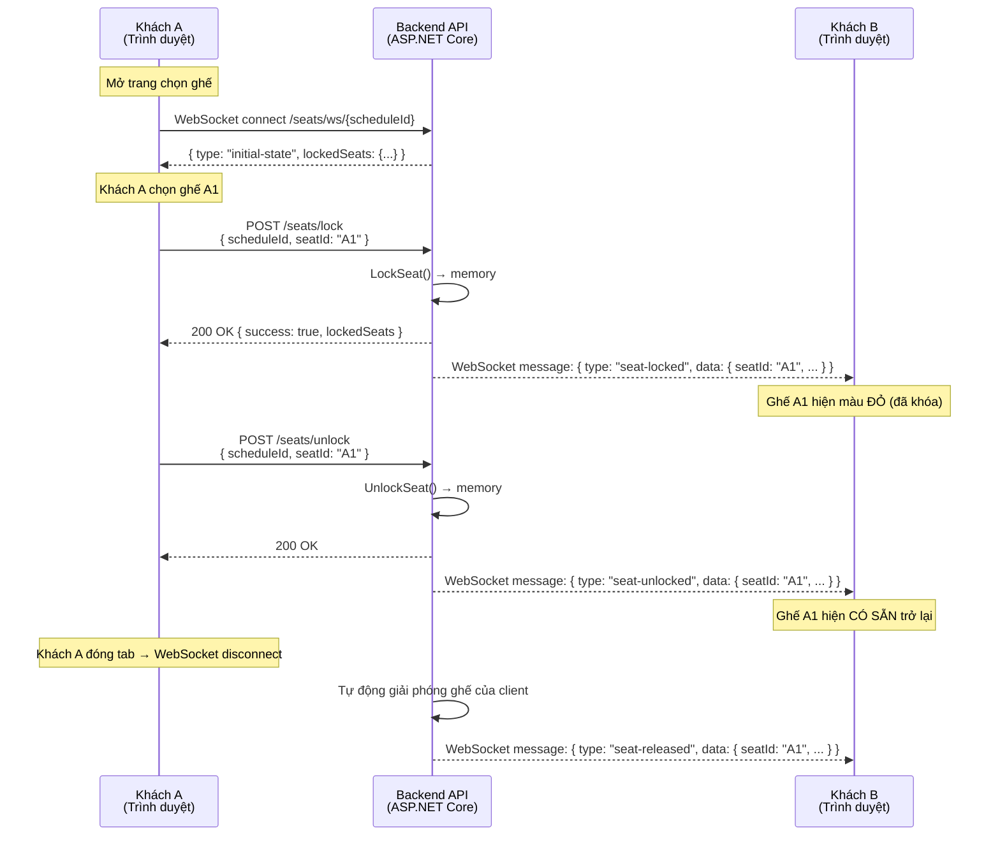

# Khóa ghế Real-time (Giữ ghế tạm thời)

> **Tại sao tính năng này quan trọng?** Khi bạn chọn một ghế trên màn hình đặt vé, ghế đó phải được **khóa tạm thời** để người khác không chọn cùng. Nếu không có cơ chế này, hai người có thể đặt cùng một ghế — dẫn đến đặt trùng, khiếu nại và mất uy tín cho rạp.

---

## Cách hoạt động (giải thích đơn giản)

Khi **bạn** chọn một ghế trên màn hình, hệ thống ngay lập tức báo cho **tất cả người dùng khác** đang xem cùng suất chiếu rằng ghế đó đã có người chọn (hiển thị màu đỏ). Nếu bạn không thanh toán trong **10 phút**, ghế sẽ tự động được giải phóng cho người khác đặt. Nếu bạn đóng tab trình duyệt, hệ thống cũng tự giải phóng ghế của bạn trong vài giây.

**Giống như giỏ hàng shopping online:** bạn bỏ đồ vào giỏ, nó được giữ riêng cho bạn trong thời gian giới hạn, rồi trở lại kệ nếu bạn không thanh toán.

---

## Kiến trúc kỹ thuật: Raw WebSocket + HTTP POST

Chúng tôi chọn **raw WebSocket** thay vì SignalR. Lý do:

- **WebSocket** là kết nối bền vững hai chiều giữa server và client. Server đẩy thông tin trạng thái ghế real-time mà client không cần hỏi đi hỏi lại.
- **HTTP POST** — dùng cho hành động client → server (khóa/mở khóa ghế). Kết nối WebSocket chủ yếu xử lý **server → client** broadcast (thông báo thay đổi trạng thái).
- **Lưu trong bộ nhớ RAM (in-memory):** Dữ liệu khóa ghế được lưu trong `ConcurrentDictionary` trên RAM của server, không phải database. Nếu server khởi động lại, các khóa bị mất — nhưng điều này chấp nhận được vì khóa chỉ tồn tại tối đa 10 phút. Khi client kết nối lại, chúng nhận được trạng thái mới nhất.

### Tại sao raw WebSocket thay vì SignalR?

| Tiêu chí | Raw WebSocket + HTTP POST | SignalR |
|----------|---------------------------|---------|
| Độ phức tạp | Tối thiểu — dùng `System.Net.WebSockets` trực tiếp | Cao hơn — đàm phán Hub, lớp trừu tượng giao thức |
| Phụ thuộc | Không cần NuGet package thêm | Yêu cầu `Microsoft.AspNetCore.SignalR` |
| Hai chiều | Có (chúng tôi chỉ dùng server→client) | Có (built-in) |
| Fallback transport | Không (chỉ WebSocket) | Tự động fallback xuống SSE, long polling |
| **Lựa chọn của chúng tôi** | ✅ **Đã chọn** | ❌ Không dùng |

---

## Sơ đồ luồng



---

## API Endpoints

| Method | Endpoint | Mô tả |
|--------|----------|-------|
| `POST` | `/api/v1/booking/seats/lock` | Khóa ghế tạm thời |
| `POST` | `/api/v1/booking/seats/unlock` | Giải phóng ghế đã khóa |
| `GET` | `/api/v1/booking/seats/ws/{scheduleId}` | WebSocket endpoint — nhận cập nhật real-time (không cần đăng nhập) |
| `GET` | `/api/v1/booking/seats/state/{scheduleId}` | HTTP fallback — lấy trạng thái khóa hiện tại |

### POST /api/v1/booking/seats/lock

**Request:**
```json
{
  "scheduleId": "guid",
  "seatId": "A1",
  "userName": "Nguyen Van A",
  "clientId": "seat-client-uuid"
}
```

**Response (200 — thành công):**
```json
{
  "success": true,
  "message": "Seat locked successfully",
  "lockedSeats": { "A1": "Nguyen Van A", "A2": "Tran Van B" }
}
```

**Response (409 — xung đột):**
```json
{
  "success": false,
  "message": "Seat is locked by another user",
  "lockedSeats": { "A1": "Tran Van B" }
}
```

### POST /api/v1/booking/seats/unlock

**Request:**
```json
{
  "scheduleId": "guid",
  "seatId": "A1",
  "clientId": "seat-client-uuid"
}
```

**Response:**
```json
{
  "success": true,
  "message": "Seat unlocked successfully",
  "lockedSeats": {}
}
```

### GET /api/v1/booking/seats/ws/{scheduleId}

Endpoint WebSocket. Mở kết nối bền vững dài. Không yêu cầu xác thực.

**Hỗ trợ:**
- Query parameter `clientId` để nhận diện client khi kết nối lại
- Tự động dọn dẹp khi ngắt kết nối (tất cả ghế của client được giải phóng)

---

## Tin nhắn WebSocket

WebSocket gửi JSON từ **server đến client**:

| Loại tin nhắn | Khi nào gửi | Dữ liệu |
|--------------|-------------|---------|
| `initial-state` | Client vừa kết nối | `{ type: "initial-state", lockedSeats: { "a1": "User" } }` |
| `seat-locked` | Ai đó khóa ghế | `{ type: "seat-locked", data: { seatId: "A1", userName: "User", lockedSeats: {...} } }` |
| `seat-unlocked` | Ai đó giải phóng ghế | `{ type: "seat-unlocked", data: { seatId: "A1", lockedSeats: {...} } }` |
| `seat-released` | Cleanup khi client ngắt kết nối | `{ type: "seat-released", data: { seatId: "A1", lockedSeats: {...} } }` |

---

## Tự động dọn dẹp

| Tình huống | Xử lý | Cơ chế |
|------------|-------|--------|
| **Không thanh toán sau 10 phút** | Đơn hàng Pending bị hủy, ghế được giải phóng | Hangfire recurring job (chạy mỗi 5 phút) |
| **Đóng tab trình duyệt** | Tất cả ghế của client đó được release | WebSocket disconnect → `RemoveConnection()` + `ReleaseSeatsByClient()` |
| **Server restart** | Toàn bộ lock trong memory mất → client kết nối lại | Client phát hiện `onclose` → có thể tự động kết nối lại |

---

## Các thành phần chính

| Component | Vị trí | Vai trò |
|-----------|--------|---------|
| `SeatWsManager` (Singleton) | `Cinema.Infrastructure/ExternalServices/Notifications/` | Quản lý lock ghế + WebSocket subscriber (`ConcurrentDictionary<string, ConcurrentDictionary<string, WebSocket>>`) |
| `SeatLockManager` | `Cinema.Infrastructure/ExternalServices/Notifications/` | Quản lý trạng thái khóa ghế nguyên tử (`ConcurrentDictionary<string, LockEntry>`) |
| `BookingController.GetSeatWebSocket` | `Cinema.Api/Controllers/Customer/Booking/` | WebSocket accept + trạng thái ban đầu + vòng đọc |
| `SeatLockerNotificationService` | `Cinema.Api/Hubs/` | Cầu nối giữa Hangfire job và `SeatWsManager` |
| `PendingOrderCancellationJob` | `Cinema.Infrastructure/BackgroundJobs/` | Tự động hủy đơn hàng Pending > 10 phút |
| `useSeatWs` hook | `apps/frontend/src/hooks/useSeatWs.ts` | React hook cho WebSocket + lock/unlock API |

### Frontend Integration (React)

Hook `useSeatWs` cung cấp mọi thứ bạn cần:

```typescript
import { useSeatWs } from '../../hooks/useSeatWs';

function SeatMap({ scheduleId }: { scheduleId: string }) {
  const { lockedSeats, lockSeat, unlockSeat, isConnected } = useSeatWs(scheduleId);
  
  // lockedSeats: Record<string, string> — { "a1": "UserName", ... }
  // lockSeat(seatId, userName) → Promise<boolean>
  // unlockSeat(seatId) → Promise<boolean>
  // isConnected: boolean — trạng thái kết nối WebSocket
}
```

**Lưu ý:** Hook chuẩn hóa tất cả seatId về lowercase để so khóa nhất quán.

---

## Xử lý lỗi

| Tình huống | Xử lý |
|------------|-------|
| **Mất mạng** | WebSocket fire `onclose` → `isConnected = false`; component có thể thử kết nối lại |
| **Server restart** | Mất hết lock; client kết nối lại nhận trạng thái mới qua `initial-state` |
| **Race condition (2 người cùng khóa 1 ghế)** | `TryAdd` nguyên tử trong `SeatLockManager` — chỉ 1 người thành công, người kia nhận `409 Conflict` |
| **Mở nhiều tab** | Mỗi tab có `clientId` riêng. Khóa cùng ghế từ tab khác được tính là "người khác" |
| **Quên tab (idle)** | Kết nối WebSocket timeout → `ReceiveAsync` throw → cleanup giải phóng toàn bộ ghế |
