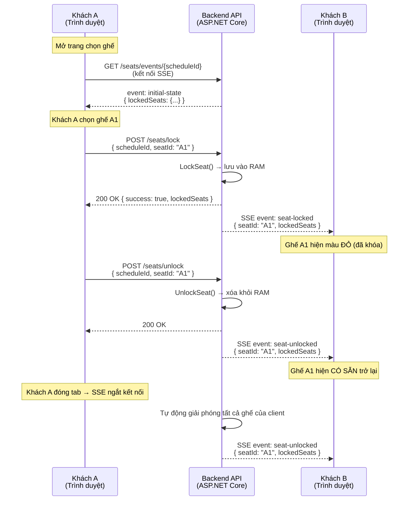

# Khóa ghế Real-time (Giữ ghế tạm thời)

> **Tại sao tính năng này quan trọng?** Khi bạn chọn một ghế trên màn hình đặt vé, ghế đó phải được **khóa tạm thời** để người khác không chọn cùng. Nếu không có cơ chế này, hai người có thể đặt cùng một ghế — dẫn đến đặt trùng, khiếu nại và mất uy tín cho rạp.

---

## Cách hoạt động (giải thích đơn giản)

Khi **bạn** chọn một ghế trên màn hình, hệ thống ngay lập tức báo cho **tất cả người dùng khác** đang xem cùng suất chiếu rằng ghế đó đã có người chọn (hiển thị màu đỏ). Nếu bạn không thanh toán trong **10 phút**, ghế sẽ tự động được giải phóng cho người khác đặt. Nếu bạn đóng tab trình duyệt, hệ thống cũng tự giải phóng ghế của bạn trong vài giây.

**Giống như giỏ hàng shopping online:** bạn bỏ đồ vào giỏ, nó được giữ riêng cho bạn trong thời gian giới hạn, rồi trở lại kệ nếu bạn không thanh toán.

---

## Kiến trúc kỹ thuật: SSE + HTTP POST

Chúng tôi chọn **SSE (Server-Sent Events)** thay vì WebSocket (SignalR). Lý do:

- **SSE** — kênh một chiều từ server đến client. Server tự động đẩy dữ liệu real-time mà client không cần hỏi đi hỏi lại.
- **HTTP POST** — dùng cho hành động client → server (khóa/mở khóa ghế). SSE không gửi được dữ liệu từ client lên server, nên chúng tôi dùng REST API riêng cho việc đó.
- **Lưu trong bộ nhớ RAM (in-memory):** Dữ liệu khóa ghế được lưu trong RAM của server, không phải database. Nếu server khởi động lại, các khóa bị mất — nhưng điều này chấp nhận được vì khóa chỉ tồn tại tối đa 10 phút. Khi client kết nối lại, chúng nhận được trạng thái mới nhất.

### Tại sao SSE thay vì SignalR WebSocket?

| Tiêu chí | SSE + HTTP POST | SignalR / WebSocket |
|----------|----------------|-------------------|
| Độ phức tạp | Đơn giản — dùng `EventSource` có sẵn trong trình duyệt | Phức tạp — cần đàm phán WebSocket, fallback transports |
| Tự động kết nối lại | Có sẵn (trình duyệt tự xử lý) | Phải tự code |
| Tương thích CDN | Hoạt động tốt (ví dụ Cloudflare) | Một số proxy chặn WebSocket |
| Scale nhiều instance | Không cần sticky session | Cần Redis backplane |
| Hai chiều | Không (dùng POST riêng) | Có (built-in) |
| **Lựa chọn của chúng tôi** | ✅ **Đã chọn** | ❌ Không dùng |

---

## Sơ đồ luồng



---

## API Endpoints

| Phương thức | Endpoint | Mô tả |
|------------|----------|-------|
| `POST` | `/api/v1/booking/seats/lock` | Khóa ghế tạm thời |
| `POST` | `/api/v1/booking/seats/unlock` | Giải phóng ghế đã khóa |
| `GET` | `/api/v1/booking/seats/events/{scheduleId}` | SSE stream — nhận cập nhật real-time (không cần đăng nhập) |

### POST /api/v1/booking/seats/lock

**Request:**
```json
{
  "scheduleId": "guid",
  "seatId": "A1",
  "userName": "Nguyen Van A"
}
```

**Response (200 — thành công):**
```json
{
  "success": true,
  "message": "Seat locked successfully",
  "lockedSeats": { "A1": "Nguyen Van A", "A2": "Tran Van B" }
}
```

**Response (409 — xung đột):**
```json
{
  "success": false,
  "message": "Seat is locked by another user",
  "lockedSeats": { "A1": "Tran Van B" }
}
```

### POST /api/v1/booking/seats/unlock

**Request:**
```json
{
  "scheduleId": "guid",
  "seatId": "A1"
}
```

**Response:**
```json
{
  "success": true,
  "message": "Seat unlocked successfully",
  "lockedSeats": {}
}
```

### GET /api/v1/booking/seats/events/{scheduleId}

Endpoint SSE (text/event-stream). Mở kết nối dài. Không yêu cầu xác thực.

**Hỗ trợ:**
- Tự động kết nối lại qua `Last-Event-ID`
- Heartbeat mỗi 15 giây (`: heartbeat`)

---

## Sự kiện SSE

| Loại sự kiện | Khi nào gửi | Dữ liệu |
|-------------|------------|---------|
| `initial-state` | Client vừa kết nối | `{ event: "initial-state", lockedSeats: { "A1": "User" } }` |
| `seat-locked` | Có người vừa khóa ghế | `{ event: "seat-locked", seatId: "A1", userName: "User", lockedSeats: {...} }` |
| `seat-unlocked` | Có người vừa mở khóa ghế | `{ event: "seat-unlocked", seatId: "A1", lockedSeats: {...} }` |

---

## Dọn dẹp tự động

| Tình huống | Xử lý | Cơ chế |
|-----------|-------|--------|
| **Không thanh toán sau 10 phút** | Order Pending tự hủy, ghế được release | Hangfire recurring job (chạy mỗi 5 phút) |
| **Đóng tab trình duyệt** | Tất cả ghế của client đó được release | SSE ngắt kết nối → `ReleaseSeatsByClient()` |
| **Server restart** | Mất toàn bộ lock trong RAM → client kết nối lại | `EventSource` tự động reconnect → nhận state mới nhất |

---

## Các thành phần kỹ thuật chính

| Thành phần | Vị trí | Vai trò |
|-----------|--------|---------|
| `SeatSseManager` (Singleton) | `Cinema.Infrastructure/ExternalServices/Notifications/` | Quản lý lock ghế + subscriber SSE |
| `BookingController` | `Cinema.Api/Controllers/Customer/Booking/` | API endpoints lock/unlock/events |
| `SeatLockerNotificationService` | `Cinema.Api/Hubs/` | Cầu nối giữa Hangfire job và `SeatSseManager` |
| `PendingOrderCancellationJob` | `Cinema.Infrastructure/BackgroundJobs/` | Tự động hủy order Pending > 10 phút |
| `useSeatSse` hook | `apps/frontend/src/hooks/` | React hook cho SSE + lock/unlock |

### Tích hợp Frontend

Hook `useSeatSse` cung cấp mọi thứ bạn cần:

```typescript
import { useSeatSse } from '../../hooks/useSeatSse';

function SeatMap({ scheduleId }: { scheduleId: string }) {
  const { lockedSeats, lockSeat, unlockSeat, isConnected } = useSeatSse(scheduleId);
  
  // lockedSeats: Record<string, string> — { "A1": "UserName", ... }
  // lockSeat(seatId, userName) → Promise<boolean>
  // unlockSeat(seatId) → Promise<boolean>
  // isConnected: boolean — trạng thái kết nối SSE
}
```

---

## Xử lý lỗi

| Tình huống | Cách xử lý |
|-----------|-----------|
| **Mất mạng** | SSE tự động kết nối lại (trình duyệt xử lý sẵn) |
| **Server restart** | Mất toàn bộ lock; client reconnect → nhận state mới nhất qua `initial-state` |
| **2 người lock cùng lúc** | `TryAdd` nguyên tử — chỉ 1 người thành công, người kia nhận `409 Conflict` |
| **Mở nhiều tab** | Mỗi tab có `clientId` riêng. Lock cùng ghế từ tab khác = "người khác" |
| **Quên tab** | Kết nối SSE timeout → server giải phóng toàn bộ ghế |
