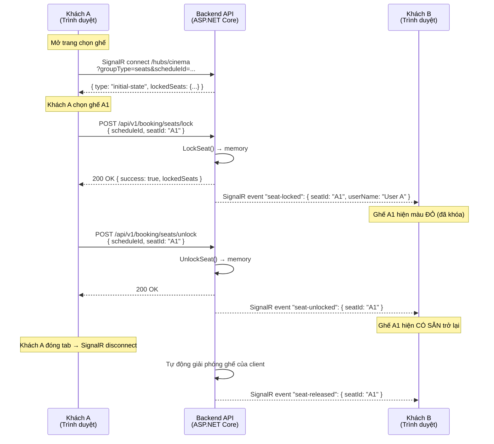

# Khóa ghế Real-time (Giữ ghế tạm thời)

> **Tại sao tính năng này quan trọng?** Khi bạn chọn một ghế trên màn hình đặt vé, ghế đó phải được **khóa tạm thời** để người khác không chọn cùng. Nếu không có cơ chế này, hai người có thể đặt cùng một ghế — dẫn đến đặt trùng, khiếu nại và mất uy tín cho rạp.

---

## Cách hoạt động (giải thích đơn giản)

Khi **bạn** chọn một ghế trên màn hình, hệ thống ngay lập tức báo cho **tất cả người dùng khác** đang xem cùng suất chiếu rằng ghế đó đã có người chọn (hiển thị màu đỏ). Nếu bạn không thanh toán trong **10 phút**, ghế sẽ tự động được giải phóng cho người khác đặt. Nếu bạn đóng tab trình duyệt, hệ thống cũng tự giải phóng ghế của bạn trong vài giây.

**Giống như giỏ hàng shopping online:** bạn bỏ đồ vào giỏ, nó được giữ riêng cho bạn trong thời gian giới hạn, rồi trở lại kệ nếu bạn không thanh toán.

---

## Kiến trúc kỹ thuật: SignalR Hub

Chúng tôi chọn **SignalR** cho toàn bộ giao tiếp real-time. Nó cung cấp kênh hai chiều thống nhất với tự động kết nối lại, quản lý nhóm và fallback transport.

### Tại sao SignalR?

| Tiêu chí | SignalR (Đã chọn) | Raw WebSocket (Trước đây) |
|----------|-------------------|---------------------------|
| Tự động reconnect | ✅ Built-in (`withAutomaticReconnect`) | ❌ Phải tự code |
| Quản lý group | ✅ Built-in (`Groups.AddToGroupAsync`) | ❌ Phải tự `ConcurrentDictionary` |
| Transport | WebSocket + SSE + Long Polling (tự động fallback) | Chỉ WebSocket |
| Scale nhiều instance | ✅ Hỗ trợ Redis Backplane | ❌ Phải tự xử lý |
| Client library | ✅ `@microsoft/signalr` (npm) | ❌ Native WebSocket API |
| **Use case của chúng tôi** | **Hub thống nhất cho ghế, thanh toán, nhóm** | Đơn giản hơn nhưng thiếu reconnect/group |

### Ba kênh kết nối

Hệ thống dùng một **Hub duy nhất** (`/hubs/cinema`) với routing dựa trên query param:

| Kênh | `groupType` | Mục đích |
|------|-------------|----------|
| **Ghế** | `seats` | Broadcast trạng thái ghế real-time theo `scheduleId` |
| **Thanh toán** | `payment` | Thông báo kết quả thanh toán theo `orderId` |
| **Nhóm** | `group` | Broadcast trạng thái nhóm/vote/chat theo `groupSessionId` |

---

## Sơ đồ luồng



---

## API Endpoints

| Method | Endpoint | Mô tả |
|--------|----------|-------|
| `POST` | `/api/v1/booking/seats/lock` | Khóa ghế tạm thời |
| `POST` | `/api/v1/booking/seats/unlock` | Giải phóng ghế đã khóa |
| `GET` | `/hubs/cinema` | **SignalR Hub** — cập nhật real-time (query: `groupType=seats&scheduleId=...`) |

### POST /api/v1/booking/seats/lock

**Request:**
```json
{
  "scheduleId": "guid",
  "seatId": "A1",
  "userName": "Nguyen Van A",
  "clientId": "seat-client-uuid"
}
```

**Response (200 — thành công):**
```json
{
  "success": true,
  "message": "Seat locked successfully",
  "lockedSeats": { "A1": "Nguyen Van A", "A2": "Tran Van B" }
}
```

**Response (409 — xung đột):**
```json
{
  "success": false,
  "message": "Seat is locked by another user",
  "lockedSeats": { "A1": "Tran Van B" }
}
```

### POST /api/v1/booking/seats/unlock

**Request:**
```json
{
  "scheduleId": "guid",
  "seatId": "A1",
  "clientId": "seat-client-uuid"
}
```

**Response:**
```json
{
  "success": true,
  "message": "Seat unlocked successfully",
  "lockedSeats": {}
}
```

### SignalR Hub tại `/hubs/cinema`

Hub thay thế endpoint raw WebSocket cũ (`GET /seats/ws/{scheduleId}`, đã bị **xoá**).

**Kết nối:**
```
/hubs/cinema?groupType=seats&scheduleId={scheduleId}&clientId={clientId}
```

**Tính năng:**
- Tự động kết nối lại (retry: 0s, 2s, 5s, 10s, 30s)
- Không cần xác thực cho kết nối ghế
- `clientId` để nhận diện client khi kết nối lại
- Tự động dọn dẹp khi ngắt kết nối

---

## SignalR Events (Server → Client)

| Event Name | Khi nào gửi | Dữ liệu |
|------------|-------------|---------|
| `initial-state` | Client vừa kết nối | `{ lockedSeats: { "a1": "User" } }` |
| `seat-locked` | Ai đó khóa ghế | `{ seatId: "A1", userName: "User", lockedSeats: {...} }` |
| `seat-unlocked` | Ai đó giải phóng ghế | `{ seatId: "A1", lockedSeats: {...} }` |
| `seat-released` | Cleanup khi client ngắt kết nối | `{ seatId: "A1", lockedSeats: {...} }` |

> **Note:** Khác với raw WebSocket (bọc trong `{ type, data }`), SignalR dùng **named events** — tên event chính là type.

---

## Tự động dọn dẹp

| Tình huống | Xử lý | Cơ chế |
|------------|-------|--------|
| **Không thanh toán sau 10 phút** | Đơn hàng Pending bị hủy, ghế được giải phóng | Hangfire recurring job (chạy mỗi 5 phút) |
| **Đóng tab trình duyệt** | Tất cả ghế của client đó được release | SignalR `OnDisconnectedAsync` → `ReleaseSeatsByClient()` |
| **Server restart** | Client tự động kết nối lại | SignalR client retry với backoff |

---

## Các thành phần chính

| Component | Vị trí | Vai trò |
|-----------|--------|---------|
| `CinemaHub` (Hub) | `Cinema.Api/Hubs/` | **SignalR Hub duy nhất** — xử lý seat/payment/group connections, `OnConnectedAsync`, `OnDisconnectedAsync` |
| `SignalRSeatBroadcaster` | `Cinema.Api/Hubs/` | Implement `ISeatBroadcaster` — broadcast sự kiện ghế tới SignalR group (`seats-{scheduleId}`) |
| `SignalRGroupBroadcaster` | `Cinema.Api/Hubs/` | Implement `IGroupBroadcaster` — broadcast sự kiện nhóm tới SignalR group (`group-{groupSessionId}`) |
| `SeatLockManager` | `Cinema.Infrastructure/ExternalServices/Notifications/` | Quản lý trạng thái khóa ghế nguyên tử (`ConcurrentDictionary<string, LockEntry>`) |
| `SeatLockerNotificationService` | `Cinema.Api/Hubs/` | Cầu nối giữa Hangfire job và SignalR broadcasters |
| `PendingOrderCancellationJob` | `Cinema.Infrastructure/BackgroundJobs/` | Tự động hủy đơn hàng Pending > 10 phút |
| `signalrClient` factory | `apps/frontend/src/api/signalrClient.ts` | Tạo `HubConnection` cho seats/payment/group |
| `useSeatWs` hook | `apps/frontend/src/hooks/useSeatWs.ts` | React hook bọc SignalR + lock/unlock API |

### Frontend Integration (React)

Hook `useSeatWs` dùng `@microsoft/signalr` bên dưới:

```typescript
import { useSeatWs } from '../../hooks/useSeatWs';

function SeatMap({ scheduleId }: { scheduleId: string }) {
  const { lockedSeats, lockSeat, unlockSeat, isConnected } = useSeatWs(scheduleId);
  
  // lockedSeats: Record<string, string> — { "a1": "UserName", ... }
  // lockSeat(seatId, userName) → Promise<boolean>
  // unlockSeat(seatId) → Promise<boolean>
  // isConnected: boolean — trạng thái SignalR connection
}
```

**Lưu ý:** Hook chuẩn hóa tất cả seatId về lowercase để so khóa nhất quán.

---

## Xử lý lỗi

| Tình huống | Xử lý |
|------------|-------|
| **Mất mạng** | SignalR fire `onreconnecting` → `isConnected = false`; tự động retry (0s, 2s, 5s, 10s, 30s) |
| **Server restart** | SignalR retry thất bại → `onclose`; hook giải phóng ghế của client qua HTTP unlock |
| **Race condition (2 người cùng khóa 1 ghế)** | `TryAdd` nguyên tử trong `SeatLockManager` — chỉ 1 người thành công, người kia nhận `409 Conflict` |
| **Mở nhiều tab** | Mỗi tab có `clientId` riêng. Khóa cùng ghế từ tab khác được tính là "người khác" |
| **Quên tab (idle)** | SignalR connection timeout → `OnDisconnectedAsync` → cleanup giải phóng toàn bộ ghế |
