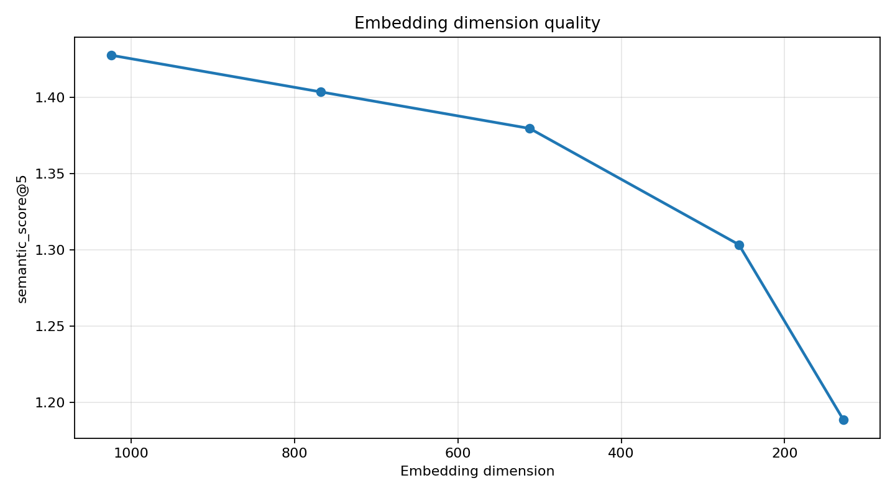
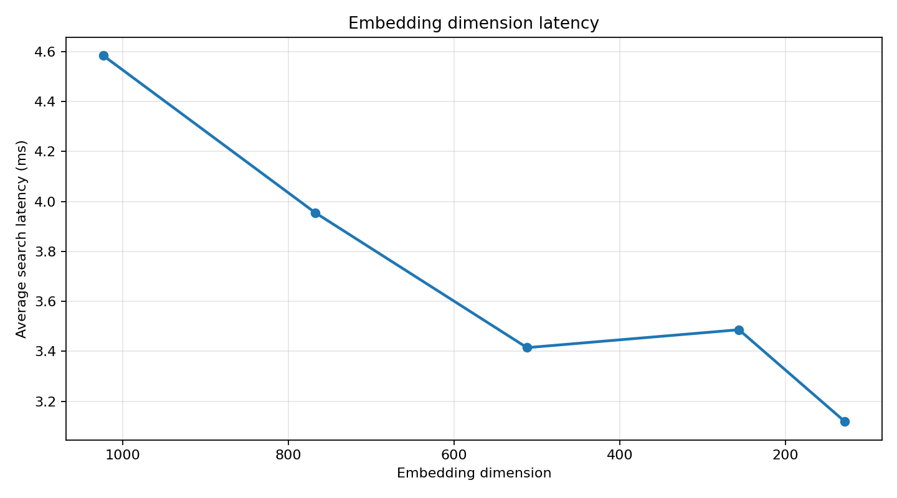
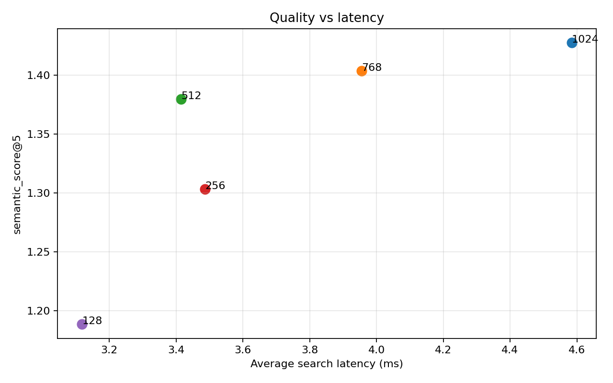
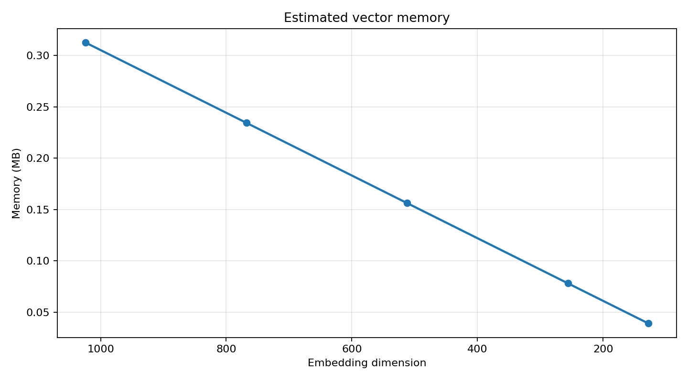
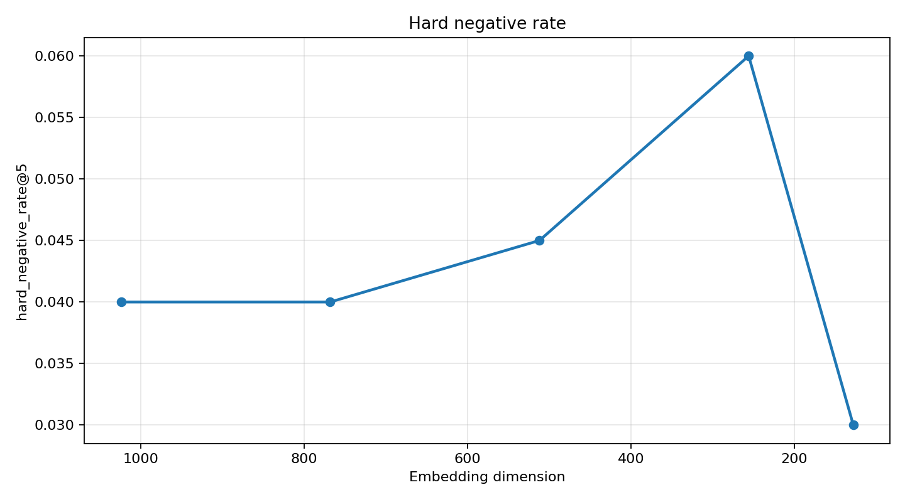

# Embedding Dimension Benchmark

## Mục tiêu

Benchmark này dùng để chọn số chiều embedding cho hệ thống gợi ý phim và semantic search trong AI service. Hệ thống hiện dùng `BAAI/bge-m3` ở local backend, Qdrant cosine search, và `EMBEDDING_DIM=768` cho production/dev config.

Lý do cần benchmark: giảm chiều giúp giảm bộ nhớ vector và latency, nhưng nếu giảm quá sâu thì dense vector dễ trả kết quả nhiễu, nhất là khi index lớn. Vì vậy dimension không được chọn theo cảm tính mà dựa trên seed benchmark có ground truth.

## Dataset và cách chạy

Seed benchmark nằm tại:

```text
services/ai/benchmarks/data/movie_benchmark_seed.json
```

Link kiểm chứng dữ liệu đầu vào:

- [movie_benchmark_seed.json](../../services/ai/benchmarks/data/movie_benchmark_seed.json)

Seed gồm:

- 80 phim giả lập theo ngôn ngữ rạp chiếu.
- 40 query benchmark.
- `expectedMovieIds`, `expectedGenres`, `expectedTags`.
- `hardNegativeMovieIds` để phạt các kết quả dễ nhầm nhưng sai.

## Data input

Benchmark không dùng dữ liệu sinh ngẫu nhiên lúc chạy. Toàn bộ phim, query, ground truth và rule chấm điểm được cố định trong file seed:

```text
services/ai/benchmarks/data/movie_benchmark_seed.json
```

Cấu trúc chính của seed:

```json
{
  "movies": [
    {
      "movieId": "...",
      "movieName": "...",
      "genres": ["Action", "Thriller"],
      "description": "...",
      "director": "...",
      "actors": ["..."],
      "tags": ["revenge", "fast-paced"],
      "communityRating": 4.5,
      "bookingCount30d": 1200,
      "viewCount30d": 4500
    }
  ],
  "benchmarkQueries": [
    {
      "queryId": "...",
      "queryText": "...",
      "expectedMovieIds": ["..."],
      "expectedGenres": ["..."],
      "expectedTags": ["..."],
      "hardNegativeMovieIds": ["..."]
    }
  ],
  "scoringRules": {
    "hitAtK": [1, 3, 5],
    "primaryMetric": "semantic_score@5"
  }
}
```

Khi review benchmark, cần mở file seed trên để kiểm tra:

- Các phim có đủ metadata để tạo embedding theo ngữ cảnh rạp.
- Query có ground truth rõ ràng qua `expectedMovieIds`, `expectedGenres`, `expectedTags`.
- `hardNegativeMovieIds` có tồn tại để đo mức nhiễu của kết quả gần đúng nhưng sai ý định.

Lệnh chạy trong Docker AI service:

```powershell
docker compose exec -T ai python benchmarks/run_embedding_dimension_benchmark.py --seed benchmarks/data/movie_benchmark_seed.json --output-dir benchmarks/output --dimensions 1024,768,512,256,128
```

Script tạo collection Qdrant riêng cho từng dimension:

```text
cinema_movies_bench_1024
cinema_movies_bench_768
cinema_movies_bench_512
cinema_movies_bench_256
cinema_movies_bench_128
```

Collection production `cinema_movies` không bị thay đổi.

## Kết quả

| Dimension | semantic_score@5 | Avg search | hit@5 | Hard negative | Vector memory |
|---:|---:|---:|---:|---:|---:|
| 1024 | 1.4277 | 4.58ms | 1.000 | 0.040 | 0.3125MB |
| 768 | 1.4037 | 3.96ms | 0.975 | 0.040 | 0.2344MB |
| 512 | 1.3797 | 3.41ms | 0.950 | 0.045 | 0.1562MB |
| 256 | 1.3035 | 3.49ms | 1.000 | 0.060 | 0.0781MB |
| 128 | 1.1885 | 3.12ms | 0.875 | 0.030 | 0.0391MB |

## Giải thích cột kết quả

| Cột | Cách hiểu |
|---|---|
| `dimension` | Số chiều embedding đang benchmark, ví dụ `1024`, `768`, `512`, `256`, `128`. |
| `collection_name` | Tên collection Qdrant riêng cho dimension đó. Collection production `cinema_movies` không bị đụng vào. |
| `movie_count` | Số phim được đưa vào collection benchmark. |
| `query_count` | Số query benchmark đã chạy. |
| `embedding_time_sec` | Tổng thời gian tạo embedding cho toàn bộ phim trong seed. |
| `upsert_time_sec` | Tổng thời gian ghi toàn bộ vector phim vào Qdrant. |
| `avg_search_ms` | Thời gian search trung bình cho mỗi query. |
| `p50_search_ms` | Median latency: 50% query có thời gian search nhỏ hơn hoặc bằng giá trị này. |
| `p95_search_ms` | Latency ngưỡng 95%: 95% query có thời gian search nhỏ hơn hoặc bằng giá trị này, dùng để nhìn các case chậm gần worst-case. |
| `genre_precision@5` | Trung bình tỷ lệ phim trong top 5 có genre khớp với `expectedGenres`. |
| `hard_negative_rate@5` | Trung bình tỷ lệ phim thuộc `hardNegativeMovieIds` xuất hiện trong top 5. Càng thấp càng tốt. |
| `semantic_score@5` | Điểm semantic trung bình của top 5 theo `scoringRules` trong seed. Đây là metric chính để so chất lượng. |
| `estimated_vector_memory_mb` | Ước tính bộ nhớ raw vector theo công thức `movie_count * dimension * 4 bytes`. |
| `hit@1` | Tỷ lệ query có ít nhất 1 phim đúng trong top 1. Ví dụ `0.6` nghĩa là 60%. |
| `hit@3` | Tỷ lệ query có ít nhất 1 phim đúng trong top 3. |
| `hit@5` | Tỷ lệ query có ít nhất 1 phim đúng trong top 5. |

Lưu ý: `hit@K`, `genre_precision@5`, `hard_negative_rate@5` và `semantic_score@5` trong file kết quả là giá trị tổng hợp trên toàn bộ query benchmark, không phải kết quả của một query đơn lẻ. Với từng query riêng lẻ, `hit@K` là `0` hoặc `1`; khi lấy trung bình trên nhiều query thì thành tỷ lệ phần trăm dạng số thập phân.

## Vì sao chọn 768 chiều?

`768` được chọn vì là điểm cân bằng tốt nhất giữa chất lượng và chi phí:

- Giữ khoảng 98.3% `semantic_score@5` so với 1024 chiều.
- `hit@5 = 0.975`, chỉ giảm nhẹ so với 1024.
- Hard-negative giữ nguyên `0.04`, không tăng nhiễu.
- Latency trung bình giảm từ `4.58ms` xuống `3.96ms`.
- Bộ nhớ vector giảm khoảng 25%, từ `0.3125MB` xuống `0.2344MB` trên seed 80 phim.

`512` cũng còn khá tốt, nhưng `hit@5` giảm xuống `0.95` và hard-negative tăng nhẹ. `256` và `128` giảm chất lượng rõ hơn, nên không dùng làm mặc định.

## Biểu đồ benchmark

<p>
  
</p>

<p>
  
</p>

<p>
  
</p>

<p>
  
</p>

<p>
  
</p>

## Danh sách ảnh output

| Ảnh | Nội dung |
|---|---|
| [dimension_quality.png](../../services/ai/benchmarks/output/dimension_quality.png) | So sánh `semantic_score@5` giữa các dimension |
| [dimension_latency.png](../../services/ai/benchmarks/output/dimension_latency.png) | So sánh latency search trung bình |
| [dimension_quality_vs_latency.png](../../services/ai/benchmarks/output/dimension_quality_vs_latency.png) | Tương quan chất lượng và latency |
| [dimension_memory_estimate.png](../../services/ai/benchmarks/output/dimension_memory_estimate.png) | Ước tính bộ nhớ vector theo dimension |
| [dimension_hard_negative_rate.png](../../services/ai/benchmarks/output/dimension_hard_negative_rate.png) | Tỷ lệ hard negative trong top 5 |

## File kết quả

- [embedding_dimension_benchmark.csv](../../services/ai/benchmarks/output/embedding_dimension_benchmark.csv)
- [embedding_dimension_benchmark.json](../../services/ai/benchmarks/output/embedding_dimension_benchmark.json)

## Quy tắc vận hành

- Không đổi dimension production nếu chưa chạy benchmark lại với seed mới.
- Nếu catalog lớn hơn nhiều, benchmark cần bổ sung phim thật hoặc seed mở rộng để tránh đánh giá quá lạc quan.
- Khi đổi `EMBEDDING_DIM`, Qdrant collection phải được rebuild/sync lại vì vector size thay đổi.
