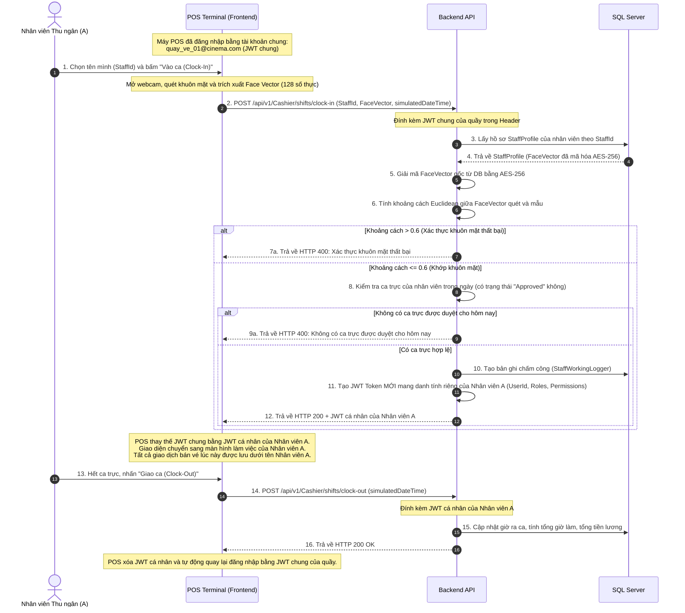

# KẾ HOẠCH TRIỂN KHAI CHI TIẾT (IMPLEMENTATION PLAN)
## JWT Permissions, Redis Distributed Lock, Điểm danh khuôn mặt & Quản lý Tài khoản POS / Duyệt-Hủy Ca Trực

Kế hoạch này tích hợp luồng nghiệp vụ **Tài khoản chung phòng ban/quầy (POS Shared Account)**, chấm công khuôn mặt, cơ chế **Hủy ca trực đã duyệt** và **Gán trực tiếp nhân viên mới** nhằm giải quyết vấn đề nhân viên nghỉ đột xuất.

---

## 1. Thiết kế Cơ cấu Quản lý Rạp (1 Rạp có bao nhiêu Quản lý?)

### Phân tích nghiệp vụ thực tế:
* Trong các chuỗi rạp phim lớn (CGV, Lotte), một chi nhánh rạp (ví dụ: CGV Vincom Bà Triệu) thường sẽ có **1 Quản lý trưởng (Cinema Manager)** và **2-3 Trưởng ca/Trợ lý quản lý (Shift Supervisors / Assistant Managers)** để thay ca nhau vận hành từ 8:00 sáng đến 12:00 đêm.
* Về mặt phần mềm, cả Quản lý trưởng và các Trưởng ca đều cần quyền quản trị vận hành như: duyệt ca trực, gán nhân viên, kiểm kho bắp nước và xử lý sự cố.
* **Thiết kế hệ thống**:
    * Hệ thống cho phép **nhiều nhân viên** có vai trò `TheaterManager` hoạt động tại cùng một Rạp (`CinemaId`).
    * Bất kỳ tài khoản nào có Role là `TheaterManager` (hoặc `Admin`) và có `StaffProfile.CinemaId` trùng với Rạp của ca trực thì đều có quyền: duyệt ca, hủy ca, và gán ca cho nhân viên tại rạp đó. Admin hệ thống có quyền bypass (quản lý tất cả các rạp).

---

## 2. Thiết kế Luồng Duyệt ca, Hủy ca & Gán nhân viên trực tiếp

### A. Duyệt ca và Hủy ca sau khi duyệt
* **Duyệt ca (`POST /api/v1/TheaterManager/shifts/registrations/{id}/approve`)**:
    * Chuyển trạng thái yêu cầu đăng ký ca trực từ `"Pending"` sang `"Approved"`.
* **Hủy ca trực (`POST /api/v1/TheaterManager/shifts/registrations/{id}/cancel`)**:
    * Quản lý hoặc Admin có thể hủy ca đã duyệt của nhân viên (Ví dụ: Nhân viên báo ốm đột xuất).
    * Hệ thống chuyển trạng thái ca trực từ `"Approved"` sang `"Cancelled"`.
    * Lúc này vị trí trống của ca đó ngày hôm đó sẽ tự động được nhả ra (khi đếm số lượng ca trực hợp lệ sẽ bỏ qua trạng thái `"Cancelled"` và `"Rejected"`). Nhân viên khác có thể đăng ký vào ca đó.

### B. Gán trực tiếp nhân viên mới (`POST /api/v1/TheaterManager/shifts/assign`)
* **Chức năng**: Cho phép Admin/Quản lý rạp gán thẳng một nhân viên vào một ca trực mà không cần qua bước nhân viên tự đăng ký rồi quản lý duyệt.
* **Xử lý trên BE**:
    1. Nhận thông tin: `StaffId` (Id nhân viên được gán), `ShiftTemplateId` (Mẫu ca), `RegistrationDate` (Ngày trực).
    2. Sử dụng Redis Lock tương tự như luồng tự đăng ký để tránh race condition: `lock:shift:{ShiftTemplateId}:{Date:yyyyMMdd}`.
    3. Dưới lock:
        * Đếm số lượng ca trực có trạng thái `"Approved"` hoặc `"Pending"` của template này trong ngày này.
        * Nếu vượt quá `MaxStaff`, trả về lỗi 400 ("Ca trực đã đầy").
        * Nếu còn chỗ, tạo bản ghi `StaffShiftRegistrationEntity` mới với `Status = "Approved"`, ghi nhận `ApprovedByUserId` là ID của Admin/Quản lý thực hiện gán ca.

---

## 3. Sơ đồ Luồng hoạt động tại Quầy POS (Mermaid Sequence Diagram)

---

## 4. Chi tiết các thay đổi đề xuất (Proposed Changes)

### A. Gói phần mềm & Cấu hình (Infrastructure)
1.  **Cập nhật `.csproj`**: Thêm package `StackExchange.Redis` (Version `2.8.0`) vào `DataAccess/DataAccess.csproj` và `ApiLayer/ApiLayer.csproj`.
2.  **Cập nhật `compose.yaml`**: Thêm dịch vụ `redis`.
3.  **Cấu hình**: Cấu hình `"RedisConnection"` trong `appsettings.Development.json` (`localhost:6379`) và tạo `appsettings.Docker.json` (`redis:6379`).

### B. Nhúng Permissions vào JWT (Claim-based Auth)
1.  **Hàm `Jwt_helper.Encrypt`**: Nhận thêm `string[] permissions` và add claim `"permission"`.
2.  **Login Use Cases**: Cập nhật `LoginRegularUseCase.cs` & `GoogleLoginUseCase.cs` để query permissions từ DB dựa trên các Role của user và truyền vào `Jwt_helper.Encrypt`.

### C. Triển khai Redis Lock Service
1.  Tạo interface `IRedisLockService.cs` trong `BusinessLayer/Interfaces/IThirdPersonServices/`.
2.  Triển khai class `RedisLockService.cs` trong `DataAccess/Services/` sử dụng `StackExchange.Redis` với cơ chế SET NX và giải phóng bằng Lua Script.
3.  Đăng ký DI trong `Program.cs`.

### D. Luồng Đăng ký ca trực & Khóa chống Race Condition
1.  **`RegisterShiftUseCase.cs`**: Đăng ký ca làm của nhân viên (sử dụng Redis lock, kiểm tra `MaxStaff`).
2.  **`ApproveShiftRegistrationUseCase.cs`**:
    *   `ApproveShiftRegistrationAsync(Guid registrationId, Guid managerUserId, string? notes)`: Duyệt ca làm (`Status = "Approved"`).
    *   `RejectShiftRegistrationAsync(Guid registrationId, Guid managerUserId, string? notes)`: Từ chối ca làm (`Status = "Rejected"`).
    *   `CancelShiftRegistrationAsync(Guid registrationId, Guid managerUserId, string? notes)`: Hủy ca trực đã duyệt (`Status = "Cancelled"`).
    *   `AssignShiftDirectlyAsync(Guid staffId, Guid shiftTemplateId, DateTime date, Guid managerUserId)`: Gán thẳng nhân viên vào ca trực (sử dụng Redis lock, tạo bản ghi `Status = "Approved"`).

### E. Chấm công Khuôn mặt Euclidean & Session Switching
1.  **Đăng ký khuôn mặt Staff (`POST /api/v1/Staff/register-face`)**: Mã hóa vector 128 số bằng AES-256 lưu vào `StaffProfileEntity.FaceVector`.
2.  **Điểm danh vào ca (`POST /api/v1/Cashier/shifts/clock-in`)**: So khớp Euclidean $\le 0.6$ với vector mẫu đã giải mã AES, kiểm tra ca trực `"Approved"`, tạo log chấm công và trả về JWT cá nhân mới của nhân viên.
3.  **Điểm danh ra ca (`POST /api/v1/Cashier/shifts/clock-out`)**: Tính toán tổng giờ làm và tiền lương dựa trên lương theo giờ của role.

---

## 5. Kế hoạch xác minh (Verification Plan)

*   **Race Condition Test**: Gửi 5 request đồng thời để đăng ký ca trực có `MaxStaff = 2`, xác minh chỉ có 2 yêu cầu thành công.
*   **Euclidean Matching Test**: Kiểm tra tính chính xác của thuật toán so khớp khoảng cách hình học khuôn mặt.
*   **Time Simulation Test**: Kiểm thử giả lập giờ bằng `simulatedDateTime` trên môi trường Development.
