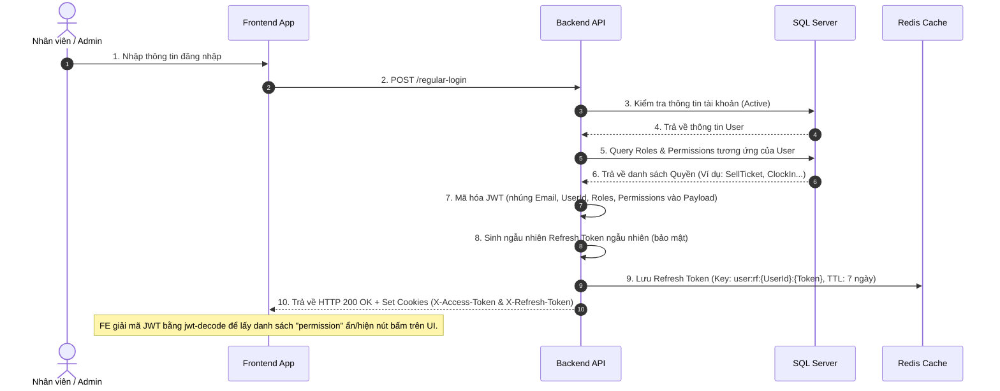
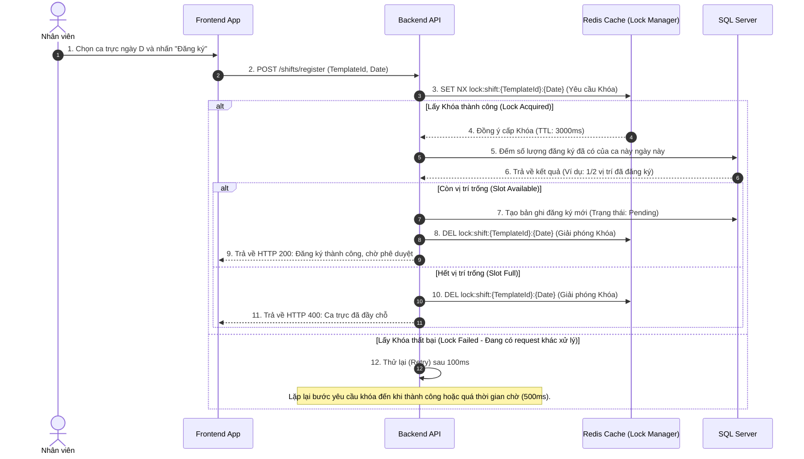
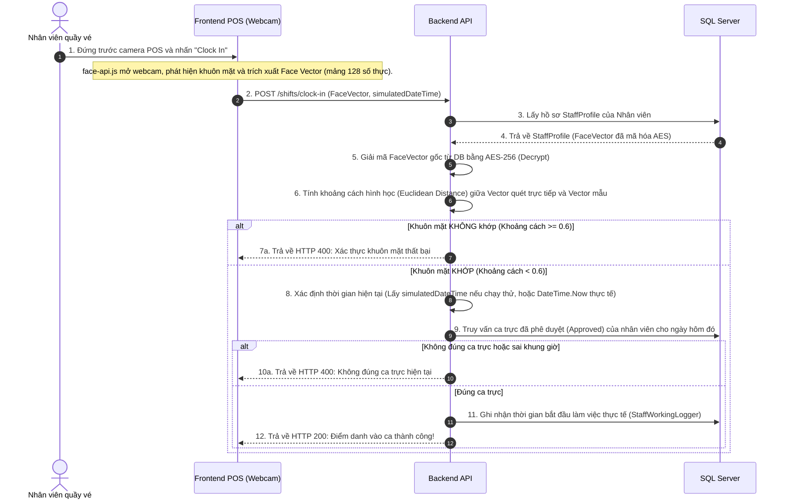
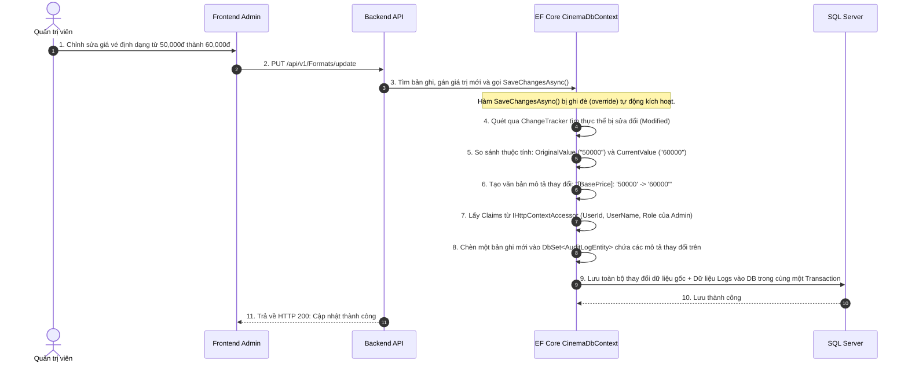

# KẾ HOẠCH TRIỂN KHAI TỔNG THỂ (MASTER IMPLEMENTATION PLAN)
## Refactor Database Schema, JWT Permissions, Tự động Audit Logs, Đăng ký ca trực & Nhận diện khuôn mặt (Bảo mật AES-256)

Tài liệu này phác thảo toàn bộ thiết kế hệ thống, các thay đổi cơ sở dữ liệu, quy trình bảo mật và sơ đồ luồng hoạt động (Sequence Diagrams) dành cho Frontend (FE) và hội đồng đánh giá đồ án.

---

## 1. Sơ đồ Luồng hoạt động Hệ thống (System Flowcharts)

Để FE và người ngoài dễ dàng hình dung cơ chế hoạt động, dưới đây là sơ đồ Mermaid mô tả các quy trình cốt lõi:

### A. Luồng Đăng nhập & Phân quyền qua JWT (Login & Authorization Flow)
Mô tả cách thức đăng nhập, truy vấn quyền hạn và tự động đính kèm quyền vào JWT:



---

### B. Luồng Đăng ký ca trực & Khóa chống Race Condition (Shift Registration & Redis Lock Flow)
Mô tả cơ chế khóa phân tán Redis để ngăn chặn tình trạng nhiều nhân viên đăng ký vượt quá số lượng tối đa (`MaxStaff`) của ca trực trong cùng một mili-giây:



---

### C. Luồng Điểm danh bằng Khuôn mặt & Giả lập Thời gian (Clock-In Face Recognition & Demo Flow)
Mô tả quy trình giải mã AES-256 Vector khuôn mặt để so khớp hình học và cơ chế hỗ trợ giả lập thời gian để demo cho giáo viên:



---

### D. Luồng Tự động ghi Audit Logs thay đổi Dữ liệu (Automatic Field-Level Audit Log Flow)
Mô tả cách thức ghi lại lịch sử thay đổi đến từng cột dữ liệu khi Admin hoặc Manager thực hiện cập nhật hệ thống:



---

## 2. Kế hoạch Refactor Cơ sở dữ liệu Chi tiết

### Cập nhật các Entity hiện có (DataAccess)
1.  **`UserInfoEntity.cs` (Sửa đổi)**:
    *   Tích hợp trực tiếp các trường cá nhân: `UserName`, `IdentityCode`, `DateOfBirth`, `PhoneNumber`.
    *   Xóa liên kết tới bảng `UserProfileEntity`.
2.  **`RoleListInfoEntity.cs` (Sửa đổi)**:
    *   Thêm `SalaryPerHour` (decimal) và `DiscountPercent` (decimal).
3.  **`OrderDetailsInfo.cs` (Sửa đổi)**:
    *   Thêm `FullName` (nvarchar), `IdentityCodeHash` (varchar). Đảm bảo `PriceEach` dùng kiểu `decimal(18,2)`.

### Tạo mới các Entity phục vụ tính năng mới (DataAccess)
1.  **`PermissionEntity.cs` (Mới)**: Danh mục quyền hạn.
2.  **`PermissionForRoleEntity.cs` (Mới)**: Bảng liên kết trung gian nhiều-nhiều giữa Roles và Permissions.
3.  **`StaffProfileEntity.cs` (Mới)**: 
    *   `UserId` (PK/FK trỏ sang User)
    *   `WorkingStatus` (bool)
    *   `CinemaId` (Guid, rạp làm việc chính)
    *   `IsCinemaManager` (bool)
    *   `FaceVector` (nvarchar(max), **Mã hóa AES-256**)
4.  **`CustomerProfileEntity.cs` (Mới)**:
    *   `UserId` (PK/FK trỏ sang User)
    *   `TotalPoint` (decimal)
5.  **`CinemaShiftTemplateEntity.cs` (Mới)**: Khung giờ mẫu ca làm việc.
    *   `ShiftTemplateId` (Guid, PK)
    *   `CinemaId` (Guid, FK)
    *   `ShiftName`, `StartTime`, `EndTime`, `MaxStaff`, `RoleId` (vị trí công việc yêu cầu).
6.  **`StaffShiftRegistrationEntity.cs` (Mới)**: Đăng ký ca trực của nhân viên.
    *   `ShiftRegistrationId` (Guid, PK)
    *   `StaffId`, `ShiftTemplateId`, `RegistrationDate`
    *   `Status` (Pending, Approved, Rejected)
    *   `ApprovedByUserId` (Guid?), `ApprovedAt`, `Notes`
7.  **`StaffWorkingLoggerEntity.cs` (Mới)**: Lịch sử chấm công ca trực thực tế.
    *   Ghi nhận giờ bắt đầu, giờ kết thúc, số giờ làm, số tiền lương nhận được trong ca và ID đợt chi trả lương (`SalaryTotalLoggerId`).
8.  **`StaffSalaryTotalLoggerEntity.cs` (Mới)**: Nhật ký đợt thanh toán lương cho nhân viên.

### Xóa bỏ (Delete)
*   Xóa file `UserProfileEntity.cs`.
*   Xóa toàn bộ thư mục `Migrations` cũ.

---

## 3. Kế hoạch Kiểm thử & Chạy lệnh CLI

Khi tiến hành chạy thực tế, ta mở Terminal chạy các lệnh sau:
1.  **Dọn dẹp DB cũ trong Docker:**
    ```bash
    dotnet ef database drop --project DataAccess --startup-project ApiLayer -f
    ```
2.  **Tạo migration Initial mới tinh:**
    ```bash
    dotnet ef migrations add InitialRefactoredSchema --project DataAccess --startup-project ApiLayer
    ```
3.  **Cập nhật cấu trúc DB mới vào SQL Server trong Docker:**
    ```bash
    dotnet ef database update --project DataAccess --startup-project ApiLayer
    ```
4.  **Biên dịch kiểm tra dự án:**
    ```bash
    dotnet build
    ```
