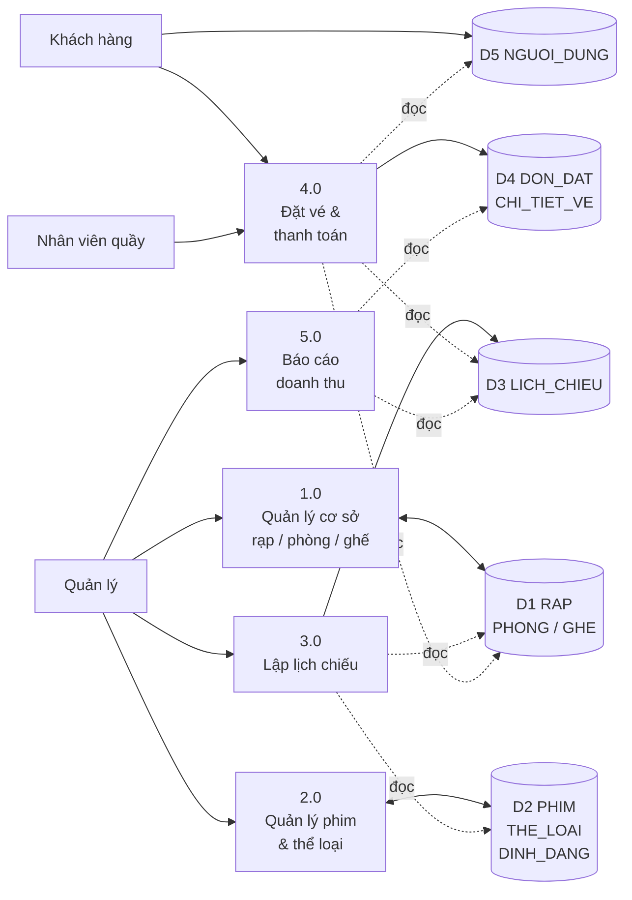
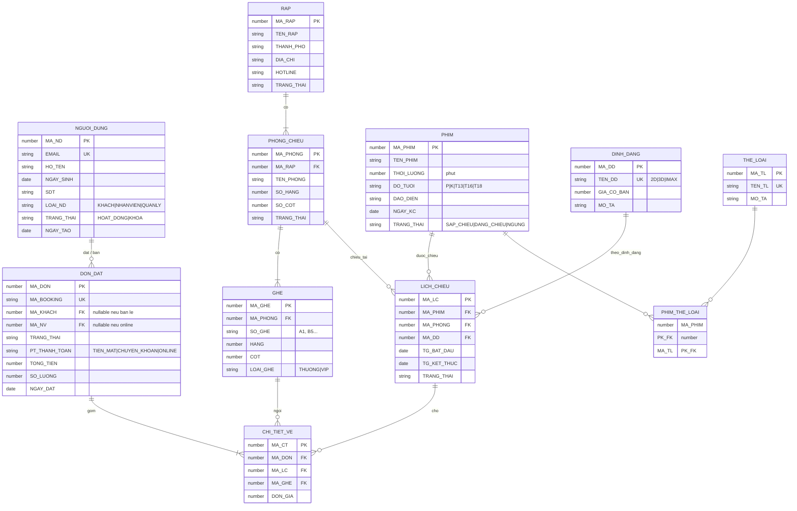

# Hệ quản trị CSDL Oracle — Đặt vé rạp chiếu phim (phiên bản tối giản)

> **Môn học:** Hệ quản trị Cơ sở dữ liệu  
> **Góc nhìn:** Phân tích (DA) + Quản trị CSDL (DBA) — **không** xây dựng Application  
> **DBMS:** Oracle Database  
> **Nguồn tham chiếu:** rút gọn từ monorepo *Galaxiad Cinema* (bỏ AI, group booking, RBAC app, ca làm, voucher phức tạp…)

---

## 1. Mục tiêu đề tài

Xây dựng **CSDL Oracle** phục vụ nghiệp vụ **quản lý rạp chiếu và đặt vé**, tập trung:

| Hạng mục | Thực hiện trên Oracle |
|:---------|:----------------------|
| Lưu trữ | Bảng, ràng buộc PK/FK/CHECK/UNIQUE |
| Toàn vẹn | Trigger (kiểm tra trùng ghế, trùng lịch, hủy đơn…) |
| Xử lý nghiệp vụ | Stored Procedure / Function |
| Báo cáo | View, truy vấn thống kê |
| Phân quyền | **Oracle Role + GRANT/REVOKE** (không tạo bảng `Permission` / `Role` trong app) |

**Không làm:** frontend, backend API, JWT, Redis, VNPay, chatbot AI.

---

## 2. Nghiệp vụ rút gọn

### 2.1. Tóm tắt

Một **rạp** có nhiều **phòng chiếu**, mỗi phòng có nhiều **ghế**.  
**Phim** thuộc một hoặc nhiều **thể loại**, chiếu theo **định dạng** (2D/3D/IMAX) với giá cơ bản.  
**Quản lý** lập **lịch chiếu** (phim + phòng + định dạng + giờ).  
**Khách hàng** (hoặc **nhân viên quầy** thay khách) tạo **đơn đặt vé**, chọn ghế → thanh toán → nhận vé.

### 2.2. Tác nhân (góc nhìn dữ liệu)

| Tác nhân | Việc làm chính |
|:---------|:---------------|
| **Khách hàng** | Đăng ký; xem phim/lịch; đặt vé; hủy đơn (trong hạn) |
| **Nhân viên quầy** | Bán vé tại quầy (tạo đơn thay khách, thanh toán tiền mặt) |
| **Quản lý** | CRUD rạp/phòng/ghế/phim/lịch; xem doanh thu |
| **DBA / Hệ thống** | Phân quyền Oracle; job hủy đơn quá hạn (nếu có) |

> Phân quyền **không** lưu trong bảng: dùng user Oracle `U_KHACH`, `U_NHANVIEN`, `U_QUANLY`, `U_DBA` + role `R_DATVE`, `R_BANVE`, `R_QUANTRI`.

### 2.3. Quy tắc nghiệp vụ cốt lõi (đủ để viết Trigger/Procedure)

| Mã | Quy tắc | Gợi ý cài trên Oracle |
|:--:|:--------|:----------------------|
| Q1 | Mỗi ghế trong phòng có nhãn duy nhất (vd. A1) | `UNIQUE (MA_PHONG, SO_GHE)` |
| Q2 | Lịch chiếu cùng phòng **không trùng giờ** (có khoảng dọn ≥ 15 phút) | Trigger `BEFORE INSERT/UPDATE` trên `LICH_CHIEU` |
| Q3 | Không tạo lịch trong quá khứ | CHECK / Trigger |
| Q4 | Đặt tối thiểu 1 ghế, tối đa 10 ghế / đơn | Procedure `P_DAT_VE` |
| Q5 | Một ghế **không** được bán 2 lần trên cùng lịch (trạng thái đơn còn hiệu lực) | UNIQUE / Trigger trên `CHI_TIET_VE` |
| Q6 | Đơn `CHO_TT` quá 10 phút → hủy, giải phóng ghế | Procedure `P_HUY_DON_QUA_HAN` (DBMS_SCHEDULER) |
| Q7 | Chỉ đơn `DA_THANH_TOAN` mới tính doanh thu | View / báo cáo |
| Q8 | Giá vé = giá định dạng (có thể mở rộng giảm giá sau) | Function `F_TINH_GIA` |
| Q9 | Khách đăng ký ≥ 16 tuổi | Trigger / CHECK trên `NGUOI_DUNG` |
| Q10 | Trạng thái đơn: `CHO_TT` → `DA_THANH_TOAN` / `DA_HUY` → `DA_SU_DUNG` | CHECK + Procedure chuyển trạng thái |

### 2.4. Trạng thái đơn đặt

```
CHO_TT  ──thanh toán──►  DA_THANH_TOAN  ──soát vé──►  DA_SU_DUNG
   │                          │
   └──hủy / hết hạn──►  DA_HUY     └──hoàn──►  DA_HOAN
```

| Mã | Ý nghĩa |
|:---|:--------|
| `CHO_TT` | Đã giữ ghế, chờ thanh toán |
| `DA_THANH_TOAN` | Đã thanh toán, vé hợp lệ |
| `DA_HUY` | Hủy / hết hạn |
| `DA_HOAN` | Đã hoàn tiền |
| `DA_SU_DUNG` | Đã soát vé tại rạp |

---

## 3. Sơ đồ luồng nghiệp vụ (BFD — Business Flow Diagram)

Sơ đồ mức context + mức 0 (tối giản):



### 3.1. Mô tả luồng chính (đặt vé)

```text
[Khách/NV] → Chọn lịch chiếu → Chọn ghế trống
     → Tạo DON_DAT (CHO_TT) + CHI_TIET_VE
     → Thanh toán → cập nhật DA_THANH_TOAN
     → (tuỳ chọn) Soát vé → DA_SU_DUNG
```

### 3.2. Kho dữ liệu ↔ bảng

| Kho | Bảng Oracle |
|:----|:------------|
| D1 | `RAP`, `PHONG_CHIEU`, `GHE` |
| D2 | `PHIM`, `THE_LOAI`, `PHIM_THE_LOAI`, `DINH_DANG` |
| D3 | `LICH_CHIEU` |
| D4 | `DON_DAT`, `CHI_TIET_VE` |
| D5 | `NGUOI_DUNG` |

**Tổng: 11 bảng** (tối giản, đủ quan hệ 1-n / n-n).

---

## 4. Sơ đồ ERD (mức logic)



### 4.1. Cardinality tóm tắt

| Quan hệ | Loại | Ghi chú |
|:--------|:----:|:--------|
| RAP → PHONG_CHIEU | 1:N | Xóa rạp → cần xử lý phòng |
| PHONG_CHIEU → GHE | 1:N | Ghế thuộc đúng 1 phòng |
| PHIM ↔ THE_LOAI | N:N | Bảng `PHIM_THE_LOAI` |
| PHIM + PHONG + DINH_DANG → LICH_CHIEU | N | 1 lịch gắn 1 phim, 1 phòng, 1 định dạng |
| NGUOI_DUNG → DON_DAT | 1:N | Khách đặt / NV tạo đơn |
| DON_DAT → CHI_TIET_VE | 1:N | Mỗi dòng = 1 ghế trên 1 lịch |
| LICH + GHE → CHI_TIET_VE | | **Không trùng** ghế đã bán trên cùng lịch |

---

## 5. So với CSDL đầy đủ của monorepo (đã cắt bỏ)

| Giữ (nghiệp vụ cốt lõi) | Bỏ (không cần cho môn HQT CSDL) |
|:------------------------|:--------------------------------|
| User đơn giản (`LOAI_ND`) | `Role`, `Permission`, `PermissionForRole` |
| Rạp / Phòng / Ghế | Tọa độ AI gợi ý ghế, department POS |
| Phim / Thể loại / Định dạng / Lịch | MovieCinema, banner, interest count |
| Đơn + chi tiết ghế | Group booking, vote, pair |
| Giá = giá định dạng | Pricing rule phức tạp, holiday, surcharge multi-segment |
| — | Voucher, điểm thưởng, membership |
| — | Ca làm, chấm công, lương |
| — | Comment, notification, audit app |
| — | AI recommendation, chatbot, Redis lock |

Phân quyền & bảo mật → **Oracle privilege**, không nhân bản mô hình RBAC ứng dụng.

---

## 6. Danh sách bảng & thuộc tính

### `NGUOI_DUNG`
| Cột | Kiểu | Ràng buộc |
|:----|:-----|:----------|
| MA_ND | NUMBER | PK |
| EMAIL | VARCHAR2(100) | NOT NULL, UNIQUE |
| MAT_KHAU | VARCHAR2(100) | NOT NULL (hash/demo) |
| HO_TEN | NVARCHAR2(100) | NOT NULL |
| NGAY_SINH | DATE | NOT NULL |
| SDT | VARCHAR2(15) | |
| LOAI_ND | VARCHAR2(20) | CHECK IN ('KHACH','NHANVIEN','QUANLY') |
| TRANG_THAI | VARCHAR2(20) | DEFAULT 'HOAT_DONG' |
| NGAY_TAO | DATE | DEFAULT SYSDATE |

### `RAP`
| Cột | Kiểu | Ràng buộc |
|:----|:-----|:----------|
| MA_RAP | NUMBER | PK |
| TEN_RAP | NVARCHAR2(200) | NOT NULL |
| THANH_PHO | NVARCHAR2(100) | NOT NULL |
| DIA_CHI | NVARCHAR2(300) | NOT NULL |
| HOTLINE | VARCHAR2(15) | |
| TRANG_THAI | VARCHAR2(20) | DEFAULT 'HOAT_DONG' |

### `PHONG_CHIEU`
| Cột | Kiểu | Ràng buộc |
|:----|:-----|:----------|
| MA_PHONG | NUMBER | PK |
| MA_RAP | NUMBER | FK → RAP |
| TEN_PHONG | VARCHAR2(50) | NOT NULL |
| SO_HANG | NUMBER | > 0 |
| SO_COT | NUMBER | > 0 |
| TRANG_THAI | VARCHAR2(20) | DEFAULT 'HOAT_DONG' |
| | | UNIQUE (MA_RAP, TEN_PHONG) |

### `GHE`
| Cột | Kiểu | Ràng buộc |
|:----|:-----|:----------|
| MA_GHE | NUMBER | PK |
| MA_PHONG | NUMBER | FK → PHONG_CHIEU |
| SO_GHE | VARCHAR2(10) | NOT NULL |
| HANG | NUMBER | NOT NULL |
| COT | NUMBER | NOT NULL |
| LOAI_GHE | VARCHAR2(20) | DEFAULT 'THUONG' |
| | | UNIQUE (MA_PHONG, SO_GHE); UNIQUE (MA_PHONG, HANG, COT) |

### `THE_LOAI`
| Cột | Kiểu | Ràng buộc |
|:----|:-----|:----------|
| MA_TL | NUMBER | PK |
| TEN_TL | NVARCHAR2(50) | NOT NULL, UNIQUE |
| MO_TA | NVARCHAR2(300) | |

### `PHIM`
| Cột | Kiểu | Ràng buộc |
|:----|:-----|:----------|
| MA_PHIM | NUMBER | PK |
| TEN_PHIM | NVARCHAR2(200) | NOT NULL |
| THOI_LUONG | NUMBER | > 0 (phút) |
| DO_TUOI | VARCHAR2(10) | CHECK P/K/T13/T16/T18 |
| DAO_DIEN | NVARCHAR2(100) | |
| NGAY_KC | DATE | |
| TRANG_THAI | VARCHAR2(20) | SAP_CHIEU / DANG_CHIEU / NGUNG |

### `PHIM_THE_LOAI`
| Cột | Kiểu | Ràng buộc |
|:----|:-----|:----------|
| MA_PHIM | NUMBER | PK, FK → PHIM |
| MA_TL | NUMBER | PK, FK → THE_LOAI |

### `DINH_DANG`
| Cột | Kiểu | Ràng buộc |
|:----|:-----|:----------|
| MA_DD | NUMBER | PK |
| TEN_DD | VARCHAR2(30) | NOT NULL, UNIQUE |
| GIA_CO_BAN | NUMBER(12,2) | > 0 |
| MO_TA | NVARCHAR2(200) | |

### `LICH_CHIEU`
| Cột | Kiểu | Ràng buộc |
|:----|:-----|:----------|
| MA_LC | NUMBER | PK |
| MA_PHIM | NUMBER | FK → PHIM |
| MA_PHONG | NUMBER | FK → PHONG_CHIEU |
| MA_DD | NUMBER | FK → DINH_DANG |
| TG_BAT_DAU | DATE | NOT NULL |
| TG_KET_THUC | DATE | NOT NULL |
| TRANG_THAI | VARCHAR2(20) | DEFAULT 'MO_BAN' |
| | | CHECK TG_KET_THUC > TG_BAT_DAU |

### `DON_DAT`
| Cột | Kiểu | Ràng buộc |
|:----|:-----|:----------|
| MA_DON | NUMBER | PK |
| MA_BOOKING | VARCHAR2(20) | NOT NULL, UNIQUE |
| MA_KHACH | NUMBER | FK → NGUOI_DUNG (nullable) |
| MA_NV | NUMBER | FK → NGUOI_DUNG (nullable) |
| TRANG_THAI | VARCHAR2(20) | DEFAULT 'CHO_TT' |
| PT_THANH_TOAN | VARCHAR2(20) | |
| TONG_TIEN | NUMBER(12,2) | >= 0 |
| SO_LUONG | NUMBER | BETWEEN 1 AND 10 |
| NGAY_DAT | DATE | DEFAULT SYSDATE |

### `CHI_TIET_VE`
| Cột | Kiểu | Ràng buộc |
|:----|:-----|:----------|
| MA_CT | NUMBER | PK |
| MA_DON | NUMBER | FK → DON_DAT |
| MA_LC | NUMBER | FK → LICH_CHIEU |
| MA_GHE | NUMBER | FK → GHE |
| DON_GIA | NUMBER(12,2) | >= 0 |
| | | **Logic:** không 2 dòng “còn hiệu lực” cùng (MA_LC, MA_GHE) → cài bằng Trigger |

---

## 7. Script CREATE TABLE (Oracle)

File đầy đủ: [`01_create_tables.sql`](./01_create_tables.sql)

Tóm tắt thứ tự tạo (tuân thủ FK):

```text
1. NGUOI_DUNG
2. RAP
3. PHONG_CHIEU
4. GHE
5. THE_LOAI
6. PHIM
7. PHIM_THE_LOAI
8. DINH_DANG
9. LICH_CHIEU
10. DON_DAT
11. CHI_TIET_VE
```

Chạy trên SQL*Plus / SQL Developer / SQLcl:

```sql
@01_create_tables.sql
```

---

## 8. Gợi ý phần thực hành tiếp (Trigger / Procedure / Phân quyền)

### 8.1. Sequence + Trigger sinh khóa

Mỗi bảng dùng `SEQ_<TEN_BANG>` + trigger `BEFORE INSERT` gán `MA_*`.

### 8.2. Procedure gợi ý

| Procedure | Chức năng |
|:----------|:----------|
| `P_DAT_VE` | Nhận MA_KHACH, MA_LC, danh sách MA_GHE → tạo đơn + chi tiết, kiểm tra ghế trống |
| `P_THANH_TOAN` | `CHO_TT` → `DA_THANH_TOAN` |
| `P_HUY_DON` | Hủy đơn (chỉ khi CHO_TT hoặc trước giờ chiếu X phút) |
| `P_HUY_DON_QUA_HAN` | Hủy mọi đơn CHO_TT > 10 phút |
| `P_THEM_LICH_CHIEU` | Thêm lịch + kiểm tra chồng giờ phòng |

### 8.3. Function / View

| Đối tượng | Mục đích |
|:----------|:---------|
| `F_TINH_GIA(MA_DD)` | Trả giá cơ bản |
| `V_GHE_TRONG` | Ghế chưa bán theo lịch |
| `V_DOANH_THU_NGAY` | Tổng tiền đơn `DA_THANH_TOAN` / `DA_SU_DUNG` theo ngày |
| `V_LICH_CHIEU_HOM_NAY` | Lịch còn mở bán hôm nay |

### 8.4. Phân quyền Oracle (thay bảng Permission)

```sql
-- Ví dụ ý tưởng (chi tiết có thể viết file 02_roles.sql sau)
CREATE ROLE R_DATVE;      -- KHACH: SELECT phim/lịch/ghế, INSERT đơn
CREATE ROLE R_BANVE;      -- NHANVIEN: thêm quyền tạo đơn tại quầy
CREATE ROLE R_QUANTRI;    -- QUANLY: CRUD master data + xem báo cáo

GRANT SELECT ON PHIM, LICH_CHIEU, GHE TO R_DATVE;
GRANT INSERT, UPDATE ON DON_DAT, CHI_TIET_VE TO R_DATVE;
GRANT R_DATVE TO U_KHACH;
GRANT R_BANVE TO U_NHANVIEN;
GRANT R_QUANTRI TO U_QUANLY;
```

---

## 9. Dữ liệu mẫu gợi ý (seed tối thiểu)

| Bảng | Gợi ý |
|:-----|:------|
| NGUOI_DUNG | 1 quản lý, 1 NV, 2 khách |
| RAP | 1–2 rạp (HN, HCM) |
| PHONG_CHIEU | 2 phòng / rạp |
| GHE | 5×8 = 40 ghế / phòng (hoặc ít hơn demo) |
| THE_LOAI | Hành động, Tình cảm, Hoạt hình… |
| PHIM | 3–5 phim |
| DINH_DANG | 2D (70k), 3D (100k), IMAX (150k) |
| LICH_CHIEU | Vài suất trong tuần |
| DON_DAT | 2–3 đơn demo các trạng thái |

---

## 10. Cấu trúc thư mục tài liệu

```text
docs/oracle-hqtsdl/
├── README.md              ← file này (nghiệp vụ + BFD + ERD)
└── 01_create_tables.sql   ← DDL Oracle
```

---

## 11. Kết luận

Phiên bản này giữ **đúng xương sống nghiệp vụ rạp chiếu** từ source (rạp → phòng → ghế → phim → lịch → đặt ghế → thanh toán), nhưng:

- **11 bảng** thay vì ~40+ entity production  
- **Không** bảng quyền ứng dụng  
- Sẵn sàng viết **Trigger, Procedure, View, Role Oracle** đúng yêu cầu môn **Hệ quản trị CSDL**

Nếu cần, bước tiếp theo có thể bổ sung: `02_sequences_triggers.sql`, `03_procedures.sql`, `04_views.sql`, `05_roles_grants.sql`, `06_seed_data.sql`.
